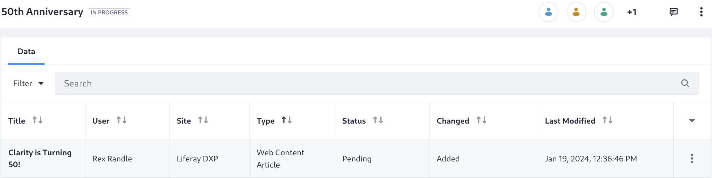

# Creating Publications for Clarity's Special Events

Kyle Klein enables Publications, gives the users the right permissions (Content Manager Role), and then Preston Palmer creates the 50th Anniversary publication.

Within the new publication, Rex Randle (must have the Content Manager role too, I guess) creates the new event (make sure it's under workflow, which currently is for FAQs). Olivia O'Neal approves the event, makes the change to the fragment on the master page, and adds the item to the navigation menu. 

<!-- Duplicates the reference doc title, so make this more specific, like Creating Publications for Clarity's Special Events -->

Clarity wants to celebrate its 50th anniversary with some special frames available only for a limited time. They must prepare content across the site to announce the event and show off the frames. This will result in a one-time content push for releasing the frames and marketing materials all at once. For this kind of dedicated content push, where multiple content creators can work together until the final version is ready, use [Publications](https://learn.liferay.com/en/w/dxp/site-building/publishing-tools/publications).

To enable publications in Liferay, first log in with the administrator Kyle Klein: email `kyle@clarityvisionsolutions.com`, password `learn`. Then,
<!-- Would Kyle represent a real user type that might be doing this lesson? -->

1. Open the *Global Menu* () &rarr; *Applications* &rarr; *Publications*.

1. Toggle *Enable Publications*. New options appear.

   

1. Toggle *Sandbox Only* mode so users are directed automatically to their last working publication when they log in. 

   <!-- I don't think we want sandbox only mode enabled, because we don't need publications automatically appearing for each users first login -->
   <!-- From the docs: If they don't have one, a new publication is generated for them using the `screen.name - date` naming pattern. You can use publication templates to set default values for these auto-generated publications. See [Using Publication Templates](./using-publication-templates.md) for more information. -->

1. Do not enable *Allow Unapproved Changes*. In this scenario users must not publish unapproved changes to production.

1. Click *Save* to save your configuration. You're redirected to the Publications application page, and the publications bar appears:

   

## Creating a Special Event Publication Template

You can jump right in and create the publication, but Clarity is likely to have more special events in the future, and these will require similar publications. To streamline this, Kyle can create a publication template:

1. Open the *Global Menu* () &rarr; *Applications* &rarr; *Publications*.

1. Click *Actions* () &rarr; *Templates*.

1. Click *Add* () and enter:

   **Template Name:** _Special Event_

   **Description:** _Create content in preparation for a special event_

1. Click _Default Template_ to set this template as the default for new publications.
   <!-- Decide what to do about the Default Sandbox Template option -->

1. Expand _Publication Information_ and enter the Publication Name: _REPLACE THIS: ${CURRENT_USERNAME}, ${TODAY_DATE}_.

   See [Using Publication Templates](https://learn.liferay.com/en/w/dxp/site-building/publishing-tools/publications/using-publication-templates) for more information.

   

1. Expand _Publication Collaborators_ and click _Add Users_.

1. In the Invite Users dialog, search for and add users to these publication roles:
<!-- To take this a step further we could create a custom role for working on the publications. It takes a Regular Role to gather these permissions, according to the docs -->

   - Administrator: Preston Palmer
   - Editor: Olivia O'Neal
   - Editor: Rex Randle

   

   Importantly, publications roles only grant permission for viewing or managing the publication itself, and do not grant page and content editing permission. These permissions must be given explicitly. See [Assigning Roles to Publication Collaborators](https://learn.liferay.com/w/dxp/site-building/publishing-tools/publications/publications-permissions#assigning-roles-to-publication-collaborators) to see the permissions these roles provide their users.

1. Click _Save_ and confirm that you'd like to invite these users.

1. Click _Create_ to finish adding the publication template.

## Creating the 50th Anniversary Publication

Preston Palmer is a publication administrator in the template, so log in with this user to create the 50th anniversary event's publication:

1. In the publications bar, click _Create New Publication_.

   

1. Replace the name with _50th Anniversary_.

1. Click _Create_.

   Preston is automatically working in the new publication after it's created.

   

## Working on the 50th Anniversary Changes

Next sign in as Olivia O'Neal, a publication editor as configured in the template. Then, 

1. Open the publications bar and click _Select a Publication_. 

1. Click _50th Anniversary_.

   

1. Open the site's master page, _Clarity MP_.

1. In the header, delete the _J2B6 Announcement_. In its place add _K3C7 50th Anniversary Announcement_.

1. Publish the master page, then open the publications bar and click _Review Changes_. The new fragment being added to the master page is tracked.

   

1. Go to _Site Menu_ () &rarr; _Content & Data_ &rarr; _Web Content_.

1. Click _Add_ () &rarr; _Event_ and specify

   * Title: Clarity is Turning 50!
   * Summary: Clarity is turning 50, so let's celebrate!
   * Body: Check out our limited time only frames! Clarity turned 50, and we're excited to offer these frames while they last.
   * Banner Image: <!-- We need one -->

1. Go to _Site Menu_ () &rarr; _Site Builder_ &rarr; _Navigation Menus_ and click _Clarity Navigation Menu_.

   <!-- Note, right now Olivia O'Neal can't get to Navigaiton Menus, need to make sure she has the right role -->

1. Add an item to the More submenu for the event you just created by clicking _Add Child_ &rarr; _Web Content Article_ &rarr; Clarity is Turning 50!_.

   

   <!-- Note, this is not in the publication apparently. Or at least I can't see it in Review Changes. But I also cannot see it in production. So perhaps because the web content article isn't there the menu item doesn't show--makes sense and it works to show it -->

Now the content is ready for the 50th anniversary!

# Workflow and Publications
<!-- Creating and Reviewing Events in the Publication -->

Goal: show how to make the publication, but also send content within the publication through a review process. Show how Liferay handles these two publishing management scenarios (reviews versus content pushes to prod)

Whoever reviews content made or edited in a publication must haver access to the publication to complete their review.

This might be a better article structure, maybe:

Enabling and Creating Publications

Working in Publications (include workflow)

Publishing

Add a workflow for events (use single approver again for speed, but maybe we should show how the instance admin can upload a custom definition?)

Have Rex Randle create the new event within the workflow and the publication.

Olivia approves the event

1. Log in as Preston Palmer, the site administrator.

   **Email Address:** preston.palmer@liferay.com

   **Password:** learn

1. Open the _Site Menu_ () then click _Content & Data_ &rarr; _Web Content_.

1. Add a web content folder for Clarity's events content.

1. Move any existing events into the folder.

1. Configure the folder to only allow events and to use the single approver workflow. See [the previous lesson](./using-workflow-with-faqs.md) for details if needed.

   Now events are configured like FAQs were configured in the last lesson.

   <!-- If these are all happening in the publication we should do this before we enable publications, when we do it for FAQs -->

Sign out, then sign in with Rex Randle. Rex has web content creation permission due to his job, Customer Advocacy Specialist. H's also able to create the 50th anniversary event:

1. Open the _Site Menu_ () then click _Content & Data_ &rarr; _Web Content_, and click the _Events_ folder.

1. Click _New_ &rarr; _Event_ and specify

   * Title: Clarity is Turning 50!
   * Summary: Clarity is turning 50, so let's celebrate!
   * Body: Check out our limited time only frames! Clarity turned 50, and we're excited to offer these frames while they last.
   * Banner Image: <!-- We need one -->

1. Click _Submit for Workflow_.

1. Log in with Preston Palmer, the publication administrator. Open the _Review Changes_ screen from the publications bar, and click _Publish_.

   

1. Click _Publish_.

   

   You cannot publish the changes until the items in the workflow are first reviewed.

The content manager, Olivia O'Neal, must review Rex's new content within the publication.

1. Log in as Olivia O'Neal.

   **Email Address:** olivia.oneal@liferay.com

   **Password:** learn

   <!--Our custom navigation menu doesn't have my workflow tasks. We'll need to add it or some other way (personal page with link or that uses the regular personal menu? -->
   <!-- Enhance the fragment: if the user has the permissions XXX, show the My Workflow Tasks link in the menu-->

1. Go to the review screen for the publication, click the user avatar and select _My Workflow Tasks_.

   

   All workflow tasks assigned directly to a user are listed in the My Workflow Task widget's Assigned to Me tab.

1. Click _Assigned to My Roles_.

   Workflow tasks that Olivia O'Neal can claim because she's part of a role defined in the workflow appear here. 

1. Click the asset's _Actions_ button () and select _Assign to Me_.

   

1. Enter the comment _I'll take this one--Olivia_ in the Comment text field, then click _Done_.

   Now the task appears in Assigned to Me.

Once the task is assigned the content review proceeds:

1. Click the name of the pending _Clarity is Turning 50!_ item in My Workflow Tasks. A preview appears, with the review status.

1. Click _Preview_ () to see the event:

   

1. Click the back arrow, then click _Actions_ () and select _Approve_.

1. Enter the comment _Looks good!_ and click _Done_.

Since the submission is approved and there is only one reviewer in the Single Approver workflow, the task is moved to the Completed section of the Assigned to Me tab. The event can now be published with the other content in support of the 50th anniversary event.

## Publishing the 50th Anniversary Content

Log in as Preston Palmer again. He's the publication administrator and the one who can publish the content.

1. From the publications bar, click _50th Anniversary_ &rarr; _Review Changes_.

   

1. Click _Schedule_ and choose today's date, and a time 2-5 minutes in the future.

   

1. Click _Schedule_ and wait until the time.

1. Go to the home page and verify the content is updated:

   

<!-- So, how do you undo the publication's changes? Once it's live that's it, right? Maybe it's not that useful for time-boxed events after all? -->

