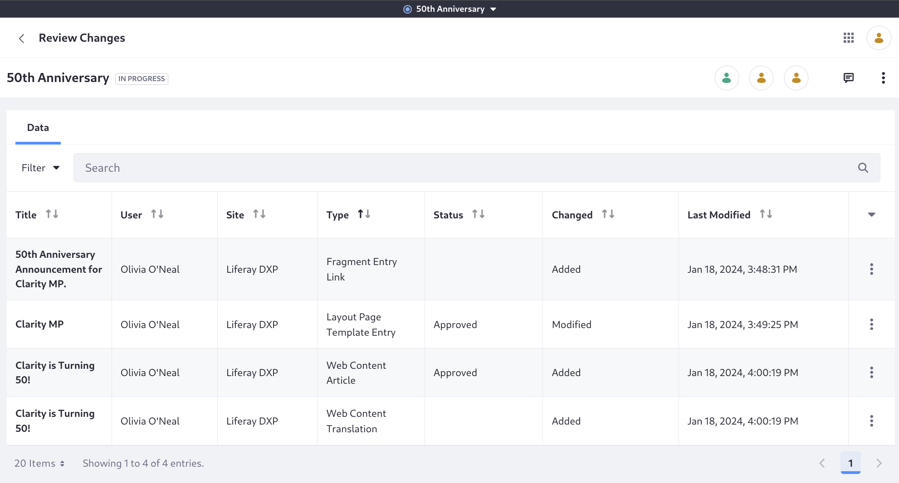
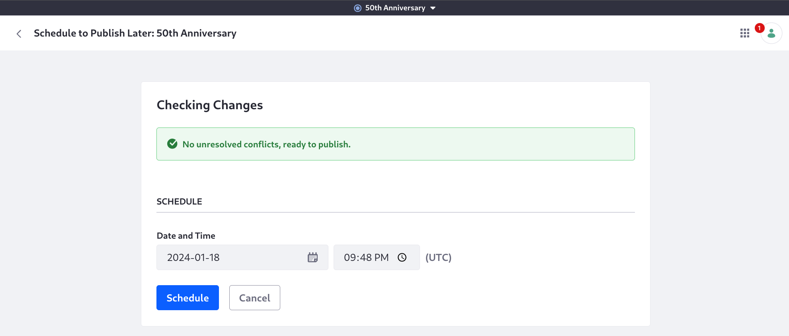

# Publishing the 50th Anniversary Content

Most of the real work is done. All that's left to do is publish the 50th anniversary content to the production environment.

Log in as Preston Palmer again. He's the publication administrator and the one who can publish the content.

1. From the publications bar, click _50th Anniversary_ &rarr; _Review Changes_.

   

1. Click _Schedule_ and choose today's date and a time 2-5 minutes in the future.

   

1. Click _Schedule_ and wait until the time.

1. Go to the home page and verify the content is updated:

   

Congratulations! You've finished this module on workflow and publishing tools. The 50th anniversary has been properly celebrated with some special content. It's time to begin thinking about Clarity's next site for their retail portal, called Glance.

Module Five: [Site Templates](../site-templates.md).

## Relevant Concepts

* [Publications](https://learn.liferay.com/w/dxp/site-building/publishing-tools/publications)
* [Publishing Tools](https://learn.liferay.com/w/dxp/site-building/publishing-tools)
* [Workflow](https://learn.liferay.com/w/dxp/process-automation/workflow)

