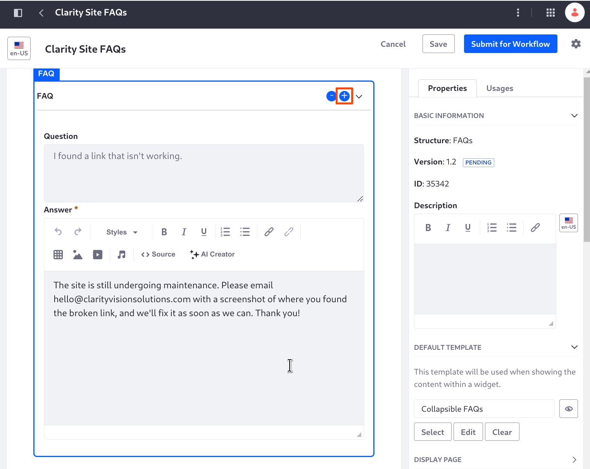
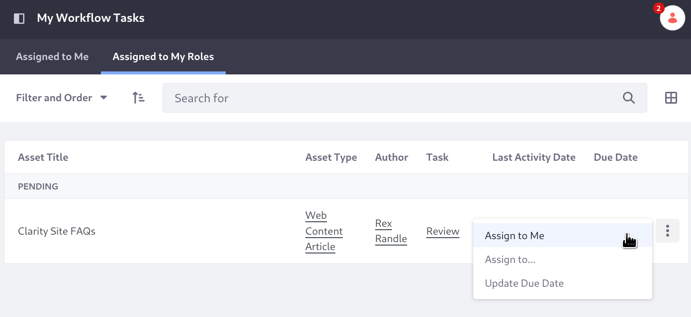
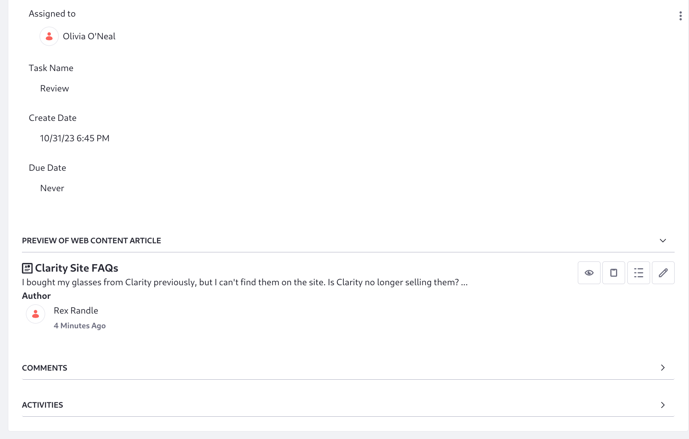
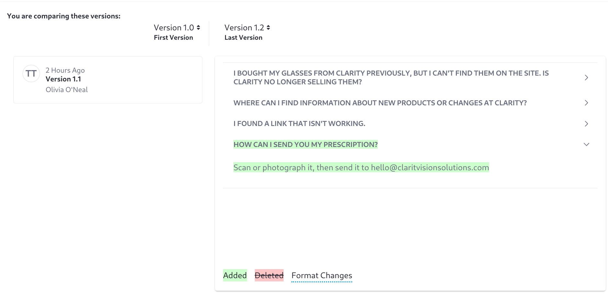
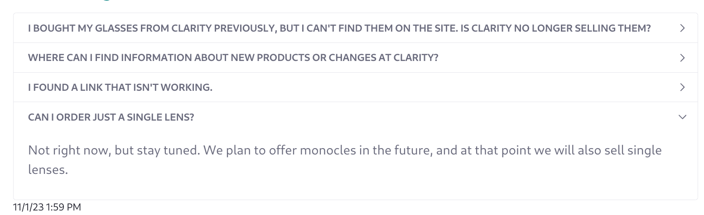
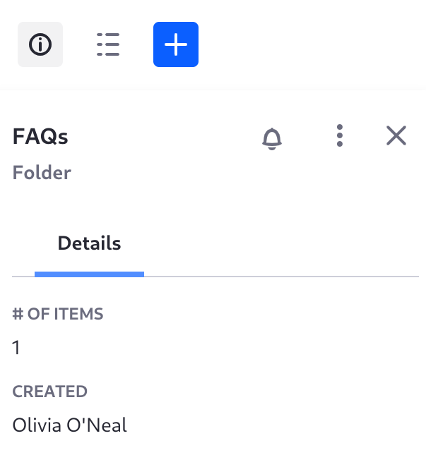
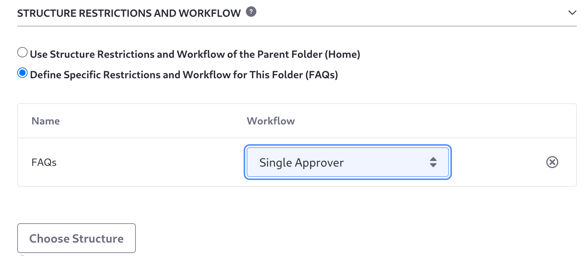

# Approving FAQs with Workflow

Clarity's initial site is in place and the first pieces of [content were added](../creating-content.md) by the content manager directly. It's time for other users to begin creating content for Clarity. To aid this effort, review processes are required to ensure the quality and consistency of published content. Liferay's workflow processes allow just such reviews. Clarity wants its customer advocacy specialist, Rex Randle, to turn common customer questions into FAQ entries, published after review and approval by the content manager, Olivia O'Neal. Preston Palmer, the site administrator, can manage workflows in the site to set this up.
<!-- Too much info, some can be extracted to the introduction, and probably presented as a table -->

1. Log in as Preston Palmer, the site administrator.

   **Email Address:** preston.palmer@liferay.com

   **Password:** learn

1. Open the _Site Menu_ () then click _Configuration_ &rarr; _Workflow_.

1. Scroll down to Web Content Article and click _Edit_.

1. Choose _Single Approver_ and click _Save_.

   

Now all web content articles added in the site will go through a review process as defined by the Single Approver workflow definition. Create a new FAQ to see how it works:

1. Log in as Rex Randle, the custom advocacy specialist who fields customer questions at the `hello@claritvisionsolutions.com` email address (visible in the footer of the site).

   **Email Address:** rex.randle@liferay.com

   **Password:** learn

1. Open the _Site Menu_ () then click _Content & Data_ &rarr; _Web Content_.

1. Click the _Clarity Site FAQs_ article to open it for editing, and scroll to the last field group:

1. Click _Add FAQ_ () on the last field group:

   
1. In the newly appearing FAQ, enter this question:

   ```
   Can I order just a single lens?
   ```

1. Enter the answer:

   ```
   Not right now, but stay tuned. We plan to offer monocles in the future, and at that point we will also sell single lenses.
   ```

1. Click *Submit for Workflow* at the top of the page.

   The button used to say _Publish_, but it changes when workflow is enabled.

The content is in the workflow, marked as _Pending_ in the administrative UI. It's also marked as _Approved_, because the first version of the article, before Rex's recent edits and before workflow was even enabled, is available and published on the FAQs display page. The pending status means that the latest version of the item is unavailable for publication on the display page.
<!-- TMI? -->


The content manager, Olivia O'Neal, must review Rex's new content. 

1. Log in as Olivia O'Neal.

   **Email Address:** olivia.oneal@liferay.com

   **Password:** learn

1. Open the _Site Menu_ () then click _Content & Data_ &rarr; _Web Content_.

1. In the page header, click the user avatar to to open Olivia's personal menu, and select _My Workflow Tasks_.

   All workflow tasks assigned directly to a user are listed in the My Workflow Task widget's Assigned to Me tab.

1. Click the _Assigned to My Roles_ tab.

   Workflow tasks that Olivia O'Neal can claim because she's part of a role defined in the workflow appear here. 

1. Click the asset's _Actions_ button () and select _Assign to Me_.

   

1. Enter the comment _I'll take this one--Olivia_ in the Comment text field, then click _Done_.

   Now the task appears in Assigned to Me, and the content review proceeds.

1. Click the name of the pending _Clarity Site FAQs_ item in My Workflow Tasks. A preview of the FAQ appears, with the review status. The preview barely shows anything, so Olivia needs to look at it more closely:

   

1. Click _View Diffs_ ().

   

1. Review what changed, then close the pop-up window.

1. Click _Actions_ () and select _Approve_.

1. Enter the comment _Looks good!_ and click _Done_.

Since the submission is approved and there is only one reviewer in the Single Approver workflow, the task is moved to the Completed section of the Assigned to Me tab. The asset is published and viewable on the Clarity Site FAQs display page.



This simple setup works, but the same workflow is used for all Clarity's web content articles. In reality, Clarity wants to allow FAQs to use one workflow and events to use another. To accomplish this, some changes are needed:

1. Move the Clarity Site FAQs article into a web content folder.

1. Configure the folder to accept only FAQs and to use its own workflow.

1. Do the same for events.

1. Remove the site level workflow configuration.

First put all FAQs into a web content folder:

1. Open the _Site Menu_ () then click _Content & Data_ &rarr; _Web Content_.

1. Click _Add_ () &rarr; Folder.

1. Enter the name _FAQs_ and click _Save_.

1. Go back to the root folder, and check the box for _Clarity Site FAQs_.

1. Click _Move_ (), then _Select_.

1. Expand the folders under _Home_ and choose _FAQs_.

1. Click _Move_.

Next, configure the folder to accept only FAQs and configure workflow for the folder:

1. Go into the FAQs folder if you're not already there.

1. Click _Information_ () to open the folder's information panel.

   

1. Click _Actions_ () &rarr; _Edit_, then expand _Structure Restrictions and Workflow_.

1. Select _Define Specific Restrictions and Workflow for This Folder (FAQs)_.

1. Click _Choose Structure_, then click _FAQs_ from the Structures list.

1. For Workflow, select _Single Approver_.

   

   The FAQs folder uses the Single Approver workflow and only allows content with the FAQs structure.

1. Repeat the procedure to put events into a folder named Events, and configure the folder to use the Single Approver workflow.

1. Go to _Site Menu_ () then click _Configuration_ &rarr; _Workflow_. Disable the site level workflow configuration for web content articles.

Now Clarity is using folder-based web content management, where each folder is configured to accept a certain type of content and use a certain workflow. 
