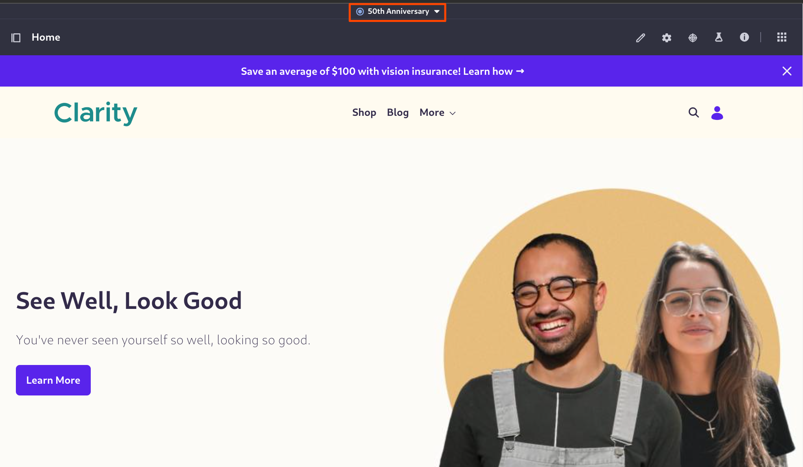
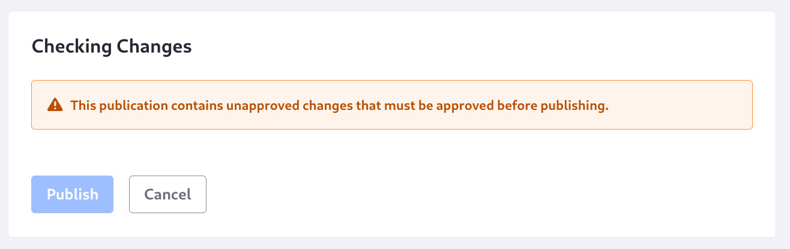
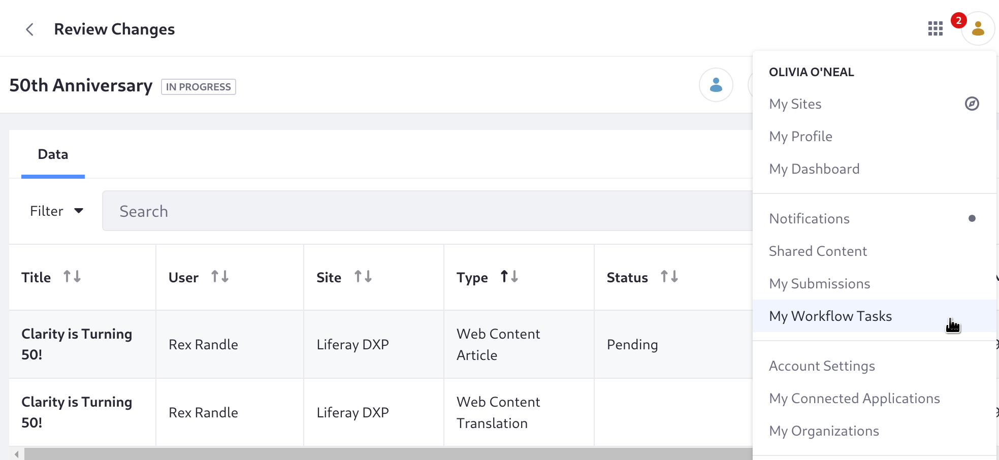
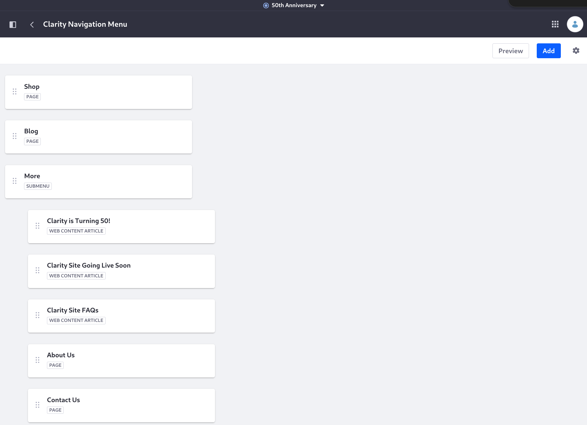

# Working in the 50th Anniversary Publication

The publication template is in place for Clarity's special events. Here, the publication administrator will create the publication, and the publication editors will begin working on its content.

Preston Palmer is a publication administrator in the template, so log in with this user to create the 50th anniversary event's publication:

1. In the publications bar, click _Create New Publication_.

   

1. Replace the name with _50th Anniversary_.

1. Click _Create_.

   Preston is automatically working in the new publication after it's created.

   

## Working on the 50th Anniversary Changes

1. Sign in with Rex Randle. Rex has web content creation permission due to his job, Customer Advocacy Specialist.

   **Email Address:** olivia.oneal@liferay.com

   **Password:** learn

1. Open the _Site Menu_ () then click _Content & Data_ &rarr; _Web Content_, and click the _Events_ folder.

1. Click _New_ &rarr; _Event_ and specify

   * Title: Clarity is Turning 50!
   * Summary: Clarity is turning 50, so let's celebrate!
   * Body: Check out our limited time only frames! Clarity turned 50, and we're excited to offer these frames while they last.
   * Banner Image: <!-- We need one -->

1. Click _Submit for Workflow_.

1. Let's see what this looks like in the ongoing publication. Log in with Preston Palmer, the publication administrator. Open the _Review Changes_ screen from the publications bar.

   

1. Click _Publish_.

   

   You cannot publish the changes until the items in the workflow are first reviewed.

The content manager, Olivia O'Neal, must first review Rex's new content within the publication.

1. Log in as Olivia O'Neal.

   **Email Address:** olivia.oneal@liferay.com

   **Password:** learn

1. Go to the review screen for the publication, click the user avatar and select _My Workflow Tasks_.

   

   All workflow tasks assigned directly to a user are listed in the My Workflow Task widget's Assigned to Me tab.

1. Click _Assigned to My Roles_.

   Workflow tasks that Olivia O'Neal can claim because she's part of a role defined in the workflow appear here. 

1. Click the asset's _Actions_ button () and select _Assign to Me_.

1. Enter the comment _I'll take this one--Olivia_ in the Comment text field, then click _Done_.

   Now the task appears in Assigned to Me.

Once the task is assigned the content review proceeds:

1. Click the name of the pending _Clarity is Turning 50!_ item in My Workflow Tasks. A preview appears, with the review status.

1. Click _Preview_ () to see the event:

   

1. Click the back arrow, then click _Actions_ () and select _Approve_.

1. Enter the comment _Looks good!_ and click _Done_.

Since the submission is approved and there is only one reviewer in the Single Approver workflow, the task is moved to the Completed section of the Assigned to Me tab. The event can now be published with the other content in support of the 50th anniversary event.

## Updating the Master Page in the Publication

Olivia O'Neal is a publication editor as configured in the template, so she can continue working in the publication.

1. Open the publications bar and click _Select a Publication_. 

1. Click _50th Anniversary_.

   

1. Open the site's master page, _Clarity MP_.

1. In the header, delete the _J2B6 Announcement_. In its place add _K3C7 50th Anniversary Announcement_.

1. Publish the master page, then open the publications bar and click _Review Changes_. The new fragment being added to the master page is tracked.

   

1. Go to _Site Menu_ () &rarr; _Content & Data_ &rarr; _Web Content_.

1. Click _Add_ () &rarr; _Event_ and specify

   * Title: Clarity is Turning 50!
   * Summary: Clarity is turning 50, so let's celebrate!
   * Body: Check out our limited time only frames! Clarity turned 50, and we're excited to offer these frames while they last.
   * Banner Image: <!-- We need one -->

1. Go to _Site Menu_ () &rarr; _Site Builder_ &rarr; _Navigation Menus_ and click _Clarity Navigation Menu_.

   <!-- Note, right now Olivia O'Neal can't get to Navigaiton Menus, need to make sure she has the right role -->

1. Add an item to the More submenu for the event you just created by clicking _Add Child_ &rarr; _Web Content Article_ &rarr; Clarity is Turning 50!_.

   

   <!-- Note, this is not in the publication apparently. Or at least I can't see it in Review Changes. But I also cannot see it in production. So perhaps because the web content article isn't there the menu item doesn't show--makes sense and it works to show it -->

Now the content is ready for the 50th anniversary!

Next: [publish the content for the event](./publishing-the-50th-anniversary-content.md)

## Relevant Concepts

* [Making and Publishing Changes](https://learn.liferay.com/w/dxp/site-building/publishing-tools/publications/making-and-publishing-changes)
* [Using Workflow with Publications](https://learn.liferay.com/w/dxp/site-building/publishing-tools/publications/using-workflow-with-publications)
* [Resolving Conflicts](https://learn.liferay.com/w/dxp/site-building/publishing-tools/publications/resolving-conflicts)
