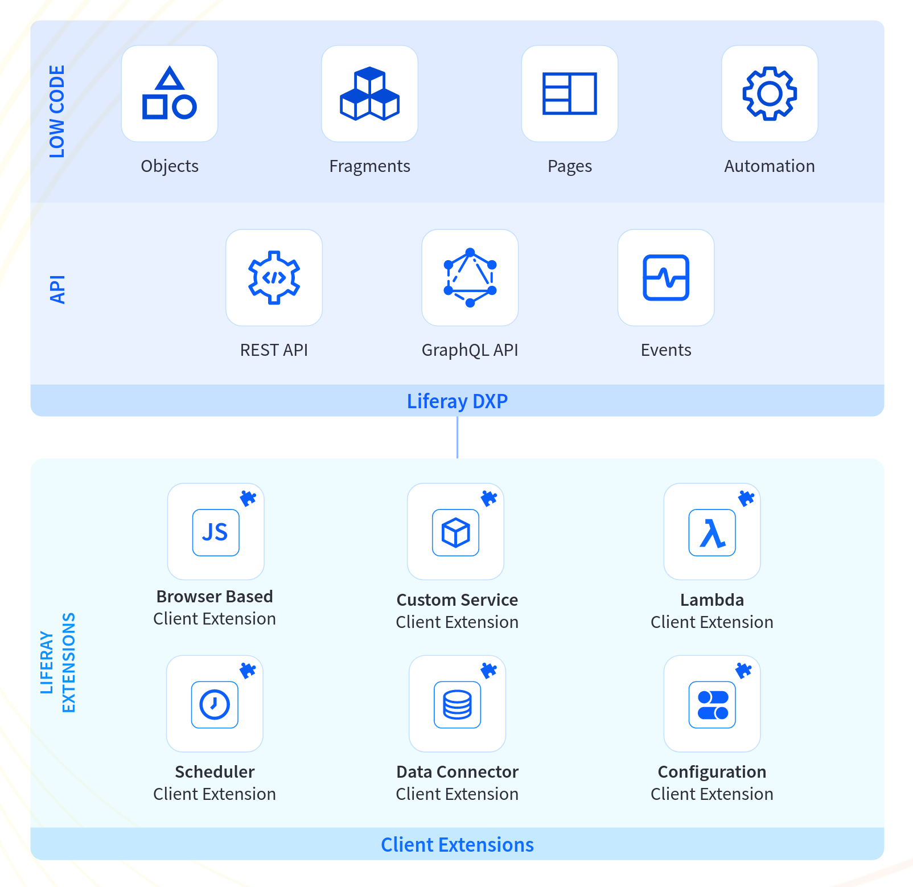

---
toc:
- ./client-extensions/browser-based-client-extensions.md
---
# Client Extensions

```{toctree}
:maxdepth: 4

client-extensions/browser-based-client-extensions.md
```

{bdg-secondary}`Available Liferay 7.4 U45+/GA45+`

Client extensions are a way to extend Liferay without using OSGi modules. You can deploy client extensions to any Liferay environment, whether you host it yourself or on Liferay Experience Cloud. They are also the primary way of customizing Liferay with Liferay Experience Cloud, together with built-in configurations like [Liferay objects](./objects.md).

While other types of Liferay extensions, such as [OSGi modules](../liferay-internals/fundamentals/module-projects.md) or [themes](../site-building/site-appearance/themes/introduction-to-themes.md), are powerful tools for customizing Liferay itself, client extensions avoid directly using or customizing Liferay code. This makes client extensions more robust and easier to apply to environments after an upgrade, since they do not depend on any specific version of Liferay. You can also develop using whatever programming languages or technologies are most familiar to you, because your client extensions run outside of Liferay and integrate with objects, with no extra code required to connect them.



With client extensions, you can

* Apply [custom JavaScript or CSS](#browser-based-client-extensions) to your pages without needing to rely on any specific code in Liferay
* Embed applications hosted remotely into a [custom element](./client-extensions/browser-based-client-extensions/understanding-custom-element-and-iframe-client-extensions.md) on a page in Liferay
* Simplify your process to apply programmatically the same configurations or objects to multiple environments, by [converting them into client extensions](#configuration-as-code)
* Call [custom services](#custom-service-client-extensions) or [functions](#lambda-client-extensions) running outside of Liferay, such as an external feed or even a custom authentication server, using the programming languages or technologies of your choice

## Types of Client Extensions

Client extensions integrate with [Liferay Workspace](./tooling/liferay-workspace/what-is-liferay-workspace.md), so that you can use the available tools there to quickly develop and deploy them. Client extensions communicate with Liferay via [headless APIs](../headless-delivery/using-liferay-as-a-headless-platform.md).

These types of client extensions are available for extending Liferay's appearance and functionality:

* [Browser-Based Client Extensions](#browser-based-client-extensions)
* [Configuration as Code](#configuration-as-code)
* [Scheduler Client Extensions](#scheduler-client-extensions)
* [Data Connector Client Extensions](#data-connector-client-extensions)
* [Lambda Client Extensions](#lambda-client-extensions)
* [Custom Service Client Extensions](#custom-service-client-extensions)

### Browser-Based Client Extensions

Browser-based client extensions are hosted on a CDN when they are deployed. Examples of browser-based client extensions include a specific CSS layout, a click-to-chat feature, or a custom shopping cart display.

* **JavaScript**: JavaScript client extensions can apply globally or within a specific theme.

* **CSS**: CSS client extensions can apply globally or within a specific theme.

* **Favicon**: Client extensions can deploy a favicon for a specific theme.

* **Custom Element**: Custom element client extensions can integrate an application into a page.

* **IFrame**: IFrame client extensions work similarly to custom elements, but they allow for limited interaction with a remote application using a separate `<iframe>` HTML element.

See [Browser-Based Client Extensions](./client-extensions/browser-based-client-extensions.md) for more information.

### Configuration as Code

```{warning}
Configuration client extensions are currently a **beta feature** in Liferay 7.4. The available features are temporarily limited.
```

In Liferay 7.4, configurations can also be used as a type of client extension. Configurations (as well as custom objects and data models) can be exported and imported easily into other environments as client extensions. This simplifies the process of configuring multiple environments at once, implementing them as a client extension and deploying them to any applicable environments in a simplified workflow, without needing a script or custom code to push the changes.

### Scheduler Client Extensions

```{warning}
Scheduler client extensions are currently a **beta feature** in Liferay 7.4. The available features are temporarily limited.
```

Scheduler client extensions are for creating jobs to execute on scheduled intervals, which you can configure with well-known Cron expressions. You can deploy code with them to run on these intervals, or to synchronize data with Liferay using [data connector client extensions](#data-connector-client-extensions) or external APIs, such as [Salesforce](https://www.salesforce.com).

### Data Connector Client Extensions

```{warning}
Data connector client extensions are currently a **beta feature** in Liferay 7.4. The available features are temporarily limited.
```

Use data connector client extensions to import data into Liferay in the form of [Liferay objects](./objects.md). These are used in conjunction with [scheduler client extensions](#scheduler-client-extensions) to synchronize data on regular, scheduled intervals.

### Lambda Client Extensions

```{warning}
Lambda client extensions are currently a **beta feature** in Liferay 7.4. The available features are temporarily limited.
```

These client extensions execute your code in a separate container outside of Liferay. You can implement custom solutions for specialized functions without needing to implement an OSGi module or model listener.

Liferay triggers the execution of this code via [objects](./objects.md). With a lambda client extension deployed, you can create objects that call on your client extension's function as an available action and customize the triggers as needed. In Liferay Experience Cloud, although the code is executed outside of Liferay, the code is executed alongside Liferay in the same environment, eliminating the need for your own server to host it.

### Custom Service Client Extensions

```{warning}
Custom service client extensions are currently a **beta feature** in Liferay 7.4. The available features are temporarily limited.
```

For more complex use cases, you can use a client extension that works as its own service in Liferay Experience Cloud. You supply your own code, and then deploy it to run as a service that functions within the cloud's network, with its own virtual server allocated to it. Being hosted in the same cloud network gives your own service access to your other services while also benefiting from the cloud's built-in security features.

Deploying custom services gives you much more power to implement customizations that benefit from behaving as a separate service. For example, you could implement your own authentication server or an application that interfaces with Liferay using its [headless APIs](../headless-delivery/using-liferay-as-a-headless-platform.md). Custom services are also useful for integrating separate applications that interface with users.

## Additional Information

* [Creating Your First Client Extension](./client-extensions/browser-based-client-extensions/tutorials/creating-your-first-javascript-client-extension.md)
* [Browser-Based Client Extensions](./client-extensions/browser-based-client-extensions.md)
* [Liferay Workspace](./tooling/liferay-workspace/what-is-liferay-workspace.md)
