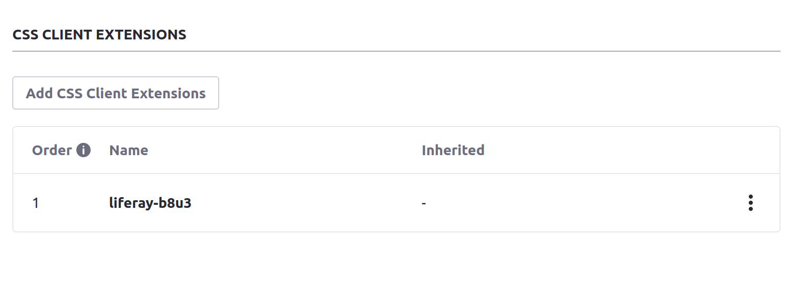

# Creating Your First CSS Client Extension

{bdg-secondary}`Available Liferay 7.4 U45+/GA45+`

A basic CSS client extension is a great place to start with developing your own client extensions. You can use a CSS client extension to override styling on any page in Liferay without needing to develop a theme or depend on any Liferay code. You'll use the [Blade CLI](../../../tooling/blade-cli.md) to generate, build, and deploy your client extension along the way.

## Prerequisites

You must have these requirements ready in your development environment to begin working with client extensions:

1. Install Java (JDK 8 or JDK 11).

    ```{note}
    Please see the [compatibility matrix](https://help.liferay.com/hc/en-us/articles/4411310034829-Liferay-DXP-7-4-Compatibility-Matrix) for information on supported JDKs, databases, and environments. See [JVM Configuration](../../../../installation-and-upgrades/reference/jvm-configuration.md) for recommended JVM settings.
    ```

1. Install the [Blade CLI](../../../tooling/blade-cli/installing-and-updating-blade-cli.md).

1. Prepare a Liferay Workspace for your development environment. You can use [Blade CLI](../../../tooling/liferay-workspace/creating-a-liferay-workspace.md#creating-a-liferay-workspace-with-blade-cli) to set this up quickly for your desired version of Liferay.

1. You must also have a running instance of Liferay to test your client extension with. You can quickly start up a Liferay instance for testing by [Starting with a Docker Image](../../../../getting-started/starting-with-a-docker-image.md).

Now you have all the necessary tools to deploy your first CSS client extension.

## Create the Client Extension with Blade CLI

Blade CLI can generate the skeleton for many types of client extensions, including CSS extensions. Follow these steps to get started:

1. Open a command line in your Liferay Workspace and navigate to the `client-extensions/` folder:

    ```bash
    cd client-extensions
    ```

1. Run this command to invoke Blade CLI, entering a name for the new folder:

   ```bash
   blade create -t client-extension [new-folder-name]
   ```

   The tool shows a list of client extension types to choose from.

1. Use the arrow keys to highlight `globalCSS` from the list of client extension types and press Enter. <!--TASK: Confirm Naming-->

   

1. Enter the desired name for your client extension at the prompt.

The Blade CLI tool creates a subfolder with your chosen name within `client-extensions/`. These files are inside of it:

* `client-extension.yaml`: A YAML file containing the basic definition of your client extension, including the `type` (`globalCSS`), your chosen name, and a generated URL. Edit this file if you want to change any of this information for your client extension. *Note that you can add more client extension definitions to this YAML file if you want to build and deploy them together.*

* `src/global.css`: A CSS file that overrides other CSS on a page when it is configured to use this client extension. This is the only source file in a CSS client extension by default.

Now you have a basic client extension. Next you'll see what this client extension does and how to adjust its behavior.

## Modify and Deploy the Client Extension

By default, the `src/global.css` file contains this code:

```css
body {
    font-family: cursive;
}
```

This causes all text on the page to appear in cursive font when the client extension is used.

First, add a change to the background color for buttons. Open the `global.css` file and add a new block of CSS to it. Add a declaration block for the `.btn-primary` class and a declaration for the `background-color`: 

```css
.btn-primary {
    background-color: purple;
}
```

Now deploy your client extension to your Liferay testing instance. If you're using a Docker container, run this command from your client extension's root folder:

```bash
blade gw deploy -Ddeploy.docker.container.id=$(docker ps -lq)
```

This builds and deploys your client extension Liferay's `deploy/` folder inside your Docker container.

```{note}
If you want to deploy your client extension to a Liferay Experience Cloud environment, use the Liferay Cloud [Command-Line Tool](https://learn.liferay.com/dxp-cloud/latest/en/reference/command-line-tool.html#) instead, and run the [`lcp deploy`](https://learn.liferay.com/dxp-cloud/latest/en/reference/command-line-tool.html#deploying-to-your-dxp-cloud-environment) command.
```

Confirm the deployment in your Liferay instance's console:

```
STARTED my-global-css-client-extension_1.0.0
```

Now that your client extension is deployed, you must configure your Liferay instance to use it. 

## Use the Client Extension on a Page

Configure a page in your Liferay instance to specifically use your deployed client extension: 

1. Log in to your running Liferay instance.

1. On any page with at least one button on it, click the _Edit_ icon  at the top.

1. In the sidebar, navigate to the Page Design Options menu (), and click the configuration icon () at the top of the menu.

   

1. In the *CSS Client Extensions* section toward the bottom of the page, click *Add CSS Client Extensions*.

   

1. Select your CSS client extension from the list in the popup modal, and click *Add*.

1. Click  *Save*.

Now your client extension is configured. Navigate back to editing the page you configured and look at the background color for any buttons on the page. The background color on the buttons now appears as the color you chose. If you want also to see your CSS applied on the page outside of Edit mode, you must publish the page.


```{tip}
If the buttons on the page still show the default background color, try doing a hard refresh of the page to clear your browser's cache (`CTRL + SHIFT + R` for most browsers). If you change your client extension and redeploy it, you may need to remove it from the page's configuration and re-add it to see the changes.
```

## Next Steps

Congratulations! You have successfully created and used your first CSS client extension in Liferay. Next, try deploying other client extension types.

* [Creating Your First JS Client Extension](./creating-your-first-javascript-client-extension.md)
