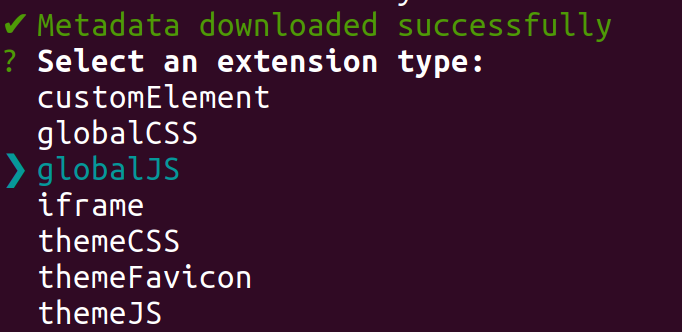
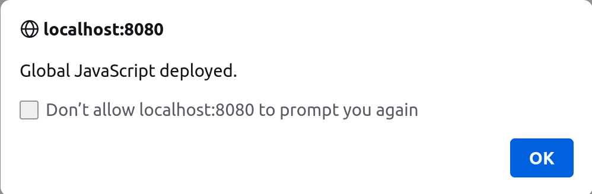

# Creating Your First JavaScript Client Extension

{bdg-secondary}`Available Liferay 7.4 U45+/GA45+`

A basic JavaScript client extension is a great place to start with developing your own client extensions. You can use a JS client extension to run your own JavaScript on any page in Liferay without worrying about any dependency on Liferay code or developing a theme. You'll use [Blade CLI](../../../tooling/blade-cli.md) to generate, build, and deploy your client extension.

## Prerequisites

You must have these requirements ready in your development environment to begin working with client extensions:

1. Install Java (JDK 8 or JDK 11).

   ```{note}
   Please see the [compatibility matrix](https://help.liferay.com/hc/en-us/articles/4411310034829-Liferay-DXP-7-4-Compatibility-Matrix) for information on supported JDKs, databases, and environments. See [JVM Configuration](../../../../installation-and-upgrades/references/jvm-configuration.md) for recommended JVM settings.
   ```

1. Install [Blade CLI](../../../tooling/blade-cli/installing-and-updating-blade-cli.md).

1. Prepare a Liferay Workspace for your development environment. You can use [Blade CLI](../../../tooling/liferay-workspace/creating-a-liferay-workspace.md#creating-a-liferay-workspace-with-blade-cli) to set this up quickly for your desired version of Liferay.

1. You must also have a running instance of Liferay to test your client extension with. You can quickly start up a Liferay instance for testing by [Starting with a Docker Image](../../../../getting-started/starting-with-a-docker-image.md).

Now you have all the necessary tools to deploy your first JS client extension.

## Create the Client Extension with Blade CLI

Blade CLI generates the skeleton for many types of client extensions, including JS extensions: 

1. Open a command line in your Liferay Workspace and navigate to the `client-extensions/` folder:

    ```bash
    cd client-extensions
    ```

1. Run this command to invoke Blade CLI, filling in the desired name for the new folder to generate:

   ```bash
   blade create -t client-extension [new-folder-name]
   ```

   The tool shows a list of client extension types. 

1. Use the arrow keys to highlight `globalJS` from the list of client extension types and press Enter.

    

1. Enter the desired name for your client extension at the prompt.

The Blade CLI tool creates a subfolder with your chosen name within `client-extensions/`. These files are inside of it:

* `client-extension.yaml`: A YAML file containing the basic definition of your client extension, including the `type` (`globalJS`), your chosen name, and a generated URL. Edit this file if you want to change any of this information for your client extension. *Note that you can add more client extension definitions to this YAML file if you want to build and deploy them together.*

* `src/global.js`: A JS file that automatically runs when a page is configured to use this client extension. This is the only source file in a JS client extension by default.

Now you have a basic client extension. Next, you'll see what this client extension does and how to adjust its behavior.

## Examine and Deploy the Client Extension

By default, the `src/global.js` file contains this line of code:

```js
window.alert('Global JavaScript deployed.');
```

This causes an alert box to appear with the given message when you open the page. Add any additional JavaScript you want to run to this file.

Then, deploy your client extension to your Liferay testing instance. If you are running Liferay from a Docker container, run this command from your client extension's root folder:

```bash
blade gw deploy -Ddeploy.docker.container.id=$(docker ps -lq)
```

This builds and deploys your client extension to your Liferay's `deploy/` folder within your Docker container.

```{note}
If you want to deploy your client extension to a Liferay Experience Cloud environment, use the Liferay Cloud [Command-Line Tool](https://learn.liferay.com/dxp-cloud/latest/en/reference/command-line-tool.html#) instead, and run the [`lcp deploy`](https://learn.liferay.com/dxp-cloud/latest/en/reference/command-line-tool.html#deploying-to-your-dxp-cloud-environment) command.
```

Confirm the deployment in your Liferay instance's console:

```
STARTED my-global-js-client-extension_1.0.0
```

Now that your client extension is successfully deployed, you must configure your Liferay instance to use it. 

## Use the Client Extension on a Page

You must configure a page in your Liferay instance to use your deployed client extension. Follow these steps to see your JS in use:

1. Log in to your running Liferay instance.

1. On any page, click the *Edit* icon  at the top.

1. In the sidebar, navigate to the Page Design *Options* menu (), and click the *Configuration* icon () at the top of the menu.

   

1. Click the *Advanced* tab and expand the *JavaScript* section toward the bottom of the page to find the *JavaScript Client Extensions* configuration section.

1. Click the *Add JavaScript Client Extensions* button to add the new client extension (to the page head or page bottom).

   

1. Click *Save*.

1. Optionally, publish the page for your JavaScript to execute on the page outside of Edit mode.

Now your client extension is configured and you can see it in action. Navigate back to the page you configured, and you'll see the alert window pop up with a message from the client extension. If you want your JavaScript also to run when you view the page outside of Edit mode, you must publish the page.



```{tip}
If the alert window does not appear at first, try doing a hard refresh of the page to clear your browser's cache (`CTRL + SHIFT + R` for most browsers). If you change your client extension and redeploy it, you may need to remove it from the page's reconfiguration and re-add it to see the changes.
```

## Next Steps

Congratulations! You have successfully created and used your first JS client extension in Liferay. Next, try deploying other client extension types.

* [Creating Your First CSS Client Extension](./creating-your-first-css-client-extension.md)
