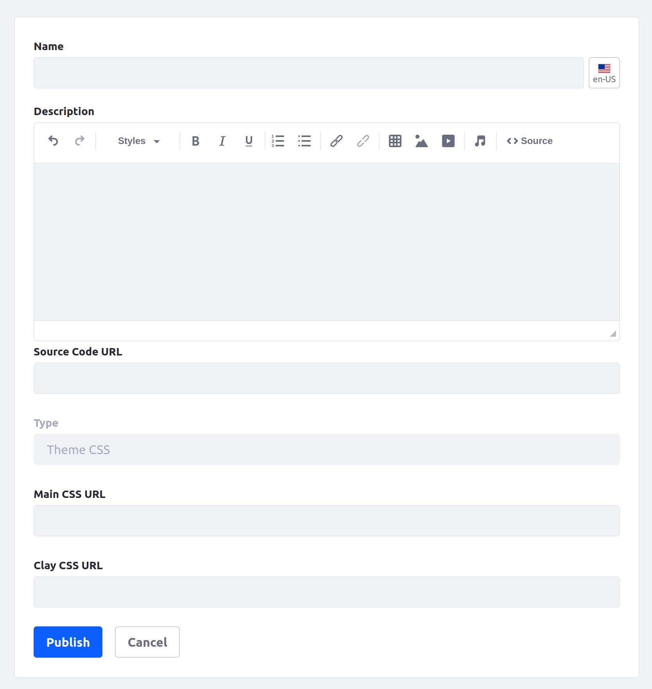
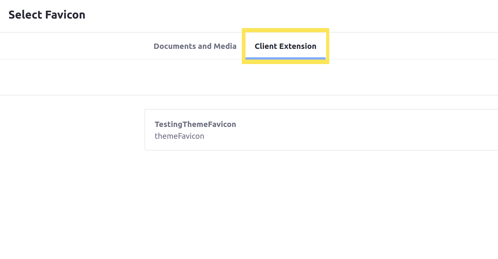
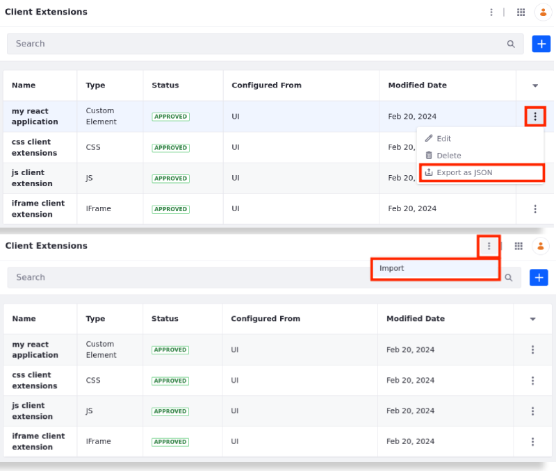

---
toc:
  - ./front-end-client-extensions/tutorials.md
  - ./front-end-client-extensions/javascript-yaml-configuration-reference.md
  - ./front-end-client-extensions/css-yaml-configuration-reference.md
  - ./front-end-client-extensions/theme-css-yaml-configuration-reference.md
  - ./front-end-client-extensions/theme-favicon-yaml-configuration-reference.md
  - ./front-end-client-extensions/theme-sprite-map-yaml-configuration-reference.md
  - ./front-end-client-extensions/custom-element-yaml-configuration-reference.md
  - ./front-end-client-extensions/iframe-yaml-configuration-reference.md
  - ./front-end-client-extensions/understanding-custom-element-and-iframe-client-extensions.md
  - ./front-end-client-extensions/client-extensions-ui-reference.md
uuid: fcdeefe5-64f7-451c-8981-41e1a04290d6
taxonomy-category-names:
- Development and Tooling
- Frontend Client Extensions
- Liferay Self-Hosted
- Liferay SaaS
---
# Front-End Client Extensions

{bdg-primary}`Liferay Self-Hosted`
{bdg-primary}`Liferay SaaS`
{bdg-warning}`Liferay PaaS`
{bdg-secondary}`Liferay 7.4`

Front-end client extensions augment your pages and integrate new functionality. Available types include CSS, JavaScript, Theme CSS, Theme Favicon, Custom Element, and IFrame.

You can create and deploy these extensions from your [Liferay Workspace](../tooling/liferay-workspace/what-is-liferay-workspace.md) or via UI (Global Menu () &rarr; Applications tab &rarr; Client Extensions under Custom Apps).

See [Understanding Custom Element and IFrame Client Extensions](./front-end-client-extensions/understanding-custom-element-and-iframe-client-extensions.md) to learn more about creating [custom element](#custom-element-client-extensions) and [IFrame](#iframe-client-extensions) client extensions.

!!! note
    You can add JavaScript, CSS, or Theme CSS client extensions to layout sets (i.e., page sets), master templates, page templates, and individual content pages. The level at which you add the extension determines which entities inherit the extension's code. For example, if you add extensions to a master template, all page templates and content pages using the master template inherit its extensions.

## JavaScript Client Extensions

JavaScript client extensions provide global JavaScript libraries and logic throughout your Liferay instance. When you deploy a JavaScript client extension and configure a page to use it, its JavaScript runs automatically each time you visit the page (in the page's header or footer).

Specify a JavaScript client extension in your `client-extension.yaml` file:

```yaml
type: globalJS
```

See [Using a JavaScript Client Extension](./front-end-client-extensions/tutorials/using-a-javascript-client-extension.md) to get started.

## CSS Client Extensions

CSS client extensions introduce new CSS styling to pages. A deployed CSS client extension on a page adds to the page's existing styling, including theme and style book settings.

Specify a CSS client extension in your `client-extension.yaml` file :

```yaml
type: globalCSS
```

See [Using a CSS Client Extension](./front-end-client-extensions/tutorials/using-a-css-client-extension.md) to get started.

## Theme CSS Client Extensions

While [CSS client extensions](#css-client-extensions) add styling to pages, theme CSS client extensions override styling on the page, including from the site's [theme](../../site-building/site-appearance/themes/introduction-to-themes.md). The client extension uses a `clay.css` file and a `main.css` file to replace the identically named files normally used in your site's theme.

You can add this type of client extension as an option from *Client Extensions* in the Liferay Applications menu.



!!! note
    The `clay.css` and `main.css` files must be hosted remotely to use this type of client extension.

    As this client extension fully replaces the default CSS contained in the theme, make sure to provide [Clay styling](https://clayui.com/docs/css/index.html) for any out-of-the-box widgets that are used by Liferay. Alternatively, to fix the styling of a particular Liferay widget, wrap the widget in a container that includes the `cadmin` CSS class under the container element's Advanced tab.

Specify a Theme CSS client extension in your `client-extension.yaml` file:

```yaml
type: themeCSS
```

## Theme Favicon Client Extensions

Override the favicon for your pages in Liferay. When deployed, the provided icon file becomes available for any page in Liferay. You can access it in a separate *Client Extensions* tab when you configure the favicon for a page from the Page Design Options menu.



## Theme Sprite Map Client Extensions

Theme sprite map client extensions override the sprite map for site pages. Define the sprite map as an `.svg` image, and it replaces the one used by your site's current theme.

Specify a theme sprite map client extension in your `client-extension.yaml` file:

```yaml
type: themeSpritemap
```

## Custom Element Client Extensions

> Previously named Custom Element Remote App

Custom element client extensions use Liferay's front-end infrastructure to integrate external applications with the platform and render them as page widgets. They can integrate applications from any domain accessible outside of Liferay.

To use custom element client extensions, you create entries at the company level with the necessary URLs and details to register them with Liferay. Liferay then generates a unique widget for each entry and renders the application as a [custom HTML element](https://web.dev/custom-elements-v1/).

Specify a custom element client extension in your `client-extension.yaml` file:

```yaml
type: customElement
```

See [Understanding Custom Element and IFrame Client Extensions](./front-end-client-extensions/understanding-custom-element-and-iframe-client-extensions.md) for more information.

## IFrame Client Extensions

> Previously named IFrame Remote Apps

IFrame client extensions work like [custom element client extensions](#custom-element-client-extensions). However, they render external applications as `<iframe>` HTML elements, which allow for limited interaction from the host page. Unlike other front-end client extensions, these *do not provide a static resource*.

Specify IFrame client extensions in your `client-extension.yaml` file:

```yaml
type: iframe
```

See [Understanding Custom Element and IFrame Client Extensions](./front-end-client-extensions/understanding-custom-element-and-iframe-client-extensions.md) for more information.

## Editor Config Contributor Client Extensions

{bdg-secondary}`Liferay DXP 2024.Q1+/Portal 7.4 GA112+`

Editor Config Contributor client extensions override existing CKEditor configurations in a `ConfigContributor.java` file.

!!! important
    The client extension's configuration options must match the `ConfigContributor` it's overriding (i.e., portlet names, editor names, and editor config keys).

Specify an Editor Config Contributor client extension in your `client-extension.yaml` file:

```yaml
type: editorConfigContributor
```

## Front-end Client Extension Properties

Set these properties in the `client-extension.yaml` file of any front-end client extension:

| Name | Data Type | Default Value | Description |
| :--- | :--- | :--- | :--- |
| `baseURL` | String | *Derived from site URL* | The base path from which all of the client extension's defined resources are served. |
| `description` | String | | The client extension's description. |
| `name` | String | | The client extension's name (as it appears in the UI). A name is required for front-end client extensions. |
| `sourceCodeURL` | URL | https://www.liferay.com | The address to the client extension's source repository. |
| `typeSettings` | String[] | [] | A list of strings that are processed with Liferay's `UnicodeProperties` syntax. Type-specific client extension properties are copied automatically into this when the client extension is built. |

See [Configuring Client Extensions in `client-extension.yaml`](./working-with-client-extensions.md#configuring-client-extensions-in-client-extension-yaml) for more information.


## Export/Import Front-end Client Extensions Configured From the UI

{bdg-secondary}`Liferay DXP 2024.Q1+/Portal 7.4 GA112+`

!!! important
    This feature is currently behind a release feature flag (LPS-182184). Read [Release Feature Flags](../../system-administration/configuring-liferay/feature-flags.md#release-feature-flags) for more information.

You can Export/Import front-end client extensions that were configured from the UI while maintaining the external reference code and references created when the client extension was used in a page.

!!! note
    This export and import method is only available to client extensions configured from the UI.

To export a front-end client extension,

1. Open the *Global Menu* (), navigate to the Applications tab, and select *Client Extensions* under Custom Apps.

1. Click *Actions* () next to the client extension you want to export and select *Export as JSON*.

The client extension is exported in JSON format and it's downloaded automatically onto your machine.

To import a front-end client extension,

1. In the Client Extensions application under Custom Apps, click *Options* () next to the Global Menu and select *Import*.

1. Select the JSON file containing the client extension and click *Import*.

The client extension is imported, and it appears in the client extensions list.



## Related Topics

- [Introduction to Client Extensions](../client-extensions.md)
- [Understanding Custom Element and IFrame Client Extensions](./front-end-client-extensions/understanding-custom-element-and-iframe-client-extensions.md)
- [Using a JavaScript Client Extension](./front-end-client-extensions/tutorials/using-a-javascript-client-extension.md)
- [Using a CSS Client Extension](./front-end-client-extensions/tutorials/using-a-css-client-extension.md)
