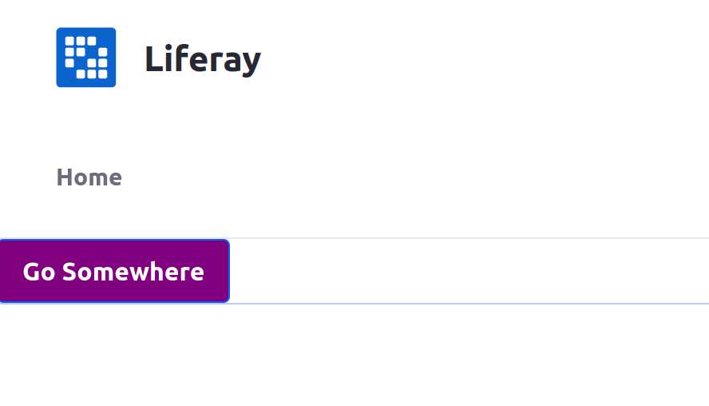

# Creating Your First CSS Client Extension

{bdg-secondary}`Available Liferay 7.4 U45+/GA45+`

A basic CSS client extension is a great place to start with developing your own client extensions. You can use a CSS client extension to override styling on any page in Liferay without needing to develop a theme or depend on any Liferay code. You'll use a sample client extension (from a [sample workspace](https://github.com/liferay/liferay-portal/tree/master/workspaces/sample-workspace)) to start with.

## Prerequisites

You must have these requirements ready in your development environment to begin working with client extensions:

1. Install Java (JDK 8 or JDK 11).

    ```{note}
    Please see the [compatibility matrix](https://help.liferay.com/hc/en-us/articles/4411310034829-Liferay-DXP-7-4-Compatibility-Matrix) for information on supported JDKs, databases, and environments. See [JVM Configuration](../../../../installation-and-upgrades/reference/jvm-configuration.md) for recommended JVM settings.
    ```

1. Download and unzip the sample workspace:

   ```bash
   curl -J -O https://repository.liferay.com/nexus/service/local/artifact/maven/content\?r\=liferay-public-releases\&g\=com.liferay.workspace\&a\=com.sample.workspace\&\v\=LATEST\&p\=zip
   ```

   ```bash
   unzip com.sample.workspace-20230217.1154.zip
   ```

Now you have all the necessary tools to deploy your first CSS client extension.

## Examine and Modify the Client Extension

The CSS client extension is in the sample workspace's `client-extensions/sample-global-css/` folder. It is defined in the `client-extension.yaml` file in this folder:

```yaml
sample-global-css:
    name: Sample Global CSS
    type: globalCSS
    url: global.css
```

This YAML block defines the client extension with the ID `sample-global-css` and contains the key configurations for a CSS client extension, including the `type` and the CSS file to add. See the [CSS YAML configuration reference](../css-yaml-configuration-reference.md) for more information on the available properties.

It also contains the `assemble` YAML block:

```yaml
assemble:
    - from: assets
      include: "**/*"
      into: static
```

This block specifies that everything in the `assets/` folder should be included as a static resource in the client extension `.zip` file once it is built. The CSS file that you add in a CSS client extension is used as static resource in Liferay.

The `assets/global.css` file contains this CSS:

```css
body {
    color: #0054f0;
}
```

This modifies the `body` color for the page when the client extension is enabled.

Add a change to also modify the background color for buttons. Open the `global.css` file and add a new block of CSS to it. Add a declaration block for the `.btn-primary` class and a declaration for the `background-color`: 

```css
.btn-primary {
    background-color: purple;
}
```

Now you're ready to deploy it.

## Deploy the Client Extension to Liferay

```{include} /_snippets/run-liferay-portal.md
```

Once your Liferay instance has started, run this command from the client extension's folder in the sample workspace:

```bash
../../gradlew clean deploy -Ddeploy.docker.container.id=$(docker ps -lq)
```

This builds and deploys your client extension to Liferay's `deploy/` folder within your Docker container.

```{note}
If you want to deploy your client extension to a Liferay Experience Cloud environment, use the Liferay Cloud [Command-Line Tool](https://learn.liferay.com/dxp-cloud/latest/en/reference/command-line-tool.html#) instead, and run the [`lcp deploy`](https://learn.liferay.com/dxp-cloud/latest/en/reference/command-line-tool.html#deploying-to-your-dxp-cloud-environment) command.
```

```{tip}
Run the command from the `client-extensions/` folder in your workspace instead to deploy all of the client extensions within it at once.
```

Confirm the deployment in your Liferay instance's console:

```
STARTED sample-global-css_1.0.0
```

Now that your client extension is deployed, you must configure your Liferay instance to use it. 

## Use the Client Extension on a Page

Configure a page in your Liferay instance to specifically use your deployed client extension: 

1. On any page in your Liferay instance with at least one button on it, click the _Edit_ icon  at the top.

1. In the sidebar, navigate to the Page Design Options menu (), and click the configuration icon () at the top of the menu.

   

1. In the *CSS Client Extensions* section toward the bottom of the page, click *Add CSS Client Extensions*.

   

1. Select your CSS client extension from the list in the popup modal, and click *Add*.

1. Click  *Save*.

Now your client extension is configured. Navigate back to editing the page you configured and look at the background color for any buttons on the page. The background color on the buttons now appears as the color you chose. If you want also to see your CSS applied on the page outside of Edit mode, you must publish the page.



```{tip}
If the buttons on the page still show the default background color, try doing a hard refresh of the page to clear your browser's cache (`CTRL + SHIFT + R` for most browsers). If you change your client extension and redeploy it, you may need to remove it from the page's configuration and re-add it to see the changes.
```

## Next Steps

Congratulations! You have successfully used your first CSS client extension in Liferay. Next, try deploying other client extension types.

* [Creating Your First JS Client Extension](./creating-your-first-javascript-client-extension.md)
