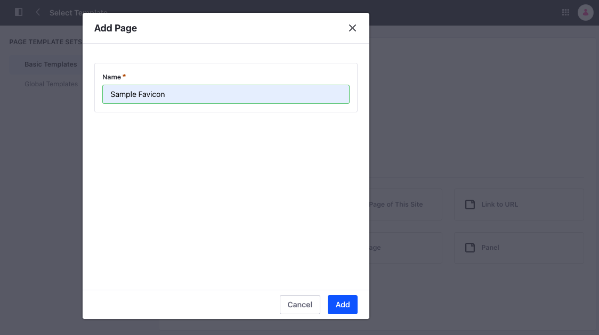

# Creating Your First Theme Favicon Client Extension

{bdg-secondary}`Available Liferay 7.4 U45+/GA45+`

You can override the default favicon in Liferay using a theme favicon client extension. This can be done without changing any Liferay code. You'll use this [Sample Workspace](https://github.com/liferay/liferay-portal/tree/master/workspaces/sample-workspace) to build and deploy your client extension.

## Prerequisites

You must meet these requirements in your development environment to begin working with client extensions:

1. Install Java (JDK 8 or JDK 11).

    ```{note}
    Please see the [compatibility matrix](https://help.liferay.com/hc/en-us/articles/4411310034829-Liferay-DXP-7-4-Compatibility-Matrix) for information on supported JDKs, databases, and environments. See [JVM Configuration](../../../../installation-and-upgrades/references/jvm-configuration.md) for recommended JVM settings.
    ```

1. Download and unzip the Sample Workspace

   ```bash
   curl https://repository.liferay.com/nexus/service/local/artifact/maven/content\?r\=liferay-public-releases\&g\=com.liferay.workspace\&a\=com.sample.workspace\&\v\=LATEST\&p\=zip -J -O
   ```

   ```bash
   unzip com.sample.workspace-20230217.1154.zip
   ```

Now you have all the necessary tools to deploy your first theme favicon client extension.

## Examine the Client Extension

The theme favicon client extension is in the sample workspace's `client-extensions/sample-theme-favicon/` folder. It is defined in the `client-extension.yaml` file in this folder:

```yaml
sample-theme-favicon:
    name: Sample Theme Favicon
    type: themeFavicon
    url: favicon.ico
```

<!-- Change absolute URL to relative once Alce's pull is merged -->
This YAML block defines the client extension with the ID `sample-theme-favicon` and contains the key configurations for a theme favicon client extension, including the `type` and the favicon file to add. See the [Theme Favicon YAML configuration reference]([../javascript-yaml-configuration-reference.md](https://github.com/Alec-Shay/liferay-learn/blob/f88ba4466dfd5267ca40bab252442fab4e9d9543/docs/dxp/latest/en/building-applications/client-extensions/front-end-client-extensions/theme-favicon-yaml-configuration-reference.md)) for more information on the properties.

It also contains the `assemble` YAML block:

```yaml
assemble:
    - from: assets
      include: "**/*"
      into: static
```

This block specifies that everything in the `assets/` folder should be included as a static resource in the client extension `.zip` file once it is built. In this example, there's only one file inside the assets folder (`favicon.ico`) and that's used as a static resource in Liferay.

## Deploy the Client Extension to Liferay

```{include} /_snippets/run-liferay-portal.md
```

Once Liferay is running,

1. Move into the `sample-theme-favicon` directory.

   ```bash
   cd client-extensions/sample-theme-favicon
   ```
   <!-- We usually tell devs to do ./gradlew but here it is two directories up. Not sure if that's alright. -->
1. Build and deploy the example.

   ```bash
   ../../gradlew deploy -Ddeploy.docker.container.id=$(docker ps -lq)
   ```

   This builds and deploys your client extension Liferay's `deploy/` folder inside your Docker container.

   ```{note}
   If you want to deploy your client extension to a Liferay Experience Cloud environment, use the Liferay Cloud [Command-Line Tool](https://learn.liferay.com/dxp-cloud/latest/en/reference/command-line-tool.html#) instead, and run the [`lcp deploy`](https://learn.liferay.com/dxp-cloud/latest/en/reference/command-line-tool.html#deploying-to-your-dxp-cloud-environment) command.
   ```

   ```{tip}
   Run the command from the `client-extensions/` folder in your workspace instead to deploy all of the client extensions within it at once.
   ```

   Confirm the deployment in your Liferay instance's console:

   ```bash
   STARTED sample-theme-favicon_1.0.0
   ```

## Use the Client Extension on a Page

To see the deployed client extension,

1. Go to your Liferay instance and click the *Product Menu* (). Navigate to *Site Builder* &rarr; *Pages*.

1. Click Add () and select *Page*.

1. Click *Widget Page* and enter a name.

   **Name**: Sample Favicon

   

1. Click *Add*.

1. In the *Favicon* section under the *Look and Feel* tab, click *Change Favicon*.

1. There's a new tab called *Client Extensions*. Click on it, and select the newly deployed favicon, *Sample Theme Favicon*.

   

1. Scroll down and click *Save*.

Go back to the homepage and click on *Sample Favicon*. The new favicon appears on the browser tab.


## Next Steps

Congratulations! You have successfully created and used your first theme favicon client extension in Liferay. Next, try deploying other client extension types.

<!-- * Add more links here when they are ready -->