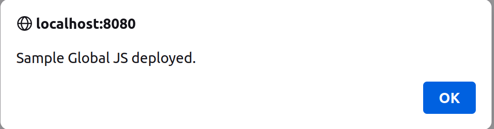

# Using a JavaScript Client Extension

{bdg-secondary}`Available Liferay 7.4 U45+/GA45+`

A basic JavaScript client extension is a great place to start with developing your own client extensions. You can use a JS client extension to run your own JavaScript on any page in Liferay without worrying about any dependency on Liferay code or developing a theme. You'll use a sample client extension (from a [sample workspace](https://github.com/liferay/liferay-portal/tree/master/workspaces/sample-workspace)) to start with.

## Prerequisites

You must have these requirements ready in your development environment to begin working with client extensions:

1. Install Java (JDK 8 or JDK 11).

   ```{note}
   Please see the [compatibility matrix](https://help.liferay.com/hc/en-us/articles/4411310034829-Liferay-DXP-7-4-Compatibility-Matrix) for information on supported JDKs, databases, and environments. See [JVM Configuration](../../../../installation-and-upgrades/reference/jvm-configuration.md) for recommended JVM settings.
   ```

1. Download and unzip the sample workspace:

   ```bash
   curl -J -O https://repository.liferay.com/nexus/service/local/artifact/maven/content\?r\=liferay-public-releases\&g\=com.liferay.workspace\&a\=com.sample.workspace\&\v\=LATEST\&p\=zip
   ```

   ```bash
   unzip com.sample.workspace-20230217.1154.zip
   ```

Now you have all the necessary tools and a JavaScript client extension included in the sample workspace.

## Examine the Client Extension

The JavaScript client extension is in the sample workspace's `client-extensions/sample-global-js/` folder. It is defined in the `client-extension.yaml` file in this folder:

```yaml
sample-global-js:
    name: Sample Global JS
    type: globalJS
    url: global.js
```

This YAML block defines the client extension with the ID `sample-global-js` and contains the key configurations for a JavaScript client extension, including the `type` and the JavaScript file to add. See the [JavaScript YAML configuration reference](../javascript-yaml-configuration-reference.md) for more information on the properties.

It also contains the `assemble` YAML block:

```yaml
assemble:
    - from: assets
      include: "**/*"
      into: static
```

This block specifies that everything in the `assets/` folder should be included as a static resource in the client extension `.zip` file once it is built. The JavaScript code that you add in a JavaScript client extension is used as a static resource in Liferay.

The `assets/global.js` file contains this line of code:

```js
window.alert('Sample Global JS deployed.');
```

This causes an alert box to appear with the given message when you open the page. Add any additional JavaScript you want to run to this file.

## Deploy the Client Extension to Liferay

```{include} /_snippets/run-liferay-portal.md
```

Once your Liferay instance has started, run this command from the client extension's folder in the sample workspace:

```bash
../../gradlew clean deploy -Ddeploy.docker.container.id=$(docker ps -lq)
```

This builds and deploys your client extension to Liferay's `deploy/` folder within your Docker container.

```{note}
If you want to deploy your client extension to a Liferay Experience Cloud environment, use the Liferay Cloud [Command-Line Tool](https://learn.liferay.com/dxp-cloud/latest/en/reference/command-line-tool.html#) instead, and run the [`lcp deploy`](https://learn.liferay.com/dxp-cloud/latest/en/reference/command-line-tool.html#deploying-to-your-dxp-cloud-environment) command.
```

```{tip}
Run the command from the `client-extensions/` folder in your workspace instead to deploy all of the client extensions within it at once.
```

Confirm the deployment in your Liferay instance's console:

```
STARTED sample-global-js_1.0.0
```

Now that your client extension is successfully deployed, you must configure your Liferay instance to use it. 

## Use the Client Extension on a Page

Configure a page in your Liferay instance to use your deployed client extension. Follow these steps to see your JavaScript in use:

1. On any page in your Liferay instance, click the *Edit* icon  at the top.

1. In the sidebar, navigate to the Page Design *Options* menu (), and click the *Configuration* icon () at the top of the menu.

   

1. Click the *Advanced* tab and expand the *JavaScript* section toward the bottom of the page to find the *JavaScript Client Extensions* configuration section.

1. Click the *Add JavaScript Client Extensions* button to add the new client extension (to the page head or page bottom).

   

1. Click *Save*.

1. Optionally, publish the page for your JavaScript to execute on the page outside of Edit mode.

Now your client extension is configured and you can see it in action. Navigate back to the page you configured, and you'll see the alert window pop up with a message from the client extension. If you want your JavaScript to also run when you view the page outside of Edit mode, you must publish the page.



```{tip}
If the alert window does not appear at first, try doing a hard refresh of the page to clear your browser's cache (`CTRL + SHIFT + R` for most browsers). If you change your client extension and redeploy it, you may need to remove it from the page's reconfiguration and re-add it to see the changes.
```

## Next Steps

Congratulations! You have successfully used your first JS client extension in Liferay. Next, try deploying other client extension types.

* [Using a CSS Client Extension](./using-a-css-client-extension.md)
