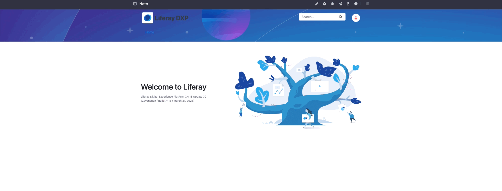

# Using a Theme CSS Client Extension

{bdg-secondary}`Available Liferay 7.4 U45+/GA45+`

With a theme CSS client extension, you can override the current theme's CSS files (`main.css` and `clay.css`) to change the look and feel of a page. Start with a client extension from the [sample workspace](https://github.com/liferay/liferay-portal/tree/master/workspaces/liferay-sample-workspace).

## Prerequisites

1. Install Java (JDK 8 or JDK 11).

    ```{note}
    Check the [compatibility matrix](https://help.liferay.com/hc/en-us/articles/4411310034829-Liferay-DXP-7-4-Compatibility-Matrix) for supported JDKs, databases, and environments. See [JVM Configuration](../../../../installation-and-upgrades/reference/jvm-configuration.md) for recommended JVM settings.
    ```

1. Download and unzip the sample workspace:

   ```bash
   curl -o com.liferay.sample.workspace-latest.zip https://repository.liferay.com/nexus/service/local/artifact/maven/content\?r\=liferay-public-releases\&g\=com.liferay.workspace\&a\=com.liferay.sample.workspace\&\v\=LATEST\&p\=zip
   ```

   ```bash
   unzip com.liferay.sample.workspace-latest.zip
   ```

Now you have the tools to deploy your first theme CSS client extension.

## Examine and Modify the Client Extension

The theme CSS client extension is in the sample workspace's `client-extensions/liferay-sample-theme-css/` folder. It is defined in the `client-extension.yaml` file:

```yaml
liferay-sample-theme-css:
    clayURL: css/clay.css
    mainURL: css/main.css
    name: Liferay Sample Theme CSS
    type: themeCSS
```

The client extension has the ID `liferay-sample-theme-css` and contains the key configurations for a theme CSS client extension, including the type and path to the two CSS resource files. See the [Theme CSS YAML Configuration Reference](../theme-css-yaml-configuration-reference.md) for more information on the available properties.

It also contains the `assemble` YAML block:

```yaml
assemble:
    - from: build/buildTheme/img
      into: static/img
```

This specifies that after building the theme, everything in the `build/buildTheme/img/` folder should be included as a static resource in the built client extension `.zip` file. The image file included in the theme CSS client extension is used as a static resource in Liferay.

The `package.json` file contains the following code:

```json
{
   "dependencies": {
      "sassy-inputs": "1.0.6"
   },
   "liferayDesignPack": {
      "baseTheme": "styled"
   },
   "main": "package.json",
   "name": "@liferay/liferay-sample-theme-css",
   "version": "1.0.0"
}
```

The `dependencies` section includes the `sassy-inputs` library. This is not used in the example, but describes how an npm module is imported and used in your theme CSS client extension. The `liferayDesignPack` section describes the base theme used for the styles. Using the `styled` theme ensures that the existing styles specified on pages, fragments and widgets are not impacted. The other fields `main`, `name` and `version` provide required metadata.

```{note}
You can set the base theme to `styled` or `unstyled`. All themes in Liferay use the `unstyled` or `styled` theme as the base. If you apply the theme CSS client extension to a page that uses a different theme, the client extension's styling replaces the styling from the theme. If you change the theme of a page that already uses a theme CSS client extension, the client extension is removed. 
```

The `src/css/_custom.scss` file contains this SCSS:

```css
@import 'sassy-inputs/sass/main';

header {
   background-image: url(../img/header_bg.jpg); 
}
```

The first line imports the npm module added in `package.json`. The CSS modifies the header to use an image as its background.

```{note}
Your code is present inside `_custom.scss` while the `client-extension.yaml` file points to `clay.css` and `main.css`. This is because the theme CSS client extension runs the full Clay CSS build process resulting in a compiled `clay.css` and `main.css` file that also contains the compiled CSS code from `_custom.scss`.
```

Add CSS to create a hover effect for all images. Open the `_custom.scss` file, add a declaration for `img:hover`, and specify these properties:

```css
img:hover{
   border: 2px solid red;
   border-radius: 10%;
}
```

This defines images as having a `2px` red border and rounded edges on hover.

Now deploy the client extension.

## Deploy the Client Extension to Liferay

```{include} /_snippets/run-liferay-portal.md
```

Once Liferay starts, run this command from the client extension's folder in the sample workspace:

```bash
../../gradlew clean deploy -Ddeploy.docker.container.id=$(docker ps -lq)
```

This builds your client extension and deploys the zip to Liferay's `deploy/` folder.

```{note}
To deploy your client extension to Liferay Experience Cloud, use the Liferay Cloud [Command-Line Tool](https://learn.liferay.com/w/liferay-cloud/reference/command-line-tool) to run [`lcp deploy`](https://learn.liferay.com/w/liferay-cloud/reference/command-line-tool#deploying-to-your-liferay-cloud-environment).
```

```{tip}
To deploy all client extensions in the workspace simultaneously, run the command from the `client-extensions/` folder.
```

Confirm the deployment in your Liferay instance's console:

```bash
STARTED liferay-sample-theme-css_1.0.0
```

## Use the Client Extension on a Page

Configure a page to use your deployed client extension:

1. On a page, click _Edit_ () at the top.

1. In the sidebar, navigate to the _Page Design Options_ menu () and click _configuration icon_ () at the top of the menu.

1. In the _Theme CSS Client Extension_ section under the _Look and Feel_ tab, click Add ().

1. Select the newly deployed client extension, _Liferay Sample Theme CSS_.

   

1. Scroll down and click _Save_.

In the page editor, the background on the header is an image, and every link that you hover over has changed background and text color. To see your changes applied on the page outside Edit mode, you must publish the page.



## Next Steps

You have successfully used a theme CSS client extension in Liferay. Next, try deploying other client extension types.

* [Using a CSS Client Extension](./using-a-css-client-extension.md)
* [Using a JS Client Extension](./using-a-javascript-client-extension.md)
* [Using a Theme Favicon Client Extension](./using-a-theme-favicon-client-extension.md)