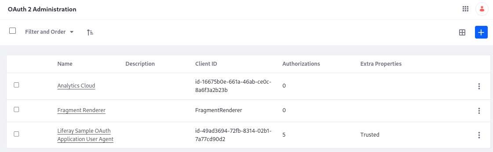

# Using a Microservice Client Extension

A microservice client extension is a standalone server process that relies on OAuth 2 for communication with Liferay. In this paradigm, the microservice is a resource server and Liferay is the authorization server. See [Using OAuth 2](../../../../headless-delivery/using-oauth2.md) for more information. The sample projects used in this demostration display the payload from a protected route in the resource server (microservice) and displays it in a front-end widget based on a [custom element](../../front-end-client-extensions/understanding-custom-element-and-iframe-client-extensions.md) client extension. In order to run the standalone server application [a Spring Boot Application](https://docs.spring.io/spring-boot/docs/current/reference/html/getting-started.html#getting-started), two client extensions types are used in this example:

| Deployable or Runnable Code                            | Type                                                                                                                                     | Description                                                                                                       | Workspace Sample |
| :----------------------------------------------------- | :--------------------------------------------------------------------------------------------------------------------------------------- | :---------------------------------------------------------------------------------------------------------------- | :--- |
| Deploy the Liferay Sample OAuth Application User Agent | Client extension: [`oAuthApplicationUserAgent`](../../configuration-client-extensions/oauth-user-agent-yaml-configuration-reference.md)  | Configures the authorization channel so the logged in user sees the microservice's payload in the custom element. | liferay-sample-etc-spring-boot  |
| Run the Spring Boot microservice application           | Protected endpoint: `/dad/joke`                                                                                                          | A protected endpoint to the resource server. It takes a Jwt token and returns a payload.                          | liferay-sample-etc-spring-boot  |
| Deploy the Liferay Sample Custom Element 2             | Client extension: [`customElement`](../../front-end-client-extensions/custom-element-yaml-configuration-reference.md)                    | Defines a custom element and requests the payload from the resource server, through its OAuth 2 client code.      | liferay-sample-custom-element-2 |

In this example, the resource server has the protected route `/dad/joke` . For any client (in our example, its the front-end widget that makes a request), must be logged into the portal and then request an authorization code from the Authorization server (Liferay) to gain a token to talk with the resource server (Spring Boot Application).  An authenticated user loads a page with the client application on it (the custom element). The custom element requests an authorization code, which is made available by the communication channel configured by our user agent extension (i.e., Liferay is the authorization server). Liferay returns the code, then the client asks for the access token. With the token, the endpoint in the microservice is accessible by the client.  The resource server is responsible for validating this JWT token with Liferay using the JWKS URI endpoint (In our sample this is done automatically)

Extensions of type `oAuthApplicationUserAgent` are registered as having a client profile User Agent Application, meaning that the Authorization Code flow is being used.

## Prerequisites

To start developing client extensions,

1. Install Java (JDK 8 or JDK 11).

   ```{note}
   Check the [compatibility matrix](https://help.liferay.com/hc/en-us/articles/4411310034829-Liferay-DXP-7-4-Compatibility-Matrix) for supported JDKs, databases, and environments. See [JVM Configuration](../../../../installation-and-upgrades/reference/jvm-configuration.md) for recommended JVM settings.
   ```

1. Download and unzip the sample workspace:

   ```bash
   curl -o com.liferay.sample.workspace-latest.zip https://repository.liferay.com/nexus/service/local/artifact/maven/content\?r\=liferay-public-releases\&g\=com.liferay.workspace\&a\=com.liferay.sample.workspace\&\v\=LATEST\&p\=zip
   ```

   ```bash
   unzip -d liferay-sample-workspace com.liferay.sample.workspace-latest.zip
   ```

Now you have the tools to start the microservice and deploy the client extension(s) to Liferay. 

```{include} /_snippets/run-liferay-portal.md
```

## Examine the Microservice Project's Client Extensions

The `client-extensions/liferay-sample-etc-spring-boot/client-extension.yaml` file defines the microservice client extension project in the sample workspace:

```yaml
assemble:
    - fromTask: bootJar
liferay-sample-notification-type-1:
    name: Liferay Sample Notification Type 1
    oAuth2ApplicationExternalReferenceCode: liferay-sample-oauth-application-user-agent
    resourcePath: /sample/notification/type/1
    type: notificationType
liferay-sample-oauth-application-user-agent:
    name: Liferay Sample OAuth Application User Agent
    scopes:
        - Liferay.Headless.Admin.Workflow.everything
    type: oAuthApplicationUserAgent
liferay-sample-object-action-1:
    name: Liferay Sample Object Action 1
    oAuth2ApplicationExternalReferenceCode: liferay-sample-oauth-application-user-agent
    resourcePath: /sample/object/action/1
    type: objectAction
liferay-sample-object-action-2:
    name: Liferay Sample Object Action 2
    oAuth2ApplicationExternalReferenceCode: liferay-sample-oauth-application-user-agent
    resourcePath: /sample/object/action/2
    type: objectAction
liferay-sample-workflow-action-1:
    name: Liferay Sample Workflow Action 1
    oAuth2ApplicationExternalReferenceCode: liferay-sample-oauth-application-user-agent
    resourcePath: /sample/workflow/action/1
    type: workflowAction
```

The `client-extensions/liferay-sample-etc-spring-boot/client-extension.dev.yaml` file defines the details of the local microservice server process details.  (Only used in local development, not in LXC)

```yaml
liferay-sample-oauth-application-user-agent:
    .serviceAddress: localhost:58081
    .serviceScheme: http
```

Most of the defined client extensions (the ones with `type: *Action`) are not needed for this example. The necessary YAML can be boiled down to

```yaml
assemble:
    - fromTask: bootJar
liferay-sample-oauth-application-user-agent:
    name: Liferay Sample OAuth Application User Agent
    scopes:
        - Liferay.Headless.Admin.Workflow.everything
    type: oAuthApplicationUserAgent
```

The external application/microservice is created with the `bootJar` command.

<!--There are some confusing things about this. You have to deploy this to Liferay, but you have to do it by running a weird command at the workspace root, gw :client-extensions:liferay-sample-etc-spring-boot:deploy. The deploy command isn't even available for the client extension (../../gradlew tasks). Also, I want to talk about bootJar and have the reader run it, but in reality we need bootRun, part of the liferay gradle plugin.

** Greg edit **
This has been addressed and now you can run `gw deploy` from within the client extension project, so the steps are
1. gw deploy
2. gw bootRun
-->

The most important part of the `client-extension.yaml` is in the `liferay-sample-oauth-application-user-agent` definition. This sets up Liferay as the authorization server, so that the front-end client extension you deploy next can call the resource server's secure endpoint and display its payload.

## Examine the Custom Element Project's Client Extensions

The `client-extensions/liferay-sample-custom-element-2/client-extension.yaml` file defines the custom-element client extension project in the sample workspace:

```yaml
assemble:
    - from: build/static
      into: static
liferay-sample-custom-element-2:
    cssURLs:
        - css/main.*.css
    friendlyURLMapping: liferay-sample-custom-element-2
    htmlElementName: liferay-sample-custom-element-2
    instanceable: false
    name: Liferay Sample Custom Element 2
    portletCategoryName: category.client-extensions
    type: customElement
    urls:
        - js/main.*.js
    useESM: true
```

<!--This custom element isn't the main point but I need to briefly describe it anyway -->

## Deploy the OAuth Application User Agent Client Extension

1. Go to the root of the sample workspace.

1. Run

   ```bash
   ./gradlew :client-extensions:liferay-sample-etc-spring-boot:deploy
   ```

1. In Liferay's log, confirm that the client extension deployed and started:

   ```bash
   STARTED liferay-sample-etc-spring-boot_1.0.0 [1588]
   ```

1. Verify that the OAuth Application User Agent was added to Liferay. Go to _Control Panel_ &rarr; _OAuth2 Administration_.

   

The Liferay Sample OAuth Application User Agent provides the [OAuth2 authorization](../../../../headless-delivery/using-oauth2.md) needed so that Liferay can access the Spring Boot application's data through its protected endpoint. All that is needed for Liferay to authorize the application in this case is declaring the external reference code in the `application-default.properties`:

```properties
liferay.oauth.application.external.reference.codes=liferay-sample-etc-spring-boot-oauth-application-user-agent
```

## Start the Microservice

From the `client-extensions/liferay-etc-spring-boot/` folder, run

```sh
../../gradlew bootRun
```

The Spring Boot application starts and prints messages in the log:

```bash
...
<==========---> 80% EXECUTING [1h 43m 56s]
> :client-extensions:liferay-sample-etc-spring-boot:bootRun
```

<!-- 
** Greg edit **
It would be good to show the message also of a successful start (spring boot startup log)
Also you could show the liferay dxp server log where it shows the client id is regsitered.
-->

## Deploy the Custom Element Client Extension

The microservice is running, and the OAuth2 Application communication channel is now provisioned and available in DXP. This example uses a [Custom Element client extension](../../front-end-client-extensions/understanding-custom-element-and-iframe-client-extensions.md) to display the data generated by the microservice. To deploy it,

1. Go to the `client-extensions/liferay-sample-custom-element-2` folder.
1. Run 

   ```bash
   ../../gradlew clean deploy
   ```

## Display Dad Jokes on a Page

Add the Custom Element 2 widget to a page in your running Liferay. When you publish the page, dad jokes are displayed in the widget:


## Additional Details

<!--More detailed OAuth 2 stuff, or is keeping it simple better?-->
<!-- ** Greg edit** I think it iwould be good to describe how the Javascript widget calls Liferay.OAuth2.FromApplication('...') and explain that it does the authorization flow and gets a token and then uses that token as Bearer Token in the request to the `client-extension` resource server `/dad/joke`.  ANnd we need to mention that this "location" of the server is abstrated from the developer.  Its encoded in the details of the OAuth2 application.  Locally it will be http://locahost:58081/.... but in LXC it will be `https://<lxc-provisioned-subdomain>.lxc.lifera.com/....` -->
