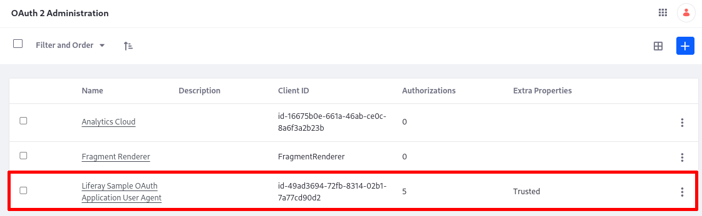

# Using a Microservice Client Extension

A microservice client extension is a standalone server process that relies on OAuth 2 for communication with Liferay. The microservice is a resource server and Liferay is the authorization server. See [Using OAuth 2](../../../headless-delivery/using-oauth2.md) for more information. The sample projects in this demonstration ingest the payload from a protected route in the resource server (microservice) and display it in a frontend widget based on a [custom element](../frontend-client-extensions/understanding-custom-element-and-iframe-client-extensions.md) client extension. In order to coordinate with the standalone [Spring Boot application](https://docs.spring.io/spring-boot/docs/current/reference/html/getting-started.html#getting-started), two client extension types are used in this example:

| Deployable or Runnable Code                            | Type                                                                                                                                    | Description                                                                                                       | Workspace Sample                |
|:-------------------------------------------------------|:----------------------------------------------------------------------------------------------------------------------------------------|:------------------------------------------------------------------------------------------------------------------|:--------------------------------|
| Deploy the Liferay Sample OAuth Application User Agent | Client extension: [`oAuthApplicationUserAgent`](../configuration-client-extensions/oauth-user-agent-yaml-configuration-reference.md) | Configures the authorization channel so the logged in user sees the microservice's payload in the custom element. | liferay-sample-etc-spring-boot  |
| Run the Spring Boot microservice application           | Protected endpoint: `/dad/joke`                                                                                                         | A protected endpoint to the resource server. It takes a JWT token and returns a payload.                          | liferay-sample-etc-spring-boot  |
| Deploy the Liferay Sample Custom Element 2             | Client extension: [`customElement`](../frontend-client-extensions/custom-element-yaml-configuration-reference.md)                   | Defines a custom element and requests the payload from the resource server, through its OAuth 2 client code.      | liferay-sample-custom-element-2 |

```{note}
For convenience, this tutorial uses the ready-to-deploy custom element from the sample workspace. However, the custom element client extension isn't the focus here. Any frontend technology that can call the authorization server and display the payload from the resource server can be used in place of the custom element.
```

The resource server has the protected route `/dad/joke`. On the behalf of the logged in user, the client (i.e., widget) requests an authorization code from the authorization server (Liferay). Once a token is granted, the client communicates with the resource server (Spring Boot application). 

Extensions of type `oAuthApplicationUserAgent` are registered as having a client profile User Agent Application, meaning that the authorization code flow is used.

## Prerequisites

To start developing client extensions,

1. Install Java (JDK 8 or JDK 11).

   ```{note}
   Check the [compatibility matrix](https://help.liferay.com/hc/en-us/articles/4411310034829-Liferay-DXP-7-4-Compatibility-Matrix) for supported JDKs, databases, and environments. See [JVM Configuration](../../../installation-and-upgrades/reference/jvm-configuration.md) for recommended JVM settings.
   ```

1. Download and unzip the sample workspace:

   ```bash
   curl -o com.liferay.sample.workspace-latest.zip https://repository.liferay.com/nexus/service/local/artifact/maven/content\?r\=liferay-public-releases\&g\=com.liferay.workspace\&a\=com.liferay.sample.workspace\&\v\=LATEST\&p\=zip
   ```

   ```bash
   unzip -d liferay-sample-workspace com.liferay.sample.workspace-latest.zip
   ```

Now you have the tools to start the microservice and deploy the client extension(s) to Liferay. 

```{include} /_snippets/run-liferay-portal.md
```

## Examine the Microservice Project's Client Extensions

The `client-extensions/liferay-sample-etc-spring-boot/client-extension.yaml` file defines the microservice client extension project in the sample workspace. Most of the defined client extensions (e.g., the ones with `type: *Action`) are not needed for this example. The necessary lines from the `client-extension.yaml` can be boiled down to

```yaml
assemble:
    - fromTask: bootJar
liferay-sample-etc-spring-boot-oauth-application-user-agent:
    .serviceAddress: localhost:58081
    .serviceScheme: http
    name: Liferay Sample Etc Spring Boot Spring Boot OAuth Application User Agent
    scopes:
        - Liferay.Headless.Admin.Workflow.everything
    type: oAuthApplicationUserAgent
```

The external application/microservice is created with the `bootJar` command that is available from the [Spring Boot Gradle Plugin](https://docs.spring.io/spring-boot/docs/current/gradle-plugin/reference/htmlsingle/). The application JAR must be included in the LUFFA for deployment in Liferay SaaS.

The most important part of the `client-extension.yaml` is in the `liferay-sample-etc-spring-boot-oauth-application-user-agent` definition. This sets up Liferay as the authorization server, so that the frontend client extension you deploy next can call the resource server's secure endpoint and display its payload.

## Examine the Custom Element Project's Client Extensions

The `client-extensions/liferay-sample-custom-element-2/client-extension.yaml` file defines the custom-element client extension project in the sample workspace:

```yaml
assemble:
    - from: build/static
      into: static
liferay-sample-custom-element-2:
    cssURLs:
        - css/main.*.css
    friendlyURLMapping: liferay-sample-custom-element-2
    htmlElementName: liferay-sample-custom-element-2
    instanceable: false
    name: Liferay Sample Custom Element 2
    portletCategoryName: category.client-extensions
    type: customElement
    urls:
        - js/main.*.js
    useESM: true
```

See [Understanding Custom Element and IFrame Client Extensions](../frontend-client-extensions/understanding-custom-element-and-iframe-client-extensions.md) for more information.

## Deploy the OAuth Application User Agent Client Extension

1. Go to the sample workspace's `client-extensions/liferay-sample-etc-spring-boot` folder.

1. Run

   ```bash
   ../../gradlew clean deploy -Ddeploy.docker.container.id=$(docker ps -lq)
   ```

1. In Liferay's log, confirm that the client extension deployed and started:

   ```log
   STARTED liferay-sample-etc-spring-boot_1.0.0 [1588]
   2023-06-07 14:24:56.245 INFO  [fileinstall-directory-watcher][BundleStartStopLogger:77] STARTED liferay-sample-etc-spring-boot_1.0.0 [1702]
   2023-06-07 14:24:56.315 INFO  [CM Event Dispatcher (Fire ConfigurationEvent: pid=com.liferay.oauth2.provider.configuration.OAuth2ProviderApplicationUserAgentConfiguration~liferay-sample-etc-spring-boot-oauth-application-user-agent)][InterpolationConfigurationPlugin:135] Replaced value of configuration property 'homePageURL' for PID com.liferay.oauth2.provider.configuration.OAuth2ProviderApplicationUserAgentConfiguration~liferay-sample-etc-spring-boot-oauth-application-user-agent
   2023-06-07 14:24:56.365 INFO  [CM Event Dispatcher (Fire ConfigurationEvent: pid=com.liferay.oauth2.provider.configuration.OAuth2ProviderApplicationUserAgentConfiguration~liferay-sample-etc-spring-boot-oauth-application-user-agent)][OAuth2ProviderApplicationUserAgentConfigurationFactory:179] OAuth 2 application with external reference code liferay-sample-etc-spring-boot-oauth-application-user-agent and company ID 20096 has client ID id-df5840e5-a91c-dcae-9bd8-873508a699
   ```

   In addition, messages about the OAuth user agent are logged.

1. Verify that the OAuth Application User Agent was added to Liferay. Go to _Control Panel_ &rarr; _OAuth2 Administration_.

   

The Liferay Sample OAuth Application User Agent provides the [OAuth 2 authorization](../../../headless-delivery/using-oauth2.md) needed so that Liferay can access the Spring Boot application's data through its protected endpoint. All that is needed for Liferay to authorize the application in this case is declaring the external reference code in the `application-default.properties`:

```properties
liferay.oauth.application.external.reference.codes=liferay-sample-etc-spring-boot-oauth-application-user-agent
```

## Start the Microservice

From the `client-extensions/liferay-etc-spring-boot/` folder, run

```sh
../../gradlew bootRun
```

The Spring Boot application starts and prints messages in the log:

```log
...
2023-06-07 10:33:44.514  INFO 2897671 --- [           main] o.s.b.w.embedded.tomcat.TomcatWebServer  : Tomcat started on port(s): 58081 (http) with context path ''
2023-06-07 10:33:44.519  INFO 2897671 --- [           main] c.l.sample.SampleSpringBootApplication   : Started SampleSpringBootApplication in 1.094 seconds (JVM running for 1.262)
<==========---> 80% EXECUTING [1h 43m 56s]
> :client-extensions:liferay-sample-etc-spring-boot:bootRun
```

## Deploy the Custom Element Client Extension

The microservice is running, and the OAuth2 Application communication channel is now provisioned and available in DXP. This example uses a [Custom Element client extension](../frontend-client-extensions/understanding-custom-element-and-iframe-client-extensions.md) to display the data generated by the microservice. To deploy it,

1. Go to the `client-extensions/liferay-sample-custom-element-2` folder.

1. Run 

   ```bash
   ../../gradlew clean deploy -Ddeploy.docker.container.id=$(docker ps -lq)
   ```

## Display Dad Jokes on a Page

Add the Liferay Sample Custom Element 2 widget to a page in your running Liferay. When you publish the page, dad jokes appear in the widget:


## How OAuth2 Authorizes the Request

When an authenticated user loads a page with the client application on it (the custom element), it requests an authorization code, which is available because of the communication channel configured by the user agent extension (i.e., Liferay is the authorization server). Liferay returns the code, then the client asks for the access token. With the token, the client can access the endpoint in the microservice. The resource server validates the JWT token with Liferay using the JWKS URI endpoint. This is done automatically in the background.

In the `DadJoke.js` file of the `liferay-sample-custom-element-2` client extension, there's an important call that initiates the authorization pipeline:

```js
try {
	oAuth2Client = Liferay.OAuth2Client.FromUserAgentApplication(
		'liferay-sample-etc-spring-boot-oauth-application-user-agent'
	);
}
```

This call provides the client with a token, which the client can use as a bearer token when requesting the resources from the `/dad/joke` route in the resource server. The client code doesn't need to worry about the location of the server it's requesting, as this information is encapsulated in the OAuth 2 application. In self-hosted environments it's declared in the OAuth application user agent's `client-extension.yaml` properties, as `.serviceAddress` and `.serviceScheme`. In Liferay SaaS environments the resource server is controlled by Liferay, so no declaration of its location is necessary. This sets up authorization code flow for the client and resource server communication, so all that's left is for the client to call the endpoint in the resource server. `DadJoke.js` fetches from the `/dad/joke` route like this:

```js
React.useEffect(() => {
   oAuth2Client
      ?.fetch('/dad/joke')
      .then((response) => response.text())
      .then((joke) => {
         setJoke(joke);
      })
      .catch((error) => console.log(error));
}, []);
```

<!-- Greg 
I think it would be good I think to show the request coming into the RestController and explain a bit about the JWT that is available there (representing the user)
     Russ
I'm leaving this comment because Greg hasn't validated the below text.
-->

The OAuth client sends a `Jwt` token to the microservice, representing the authenticated user. Included is the authorization code, permissions that are granted, and many other details. This sample prints these details to the log for convenience:

```log
2023-06-08 16:01:42.617  INFO 3851009 --- [io-58081-exec-5] c.liferay.sample.DadJokeRestController   : JWT Claims: {sub=20123, grant_type=authorization_code, authorization_code=404dd760ffcaa322fd38387319941990e5e10bb2d97ab360e63271f613eb33f1, scope=Liferay.Headless.Admin.Workflow.everything, iss=localhost, exp=2023-06-08T20:10:51Z, iat=2023-06-08T20:00:51Z, jti=8ffd31c001c54b1331d484731ff1e43b341dd4cb7232b98da96a4aaec6b6a6d, client_id=id-60ac3dc8-f5e8-484e-25b3-23d435e838c6, code_verifier=~zACCmEV6ZuhZHAZ0Q.RaEvGo5YUMF6x2QimtgT4lgXjWB6_Jc0QtVDNrtnxeOTfondPxH4pwxY0aAI-Op0oz1vajQTTqhrNegJnSZ4vLEBZGgE9m5Jgmi3ORDy1Bg7Q, username=test@liferay.com}
2023-06-08 16:01:42.618  INFO 3851009 --- [io-58081-exec-5] c.liferay.sample.DadJokeRestController   : JWT ID: 8ffd31c001c54b1331d484731ff1e43b341dd4cb7232b98da96a4aaec6b6a6d
2023-06-08 16:01:42.618  INFO 3851009 --- [io-58081-exec-5] c.liferay.sample.DadJokeRestController   : JWT Subject: 20123
```
