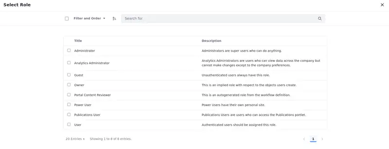

# Implementing an Item Selector

*Item selectors* are pop-up dialogs for selecting assets, such as documents, videos, or users.

By configuring the item selector's criteria and defining its usage, you can create item selector dialogs for your own application.


## Start with a Sample Module

To implement an item selector, you must embed it in an application, such as a module for a widget. This example uses an [MVC Portlet](../developing-a-java-web-application/using-mvc/using-a-jsp-and-mvc-portlet.md) with a JSP view. The item selector displays a list of roles to be selected.

1. Download the sample module:

   ```bash
   curl https://resources.learn.liferay.com/dxp/latest/en/building-applications/data-frameworks/liferay-f5d5.zip -O
   ```

   ```bash
   unzip liferay-f5d5.zip
   ```

1. ```{include} ../../_snippets/run-liferay-portal.md
   ```

1. Run the following commands from the root of the module to build and deploy to your Docker container:

   ```bash
   ./gradlew deploy -Ddeploy.docker.container.id=$(docker ps -lq)
   ```

   ```{tip}
   This command is the same as copying the deployed jars to `/opt/liferay/osgi/modules` on the Docker container.
   ```

1. Confirm the deployment in the Liferay Docker container console.

   ```bash
   STARTED com.acme.f5d5.web_1.0.0 [1017]
   ```

   The example portlet module is deployed. When you add it to a page, it's a simple portlet with one button.

   

1. Click *Select* and the Item Selector appears:

   

1. Select an item and its value appears in a JavaScript alert box. Since this item selector selects roles, the displayed value is the primary key of the selected role.

## Setting an Item Selector's Criteria in your Controller

In an MVC Portlet pattern, the `Portlet` class is the controller class (the C in MVC). It defines the necessary criteria for the selector (i.e., the rule it will use to choose the entity) and creates a URL for that criteria.

1. Open the `F5D5Portlet.java` class.

1. At the bottom of the class, OSGi injects an [`ItemSelector` class](https://github.com/liferay/liferay-portal/blob/master/modules/apps/item-selector/item-selector-api/src/main/java/com/liferay/item/selector/ItemSelector.java) instance because of the `@Reference` annotation.

   ```java
   @Reference
   private ItemSelector _itemSelector;
   ```

1. Scroll to the portlet's `render` method.

1. The method creates a criterion class instance to represent the desired entities to display in the item selector. Criterion classes must implement the [`ItemSelectorCriterion` interface](https://docs.liferay.com/dxp/apps/item-selector/latest/javadocs/com/liferay/item/selector/ItemSelectorCriterion.html).

   This example uses a reference to [`RoleItemSelectorCriterion`](https://docs.liferay.com/dxp/apps/roles/latest/javadocs/com/liferay/roles/item/selector/RoleItemSelectorCriterion.html) so that roles are shown in the selector. It's defined by creating a new instance of the class.

   ```java
   ItemSelectorCriterion itemSelectorCriterion =
        new RoleItemSelectorCriterion();
   ```

   ```{tip}
   If no criterion exists for the type of entity that you need, you can create your own `ItemSelectorCriterion` class by extending `BaseItemSelectorCriterion`.
   ```

1. Next, you need a return type class to represent the information provided by the entities when users select them. Return type classes must implement the [`ItemSelectorReturnType` interface](https://docs.liferay.com/dxp/apps/item-selector/latest/javadocs/com/liferay/item/selector/ItemSelectorReturnType.html). For example, the class may be used to return the entity's URL, UUID, or primary key. The return type class is added to the criterion class created previously.

   ```{important}
   Every criterion **must** have at least one return type associated with it when used.
   ```

   This example uses a reference to [`UUIDItemSelectorReturnType`](https://docs.liferay.com/dxp/apps/item-selector/latest/javadocs/com/liferay/item/selector/criteria/UUIDItemSelectorReturnType.html) to define the selected roles' `UUID` value as the data to return. If multiple roles are selected, they are returned as a comma-delimited list.

   ```{note}
   If a UUID is not available, the primary key is returned.
   ```

1. Define the return type by registering it with the item criterion:

   ```java
	itemSelectorCriterion.setDesiredItemSelectorReturnTypes(
		new UUIDItemSelectorReturnType());
   ```

   ```{tip}
   If no return class exists for the type of information you need, then you can define your own with the [ItemSelectorReturnType](https://github.com/liferay/liferay-portal/blob/master/modules/apps/item-selector/item-selector-api/src/main/java/com/liferay/item/selector/ItemSelectorReturnType.java) implementation.
   ```

   The item selector uses the criterion and return type classes to decide what selection views of items (presented as tabs) to show and how to identify each item.

1. Now you can use the criteria to generate a URL for the item selector. This URL creates the item selector dialog in your front-end code.

   The [`RequestBackedPortletURLFactory` class](https://docs.liferay.com/portal/7.4-latest/javadocs/portal-kernel/com/liferay/portal/kernel/portlet/RequestBackedPortletURLFactory.html) can quickly generate an item selector URL using the criteria:

   ```java
	PortletURL itemSelectorURL = _itemSelector.getItemSelectorURL(
		RequestBackedPortletURLFactoryUtil.create(renderRequest),
		renderResponse.getNamespace() + "selectRole",
		itemSelectorCriterion);
   ```

   ```{important}
   The String you use to generate the URL (in this example, ``selectRole``) is the dialog's event name. This must match a value you'll use later when creating the dialog in your front-end code.
   ```

1. Add the item selector URL to the `renderRequest` so that it's available in the JSP:

   ```java
   renderRequest.setAttribute(F5D5WebKeys.ITEM_SELECTOR_URL, itemSelectorURL);
   ```

   The `view.jsp` file is where the front-end code is defined. The `renderRequest` object in your Java class' `render` method is passed to the JSP file. Use a constant to make sure you identify the URL in both the controller (portlet class) and the view (JSP).

1. Finally, call `MVCPortlet`'s `render` method to continue the rendering process once your code is executed:

   ```java
   super.render(renderRequest, renderResponse);
   ```

That's the controller code. Execution now passes to the view layer (the V in MVC), which is implemented in the `view.jsp` file.

## Use the Item Selector in Your View

You must retrieve the item selector and define a way to use it in your front-end code.

1. Open `view.jsp` from the example.

1. You can use a [Clay button](https://clayui.com/docs/components/button.html) tag to create a button to open your item selector:

   ```jsp
   <clay:button
     id='<%= liferayPortletResponse.getNamespace() + "selectRoleButton" %>'
     label="Select"
   />
   ```

   The `clay:button` tag creates a button with the ID `selectRoleButton` and the label Select displayed on your widget. This button can be identified by the String `<portlet:namespace />selectRoleButton`.

1. Use the `<script>` tag to embed JavaScript that opens the item selector:

   ```jsp
   <script>
      var selectRoleButton = document.getElementById('<portlet:namespace />selectRoleButton');

      selectRoleButton.addEventListener(
         'click',
         function(event) {
            Liferay.Util.openSelectionModal(
               {
                  onSelect: function (event) {
                     alert(event.value);
                  },
                  selectEventName: '<portlet:namespace />selectRole',
                  title: 'Select Role',
                  url: '<%= request.getAttribute(F5D5WebKeys.ITEM_SELECTOR_URL) %>'
               }
            );
         }
      );
   </script>
   ```

This snippet of JavaScript first retrieves the Select button through its identifier (`portlet:namespace />selectRoleButton`). Then it adds an event listener to create the item selector dialog when clicked.

The `Liferay.Util.openSelectionModal` method creates the dialog.

The `onSelect` field must define a function to handle the value when it is clicked. Define the dialog's behavior when the user makes a selection within this function. In this implementation, it shows an alert box containing the selected value.

The value for the `selectEventName` field must match the String you used with the `RequestBackedPortletURLFactory` in the Java code (in this example, `selectRole`).

You must also retrieve the item selector URL from the request where the controller stored it, using the same constant to identify it, supplying it in the `url` field.

```{tip}
If you want your item selector to support selecting multiple items, you can enable multiple selection by adding `multiple: true` to the `openSelectionModal` call.
```

Use the item selection stored in `event`. The data type and information contained in the result depends on what return type class you used in the Java code. Since this example uses `UUIDItemSelectorReturnType`, the data is a String value with the UUIDs of one or more selected items.

Inside the selection function, you implement how you want to use the value. This example shows a simple JavaScript alert.

Now that you've seen how it works, you can replace the JavaScript alert with something more useful.

## Add A Form

When you use an item selector, you want the selected value inserted into a form. Here's how to do that:

1. Open `view.jsp`.

1. Find the `<clay:button>` tag. Surround it with a form like this:

   ```jsp
   <form name="<portlet:namespace/>form">
      <input name="role" />
      <clay:button
         id='<%= liferayPortletResponse.getNamespace() + "selectRoleButton" %>'
         label="Select"
      />
   </form>
   ```

   Now you have a form with one input field called `role`.

1. Scroll down to the JavaScript alert. Replace the JavaScript alert with a call to Liferay's front-end `setFormValues` method:

   ```jsp
   Liferay.Util.setFormValues(document.<portlet:namespace />form, {
          role: event.value
   });
   ```

1. Redeploy the portlet:

   ```bash
   ./gradlew deploy -Ddeploy.docker.container.id=$(docker ps -lq)
   ```

1. Now select an item as you did before. Its ID is inserted into the form field you created.

## Conclusion

Congratulations! You now know how to implement an item selector!
