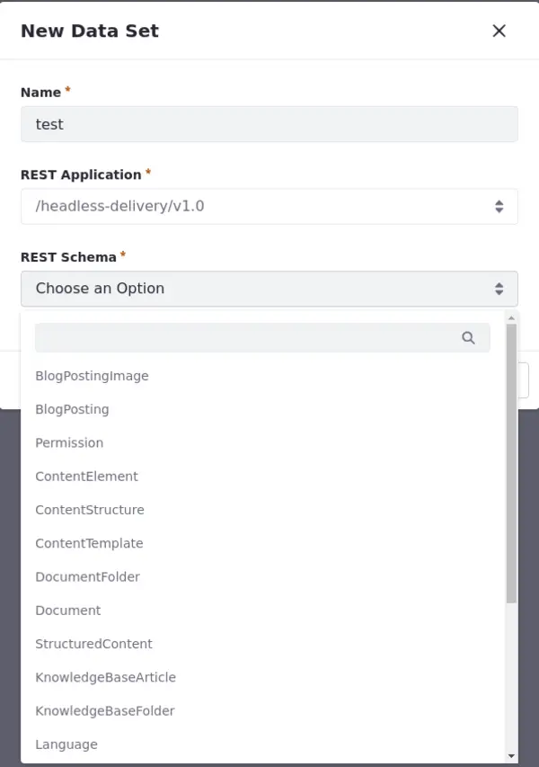

---
toc:
  - ./data-sets/creating-data-sets.md
  - ./data-sets/data-set-views.md
uuid: 314a9243-1503-437a-a275-802b8b5a571b
taxonomy-category-names:
  - Development and Tooling
  - Data Sets
  - Liferay Self-Hosted
  - Liferay SaaS
---

# Data Sets

{bdg-secondary}`Liferay DXP 2024.Q1 U112`
{bdg-link-primary}`[Beta Feature](../system-administration/configuring-liferay/feature-flags.md#beta-feature-flags)`

Data sets are like virtual containers that help organize and manage related data in Liferay. They gather information from different resources available through Liferay headless APIs (e.g., object definitions, blog posts, documents, and more), making it easier to handle everything in one place. Use the [API Explorer](../headless-delivery/consuming-apis/consuming-rest-services.md) to access the full list of available headless APIs.



Here are some uses for data sets:

- Aggregate data from multiple sources, such as customer profiles, transaction records, and product catalogs, to generate comprehensive analytics reports or personalized experiences. With data sets, you can harmonize data sources for insightful analysis.

- Consolidate information into cohesive data sets, enabling seamless content management and publication workflows.

- Tailor content display based on user preferences or behaviors. With data sets and views, you can craft dynamic content layouts that adapt to individual user segments, delivering personalized experiences.

You [create](./data-sets/creating-data-sets.md), organize, and control your data sets using the Data Set Manager application. 

But data sets aren't just about gathering and organizing data. They're also about displaying it in the best way possible. With [data set views](./data-sets/data-set-views.md), you can customize how your data is presented to users.

By using data sets and views, you have more control over your data. Whether you're displaying content on pages, personalizing experiences, or just trying to make sense of a lot of information, data sets get the job done. Make data management easier with customizable data sets and views.

Take your data sets even further by integrating them with [experiences](../site-building/personalizing-site-experience/experience-personalization/creating-and-managing-experiences.md) and [segments](../site-building/personalizing-site-experience/segmentation/creating-and-managing-user-segments.md), so you can deliver exactly the right content to the right people at the right time.


```{raw} html
:file: ../landingpage_template.html
```

```{raw} html
:file: data-sets/landing.html
```
