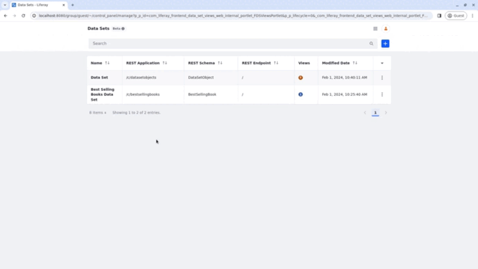
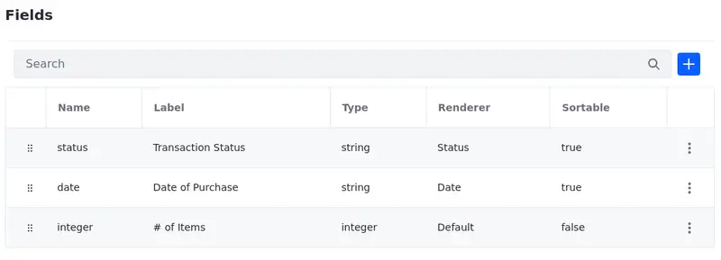
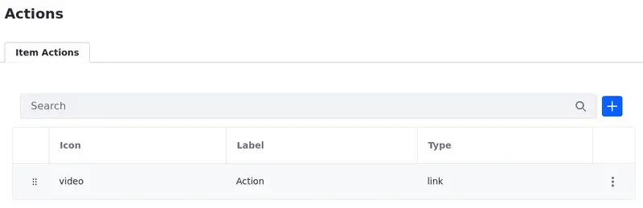

# Creating Data Set Views
{bdg-secondary}`Liferay DXP 2024.Q1 U112`

!!! important
   This feature is currently behind a [developer feature flag](../../system-administration/configuring-liferay/feature-flags.md#dev-feature-flags) (LPS-167253) and a [beta feature flag](../../system-administration/configuring-liferay/feature-flags.md#beta-feature-flags) (LPS-164563).

After [creating data sets](./creating-data-sets.md), you can create data set views to customize how you display your data set.

To create a data set view,

1. Open the *Global Menu* (), select the *Control Panel* tab, and click *Data Sets* under Object.

1. Click on the *Name* of the data set you want to add the view to.

   Alternatively, you can click *Actions* () next to the data set entry and select *Edit*.

1. Click *Add* (), name your data set, and add a description (optional).

1. Click on the name of the data set view to start editing it.

   Alternatively, you can click *Actions* () next to the data set view entry and select *Edit*.

   You can also delete a data set view using the Actions menu.

## Managing Data Set Views

The Data Set View application is divided in tabs,

- In the Details tab, see and edit the name (1) and description (2) of your data set view. Click *Save* once the alterations are complete to save them.

   You can also see the information about the REST Application, Schema, and Endpoint (3) used with that data set.

   

- In the [Fields tab](./data-set-view-fields.md), select which fields are displayed in your data set view and manage them.

   You can also edit the field, add a friendly label, and localize it, choose a renderer for the field, and define the field as sortable or not sortable.

   

- In the [Filters tab](./data-set-view-filters), define filters that users can apply to the data set fragment. You can apply customized filters using [Client Extensions](../client-extensions.md), use date-type fields and show entries within a given period, or configure [Picklists](../objects/picklists.md) as the source of the options for the filter.

   

- In the [Sorting tab](./data-set-view-sorting), you can set default sorting rules that are applied to the entries once the user vists the page.

   

- In the [Actions tab](./data-set-view-actions),

   

- In the Pagination tab,

   

## Relevant Topics

- [Creating Data Sets](./creating-data-sets.md)

