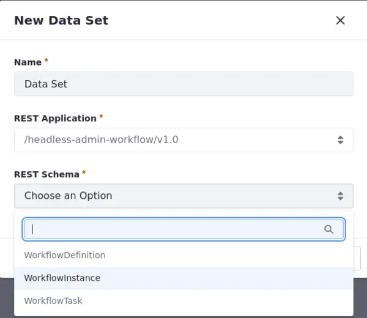
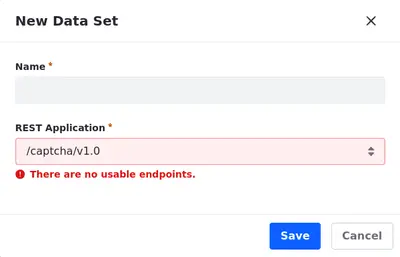
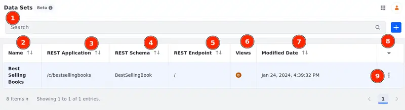

# Creating Data Sets
{bdg-secondary}`Liferay DXP 2024.Q1 U112`
{bdg-link-primary}`[Beta Feature](../system-administration/configuring-liferay/feature-flags.md#beta-feature-flags)`

!!! important
   This feature is currently behind a [developer feature flag](../../system-administration/configuring-liferay/feature-flags.md#dev-feature-flags) (LPS-167253) and a [beta feature flag](../../system-administration/configuring-liferay/feature-flags.md#beta-feature-flags) (LPS-164563).

With Liferay, you can create data sets from different resources available through RESTful APIs. Use data sets to create and manage [data set views](./creating-data-set-views.md) and customize how you display your data set.

## Creating a Data Set

1. Open the *Global Menu* (), select the *Control Panel* tab, and click *Data Sets* under Object.

1. Click *Add* () and name your data set.

1. Choose the REST Application from a list of available options.

   Some of these options enable a REST Schema field where you must select a schema from a list of available options.

   

   !!! note
      When there is only one option available for the REST Schema and Endpoint (e.g. object definitions and `/batch-planner/v1.0`), they are set automatically once you select the REST Application.

1. (When available) Choose a REST Schema from a list of available options.

   Some of these options enable a REST Endpoint field where you must select an endpoint from a list of available options.

   If there is only one Schema available, the option is automatically selected.

1. (When available) Choose a REST Endpoint from a list of available options.

   Some REST Application options don't have usable endpoints, and it's not possible to create data sets with those options (e.g. `/captcha/v1.0` and `/data-engine/v2.0`).

   

1. Click *Save*. The data set is created, and you can see all the information about it in the data set manager.

## Data Set Manager

Once created, data sets are shown in the data set manager. Use the application to view information and edit the existing data sets.

In the data set manager, you can find a Search Bar (1), the Name of the data set (2), the REST Application (3), REST Schema (4), and REST Endpoint (5) applied to the data set, the number of data set views (6) for that specific data set, and the last time the data set was modified (7).

You can also click on the arrow down icon (8) and search for a specific table field or check/uncheck the existing fields to show/hide them in the table.

Edit, rename, alter the permissions, or delete your data set using the data set's Action menu ()(9). Alternatively, click on the name of the data set to edit it.

While editing a data set, you can [create and manage data set views](../data-sets/creating-data-set-views.md).

## Related Topics

- [Creating Data Set Views](../data-sets/creating-data-set-views.md)