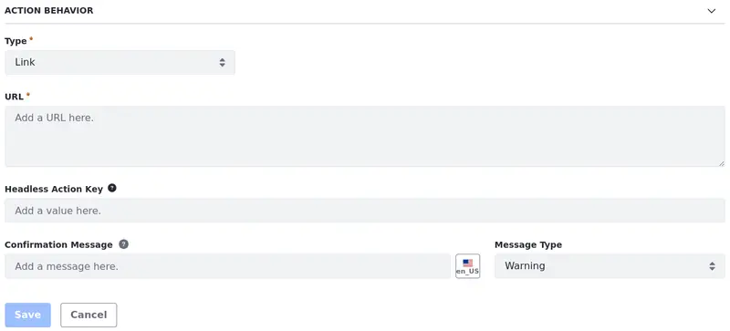

# Data Set View Actions
{bdg-secondary}`Liferay DXP 2024.Q1 U112`
{bdg-link-primary}`[Beta Feature](../system-administration/configuring-liferay/feature-flags.md#beta-feature-flags)`

!!! important
   This feature is currently behind a [developer feature flag](../../system-administration/configuring-liferay/feature-flags.md#dev-feature-flags) (LPS-167253) and a [beta feature flag](../../system-administration/configuring-liferay/feature-flags.md#beta-feature-flags) (LPS-164563).

While managing data set views, you can define actions to be used in the data set fragment. Currently, you can configure Link-type actions that redirect users to a specified URL.

## Adding Actions to the Data Set View

1. Open the *Global Menu* (), select the *Control Panel* tab, and click *Data Sets* under Object.

1. Click on the *Name* of the data set you want to access.

   Alternatively, you can click *Actions* () next to the data set entry and select *Edit*.

1. Click on the *Name* of the data set view to start editing it.

1. Select the Actions tab and click *New* () &rarr; you are redirected to a page where you can configure your action before creating it.

Under the Display Options section,

1. Fill in the Label and, optionally, [localize](./data-set-view-fields.md#editing-and-localizing-labels) it.

1. (Optional) Choose an out-of-the-box icon to show in your Data Set fragment. The icon redirects the user to a specified URL. If no icon is selected, the Action's label appears as text inside a button component.

   

Under the Action Behavior section,

1. The Link Type is selected by default. Use it to redirect users to a specified URL once they click on the action button/icon.

<!-- This will change once new features are introduced. There is talk of adding modals, panels, and buttons to create new elements. Then, I'll restructure this doc and add sections for each of those types. - Eric  -->

1. Specify the URL for redirecting the user.

1. (Optional) Enter a Headless Activation Key. With the activation key, administrators can associate an action to a headless endpoint (e.g. GET, POST, and DELETE).

   So, if you want to create a button with an action to edit a document, you should use `replace` as the Headless Activation Key.

   You can find those activation keys through your [API Explorer](../../headless-delivery/consuming-apis/consuming-rest-services.md). See [Use Case: Using Actions to Edit Documents](./using-data-set-view-actions.md#use-case-using-actions-to-edit-documents) to learn more.

   

   !!! important
       As the action is associated with a headless endpoint, the user must have the necessary permissions to use the endpoint (e.g. to edit the document). Otherwise, the action is not shown.

1. (Optional) Enter a Confirmation Message. The message is shown before the action is executed.

   No message is displayed if this field is left blank.

   You can choose the Message Type from these options: Warning, Info, Secondary, Success, and Danger.

Once you're done, users should be redirected to the selected URL once they click on the action button/icon.

## Related Topics

- [Creating Data Set Views](./creating-data-set-views.md)
- [Creating Data Sets](./creating-data-sets.md)
- [Data Set View Fields](./data-set-view-fields.md)
- [Data Set View Filters](./data-set-view-filters.md)