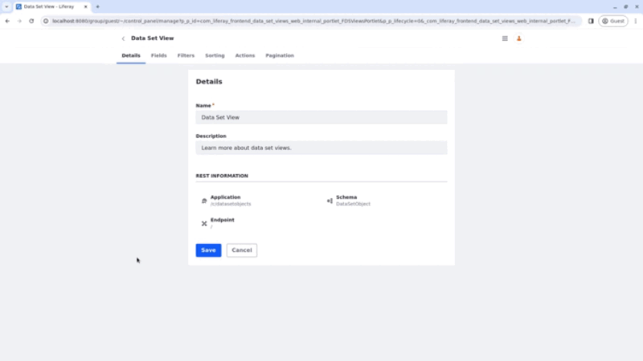

# Data Set View Fields
{bdg-secondary}`Liferay DXP 2024.Q1 U112`
{bdg-link-primary}`[Beta Feature](../system-administration/configuring-liferay/feature-flags.md#beta-feature-flags)`

!!! important
   This feature is currently behind a [developer feature flag](../../system-administration/configuring-liferay/feature-flags.md#dev-feature-flags) (LPS-167253) and a [beta feature flag](../../system-administration/configuring-liferay/feature-flags.md#beta-feature-flags) (LPS-164563).

Use the data set manager to select which fields to display in your data set view. You can add, delete, order, and edit your fields using the Fields tab in the data set view editor.

## Adding Fields to the Data Set View

1. Open the *Global Menu* (), select the *Control Panel* tab, and click *Data Sets* under Object.

1. Click on the *Name* of the data set you want to access.

   Alternatively, you can click *Actions* () next to the data set entry and select *Edit*.

1. Click on the *Name* of the data set view to start editing it.

1. Select the Fields tab.

1. Click *Add* ().

1. In the modal that opens, select the fields to be displayed.

   Select one or more fields. You can also select all fields at once by clicking the checkbox next to the search bar.

   Use the search bar to find specific fields. Leave the search bar empty to see all available fields.

1. Click *Save*.

With the fields in place, you can reorder them by using the drag icon on the left to drag and drop the field into the desired position.

## Editing Fields in the Data Set View

Now, you can edit your fields to alter and localize their labels, select a renderer, and define if they are sortable or not.

To edit a field, click *Actions* () next to the field and select *Edit*.

   

### Editing and Localizing Labels

Once you start editing a field, you can change the label to a more user-friendly one and localize it (1).

To localize the label,

1. Click the flag icon next to the Label field and choose a Language.

1. Enter the translated text in the Label field (2).

   The translated text is saved automatically.

   The localization status label next to the flag changes to `Translated` to indicate that the localization was successful.

   

!!! note
    The localized text is shown if users have the respective language applied to their portal.

### Selecting a Renderer for the Field

A renderer (3) is a structured way to customize how a component is displayed. They are built to be convenient. You enter a raw value and the renderer assumes the most typical format and UI for it.

In the picture below, on the left, the status, date, and date and time fields have the default renderer applied. On the right, the status, date, and date and time renderers are applied to the respective fields.

<!-- once I have more information about renderers, I'll add a link to another section where I'll explain the types of renderers and what they do or what kind of structure/data/data type they need to work. -->

### Defining the Field as Sortable

When a field is marked as sortable, users can sort the elements while using the data set fragment in a content page.

In the video below, the integer field initially allows sorting, enabling users to filter entries based on it. However, when the sortable checkbox is unchecked, sorting entries using the integer field as a filter becomes impossible.

## Related Topics

- [Creating Data Set Views](./creating-data-set-views.md)
- [Creating Data Sets](./creating-data-sets.md)
- [Data Set View Actions](./data-set-view-actions.md)
- [Data Set View Filters](./data-set-view-filters.md)