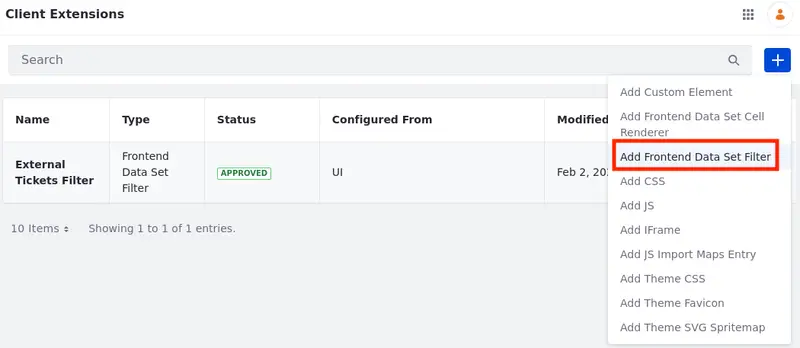
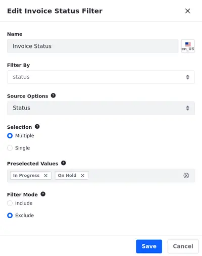

# Data Set View Filters
{bdg-secondary}`Liferay DXP 2024.Q1 U112`
{bdg-link-primary}`[Beta Feature](../system-administration/configuring-liferay/feature-flags.md#beta-feature-flags)`

!!! important
   This feature is currently behind a [developer feature flag](../../system-administration/configuring-liferay/feature-flags.md#dev-feature-flags) (LPS-167253) and a [beta feature flag](../../system-administration/configuring-liferay/feature-flags.md#beta-feature-flags) (LPS-164563).

While managing data set views, you can define pre-applied filters to be used in the data set fragment. Although you can set those filters, users can change their parameters however they want.

## Adding Filters to the Data Set View

1. Open the *Global Menu* (), select the *Control Panel* tab, and click *Data Sets* under Object.

1. Click on the *Name* of the data set you want to access.

   Alternatively, you can click *Actions* () next to the data set entry and select *Edit*.

1. Click on the *Name* of the data set view to start editing it.

1. Select the Filters tab.

1. Click *Add* () and choose one of the available options: [Client Extension](#client-extension-filter), [Date Range](#date-range-filter), or [Selection](#selection-filter).

## Client Extension Filter

Use Frontend Data Set Filter [client extensions](../client-extensions.md) to fully customize the filter experience and add new types of filters to your data set view.

1. Choose *Client Extension* when adding a new filter.

1. In the modal that opens, fill in the Name of the filter and, optionally, [localize](#localizing-the-filters-name) it.

1. Select the Field by which you want to filter the entries.

1. Select the Frontend Data Set Filter client extension and click *Save*.

<!-- I'll add more information about how to use client extensions with data set views as soon as I get some -->

## Date Range Filter

Use date-type fields to pre-filter the displayed entries.

1. Choose *Date Range* when adding a new filter.

1. In the modal that opens, fill in the Name of the filter and, optionally, [localize](#localizing-the-filters-name) it.

1. Select the Field by which you want to filter the entries.

1. (Optional) Set From and To dates to pre-filter the entries and the filter will show entries within the specified range.

   You can set just one of the two dates.

1. Click *Save*.

## Selection Filter

Use picklist options as parameters for the filter.

1. Choose *Selection* when adding a new filter.

1. In the modal that opens, fill in the Name of the filter and, optionally, [localize](#localizing-the-filters-name) it.

1. Select the Field by which you want to filter the entries.

1. Choose a picklist to associate with the filter.

1. Determine if users can select multiple or single values.

1. Preselect values for the filter.

   If you choose the Single selection option, you can only preselect one value.

1. Decide to include or exclude entries based on the filter parameters.

1. Click *Save*.

## Localizing the Filter's Name

1. Click the flag icon next to the Name field and choose a Language.

1. Enter the translated text in the Name field.

   The translated text is saved automatically.

   The localization status label next to the flag changes to `Translated` to indicate that the localization was successful.

   

!!! note
    The localized text is shown if users have the respective language applied to their portal.

## Related Topics

- [Creating Data Set Views](./creating-data-set-views.md)
- [Creating Data Sets](./creating-data-sets.md)
- [Data Set View Fields](./data-set-view-fields.md)
- [Data Set View Actions](./data-set-view-actions.md)