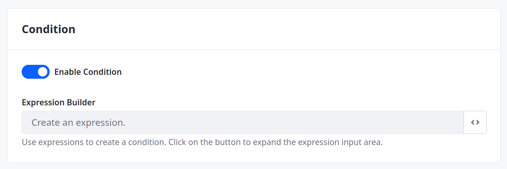

# Defining Object Actions

{bdg-secondary}`Liferay 7.4 U60+/GA60+`

Object actions define operations that you can run manually or automatically for object entry events.

To add an action,

1. Open the *Global Menu* (  ), go to the *Control Panel* tab, and click *Objects*.

1. Begin editing an object definition.

   ```{note}
   For Liferay 7.4 U22+/GA22+, you can add actions to system objects.
   ```

1. Go to the *Actions* tab and click *Add* (  ).

1. In the Basic Info tab, enter a *Name* and *Description* for the action.

   

1. Go to the *Action Builder* tab to define the custom trigger, conditions, and action.

   

1. Specify a trigger event to determine when the action is performed.

   | Trigger                      | Description                            |
   | :--------------------------- | :------------------------------------- |
   | On After Add                 | When an entry is added                 |
   | On After Attachment Download | When an entry attachment is downloaded |
   | On After Delete              | When an entry is deleted               |
   | On After Update              | When an entry is updated               |
   | Standalone                   | Triggered manually                     |

   All triggers besides standalone are automatic. Standalone triggers are for running any type of action manually. See [Using Manual Actions](./using-manual-actions.md) for more information.

   

1. (Optional) Enable a condition for automatic triggers. Click *Code* (  ) to view available expressions.

   On Liferay 7.4 U33+/GA33+, Liferay validates the condition's syntax when you click *Done*. If the expression is invalid, Liferay displays an error message. See [Expression Builder Validations Reference](../validations/expression-builder-validations-reference.md) for more information on available fields, operators, and functions.

   <!--TASK: See [Using Action Conditions]() for more information. -->

   

1. Select the type of action to perform and fill out all additional fields.

   | Type                   | Description                                                   |
   | :--------------------- | :------------------------------------------------------------ |
   | Notification           | Send email or user notifications using a predefined template. |
   | Add an Object Entry    | Create entries in an active object.                           |
   | Update an Object Entry | Update fields in the current object entry.                    |
   | Webhook                | Deliver a payload to a URL.                                   |
   | Groovy Script          | Execute custom [Groovy](https://groovy-lang.org/) scripts.    |

   ```{important}
   Groovy script actions are only available for Liferay PaaS and Liferay DXP Self-Hosted.
   ```

   See [Understanding Action Types](./understanding-action-types.md#understanding-action-types) for more information.

1. Click *Save*.

Once created, the action is active and triggered according to your configuration.

You can deactivate an action from its Basic Info tab. Toggle the *Active* switch and click *Save*.


## Related Topics

* [Creating Objects](../creating-objects.md)
* [Understanding Action Types](./understanding-action-types.md)
