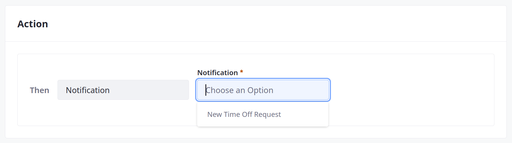

# Understanding Action Types

Actions define custom operations triggered by object entry events. Liferay Objects provides four action types:

| Action Type | Description |
| :--- | :--- |
| [Webhook](#webhook-actions) | Deliver a payload to a URL. |
| [Groovy Script](#groovy-script-actions) | Execute custom [Groovy](https://groovy-lang.org/) scripts. |
| [Notification](#notification-actions) | Send email notifications using a predefined template. |
| [Add an Object Entry](#add-an-object-entry-actions) | Create entries in an active object. |

```{important}
Groovy script actions are only available for Liferay Experience Cloud Self-Managed and Liferay DXP Self-Hosted.
```

## Webhook Actions

{bdg-secondary}`Available Liferay 7.4+`

*Webhook* actions deliver a data payload to a set URL. You must enter the target URL. If applicable, enter a secret.



## Groovy Script Actions

{bdg-secondary}`Available Liferay 7.4 U27+ and GA27+`

*Groovy Script* actions execute Groovy scripts. Enter your script into the provided code window. For Liferay 7.4 U33+ and GA33+, Liferay uses the [GroovyShell class](https://docs.groovy-lang.org/latest/html/api/groovy/lang/GroovyShell.html) to validate your Groovy script syntax when you click Save. If the script is invalid, Liferay displays an error message.


## Notification Actions

{bdg-secondary}`Available Liferay 7.4 U32+ and GA32+`

Use *Notification* actions to automate email notifications for Object events. Your instance requires a [configured mail server](../../../../installation-and-upgrades/setting-up-liferay/configuring-mail.md) and at least one [notification template](../../../../process-automation/notifications/creating-notification-templates.md).

A notification template is required to determine the sender, recipient, and content for each email.


## Add an Object Entry Actions

{bdg-secondary}`Available Liferay 7.4 U33+ and GA33+`

*Add an Object Entry* actions create entries in the specified Object. You must choose an active Object. If the Object includes any required fields, you must set predefined values for the new entries. Enter these values directly or use the expression builder to set values dynamically. You can set values for non-mandatory fields if desired.


## Additional Information

* [Creating Objects](../creating-objects.md)
* [Defining Object Actions](./defining-object-actions.md)
