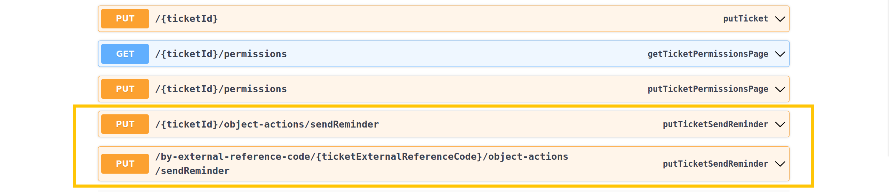
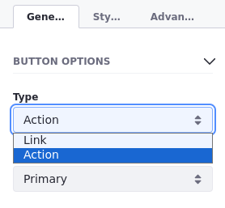
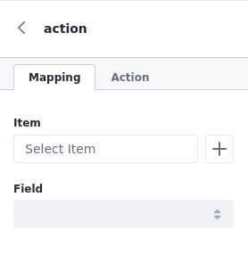
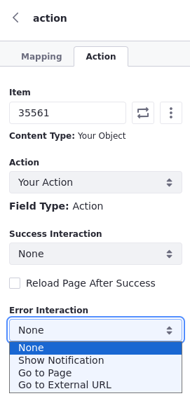
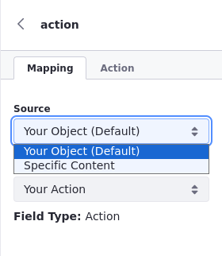
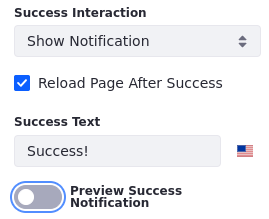
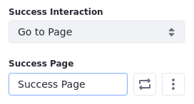
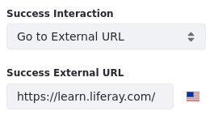

# Using Manual Actions

{bdg-secondary}`Available Liferay 7.4 U60+/GA60+`

When you use the standalone trigger for object actions, the actions become manual instead of automatic. Trigger these actions using either

* [the object's UI](#trigger-actions-via-ui)
* [dedicated action APIs](#trigger-actions-via-apis)
* [fragments in pages](#trigger-actions-via-pages)

This example creates a standalone action for sending notifications.


See [Defining Object Actions](./defining-object-actions.md) for how to add standalone actions to object definitions.

## Trigger Actions via UI

Active standalone actions appear in the Actions menu for object entries. To trigger these actions via the UI,

1. Navigate to the object definition's application page.

1. Click the *Actions* button () for the desired entry and select the standalone action.

   In this example, the action is Send Reminder.

   

## Trigger Actions via APIs

Liferay automatically generates REST APIs for published object definitions. These include APIs for active standalone actions.

To view these APIs,

1. Open Liferay's API Explorer at `[server]:[port]/o/api` (e.g., `localhost:8080/o/api`).

1. Click *REST Applications* and select the desired object definition. Custom objects use the `c/[pluralobjectlabel]` naming pattern (e.g., `c/tickets`).

For each standalone action, Liferay generates two PUT APIs: one that uses the entry's ID and another that uses the entry's external reference code (ERC).



Calling either API triggers the action for the specified entry.


## Trigger Actions via Pages
You can map standalone actions to fragment components in pages (e.g. [content pages](#mapping-buttons-to-object-actions-in-content-pages) or [display page templates](#mapping-buttons-to-object-actions-in-display-page-templates)). 

Liferay provides an out-of-the-box button component ready to be mapped to an object action. If Liferay's out-of-the-box solution doesn't satisfy your use case, you can map actions to custom fragments by adding the tags `data-lfr-editable-id="action"`  and `data-lfr-editable-type="action"` to their HTML code. To learn more about adding tags to fragments, see [Fragment Specific Tags and Attributes Reference](../../../developer-guide/reference/fragments/fragment-specific-tags-reference.md)

Here is an example of an action-ready custom button:

```HTML
<button class="btn btn-${configuration.buttonSize} btn-${configuration.buttonType}" 
    data-lfr-editable-id="action" data-lfr-editable-type="action">
  Go Somewhere
</button>
```

### Mapping Buttons to Object Actions in Content Pages

1. [Create a Page](../../../../site-building/creating-pages.md).

1. Add an out-of-the-box *Button* to your layout. See [Adding Elements to Content Pages](../../using-content-pages/adding-elements-to-content-pages.md) to learn how to edit a content page.

1. Click on the *Button* once. Under Button Options, select *Action* as the type. This configuration allows you to map actions to the button.

    

1. Click on the *Button* a second time. An action menu opens on the right.

    

1. Under the Mapping tab, click on the *Item* field or the *Select Item* icon () right next to the field. 

1. Select your object from the list at the top. The available object entries appear at the bottom. Choose a specific object entry.

    

1. Select the *Field* to be mapped to the button label.

1. Under the Action tab, select a specific object entry.

1. Choose an action. This action is triggered once the user clicks on the button.

1. Set the *Success* and *Error* interactions. See [Managing Success and Error Interactions](#managing-success-and-error-interactions) for more information.

```tip
You can use collection display fragments or form fragments with components mapped to actions. See [Displaying Collections](../../../../site-building/displaying-content/additional-content-display-options/displaying-collections.md) and [Using Fragments to Build Forms](../../using-fragments-to-build-forms.md) to learn more about using collection displays and form fragments.
```

### Mapping Buttons to Object Actions in Display Page Templates

1. [Create a Display Page Template](../../../../site-building/displaying-content/using-display-page-templates/creating-and-managing-display-page-templates.md).

    Choose your object as the content type. This makes your object the default source when mapping the button or the action.

    

1. Add an out-of-the-box *Button* to your layout.

1. Click on the *Button* once. Under Button Options, select *Action* as the type. This configuration allows you to map actions to the button.

1. Click on the *Button* a second time. An action menu opens on the right.

1. Under the Mapping and Action tabs, your object is already set as a default source. 

    If you need to choose specific content, click on the *Source* field, select *Specific Content*, and choose the specific *Item*.

    

1. Select the *Field* to be mapped to the button label.

1. Under the Action tab, choose an action. This action is triggered once the user clicks on the button.

1. Set the *Success* and *Error* interactions. See [Managing Success and Error Interactions](#managing-success-and-error-interactions) for more information.

### Managing Success and Error Interactions
With Liferay, you can choose what happens if an action succeeds or fails after the user clicks on a component mapped to an action.

There are four options available for both interactions:


* **None**: Nothing happens after the action is performed.

* **Show Notification**: Notifies the user. You can write your custom success/error message, preview the notification, and configure the page to reload after the action is triggered. 

    

* **Go to Page**: Navigates to a Success/Error Page in your Site.

    

* **Go to External URL**: Navigates to an external URL.

    

## Action Permissions

Liferay automatically generates permissions for managing which roles can trigger standalone actions. Each permission follows the `action.[actionName]` naming pattern (e.g., `action.sendReminder`). See [Permissions Framework Integration](../../understanding-object-integrations/permissions-framework-integration.md) for more information on object permissions.

![Standalone permissions use the action.[actionName] naming pattern.](./using-manual-actions/images/14.png)

## Related Topics

* [Defining Object Actions](./defining-object-actions.md)
* [Understanding Action Types](./understanding-action-types.md)
* [Headless Framework Integration](../../understanding-object-integrations/headless-framework-integration.md)
