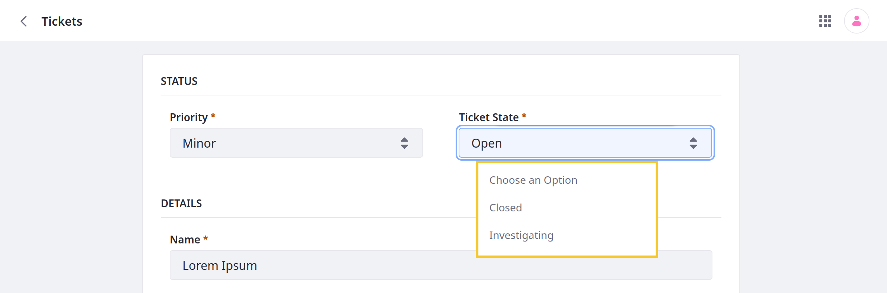

# Adding and Managing Custom States

Some use cases may require assigning multiple states to an Object entry at the same time. For example, when building an Order application, you may need to assign and manage order, payment, and delivery statuses for the same entry, each with its own flow and associated business logic. Using Liferay picklists with custom Objects, you can achieve this functionality.

With [picklists](../picklists.md), you can define lists of strings and use them with Object fields to define custom states for entries. Once added to an Object definition, you can design the flow for each state and use [validations](./adding-custom-validations.md) and [actions](./defining-object-actions.md) to add custom business logic for different states. These custom states can also be used alongside [workflow statuses](../enabling-workflows-for-objects.md) to define complex review and approval processes. <!--REFINE-->



## Adding a State Field to Object Definitions

Follow these steps to use a picklist to add custom states for an Object's entries:

1. Open the *Global Menu* (), click the *Control Panel* tab, and go to *Picklists*.

1. Create a picklist with the desired items. These items define Object entry states. See [Creating a Picklist](../picklists/using-picklists.md#creating-a-picklist) for more detailed steps.

   ```{note}
   You can add, remove, or edit picklist items for both draft and published Object definitions at any time.
   ```

   

1. Open the *Global Menu* (), click the *Control Panel* tab, and go to *Objects*.

1. Begin editing the desired custom Object.

1. Go to the *Fields* tab and click the *Add* button ().

   

1. Enter a *Label* and *Field Name*.

1. Select the *Picklist* type and choose the desired list.

1. Toggle *Mark as State*.

   ```{note}
   State fields are automatically set to *mandatory*, and you cannot change them to optional.
   ```

1. Select a *Default Value* for the state field.

   

1. Click *Save*.

After adding the field to a definition, you can [set up a flow](#setting-up-a-flow-for-state-fields) to determine which transitions are available for each state.

## Setting Up a Flow for State Fields

Go to the *State Manager* tab to configure the flow used for the state field.


Determines available options from each state. Can select multiple options. Ensures the entry goes through the desires process.


## Additional Information
