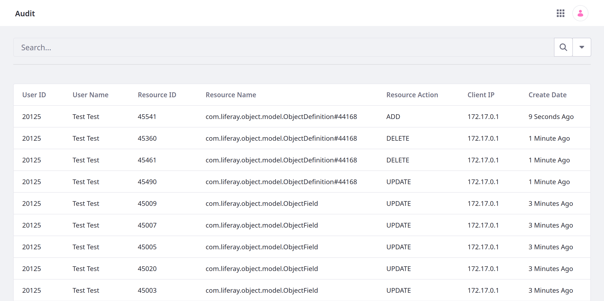
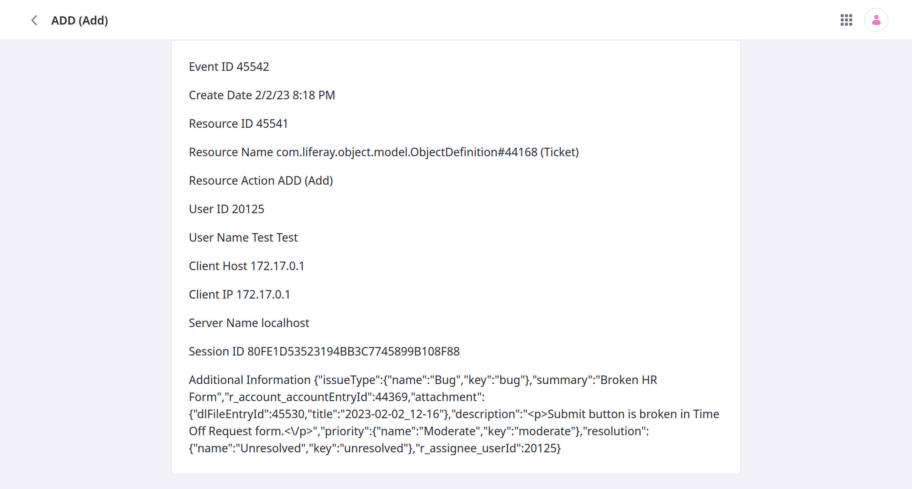
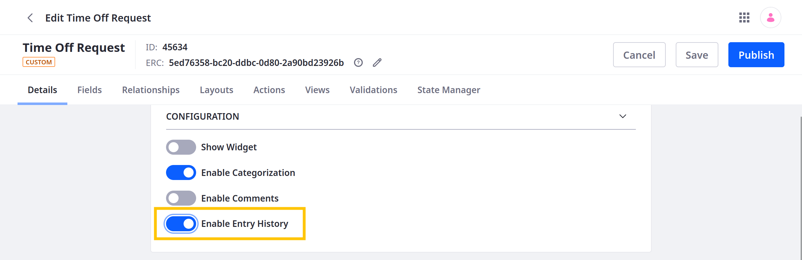

# Auditing Object Events

{bdg-secondary}`Liferay 7.4 U72+/GA72+`

You can use Liferay's audit framework to track events for custom object definitions and their entries. To track entry events, you must [enable entry history](#enabling-entry-history) for the object definition. While enabled, you can view an entry's history via the [Audit application](#using-the-audit-application) or [REST APIs](#using-rest-apis).

## Using the Audit Application

{bdg-primary}`Subscription`

To access the Audit application, open the *Global Menu* () &rarr; *Control Panel*  &rarr; click *Audit*.



Events appear in a table:

| Column | Description |
| :--- | :--- |
| User ID | Acting user's ID. |
| User Name | Acting user's name. |
| Resource ID | Affected resource's ID. |
| Resource Name | Affected resource's name, including its ID (e.g., `ObjectDefinition#44168`). |
| Resource Action | Action performed (`ADD`, `UPDATE`, or `DELETE`). |
| Client IP | IP address responsible for the action. |
| Create Date | When the event record was created. |

Click an event field to view a more complete record, including specific action details. You can search and filter results using keywords and other terms.

Object entry events use the `ObjectDefinition#[ObjectID]` naming pattern.



## Using REST APIs

You can use the `nestedFields` parameter with the `auditEvents` value to return an entry's history in GET API calls (e.g., `http://localhost:8080/o/c/tickets/?nestedFields=auditEvents`). See [Using nestedFields to Audit Entry History](../understanding-object-integrations/using-custom-object-apis/using-nestedfields-to-audit-entry-history.md) for a basic tutorial.

```{important}
Using REST APIs to view an entry's history requires both the `View` and `Object Entry History` permissions for the entry. See [Permissions Framework Integration](../understanding-object-integrations/permissions-framework-integration.md) for more information.
```

## Enabling Entry History

By default, entry history is disabled for custom objects. For 7.4 U72+/GA72+, you can configure this setting at any time. In earlier versions, you can only configure this setting before [publishing the object definition](./creating-objects.md#publishing-object-drafts).

To enable entry history,

1. Open the *Global Menu* (), go to the *Control Panel* tab, and click *Objects*.

1. Begin editing the desired object definition.

1. In the Details tab, toggle *Enable Entry History*.

   

1. Click *Save*.

While enabled, Liferay keeps a history of entry events that you can view in the Audit application or via REST API calls.

## Related Topics

* [Objects](../../objects.md)
* [Creating and Managing Objects](../creating-and-managing-objects.md)
