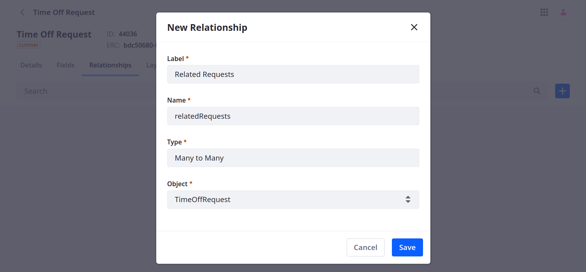
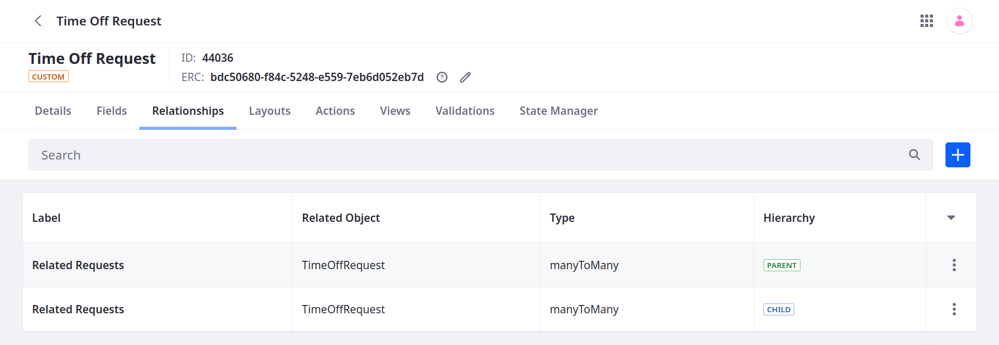
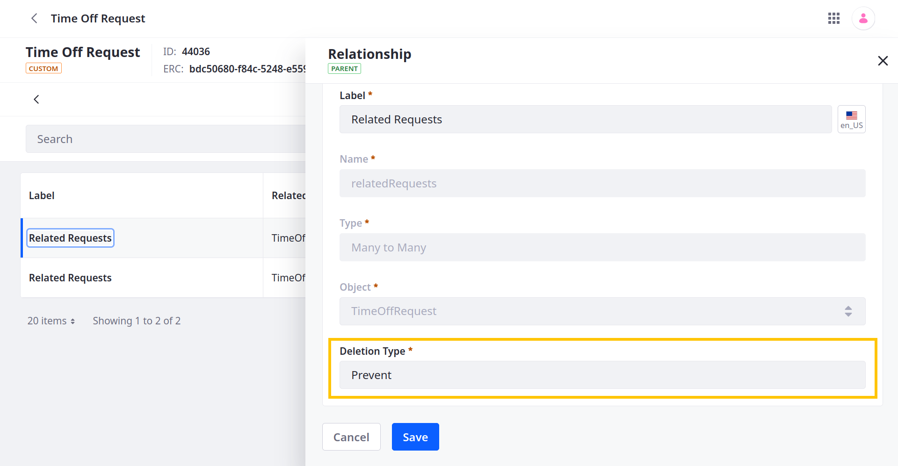
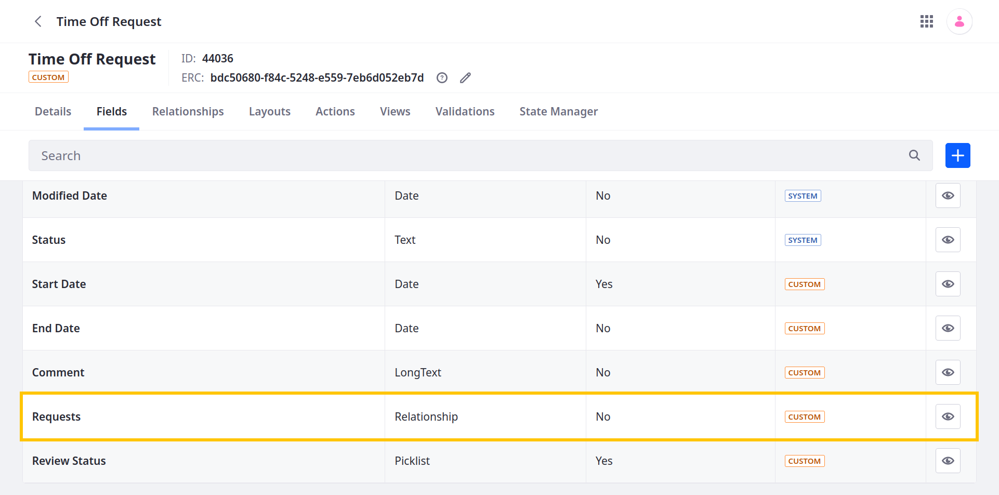
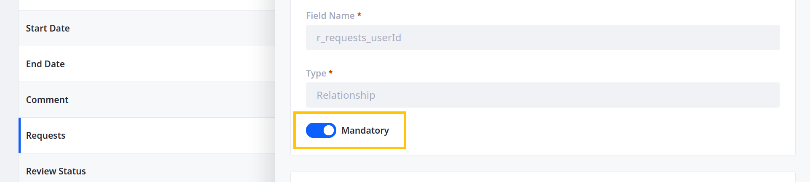
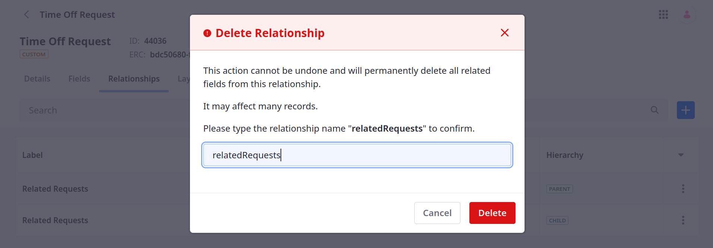

# Defining Object Relationships

{bdg-secondary}`Available Liferay 7.4+`

Relationships are connections between object definitions that you can use to link their entries. You can add relationships to any published or unpublished object, including both system and custom objects.

## Relationship Types

Objects provides two types of relationships:

<!--TASK: Add One to One after it's been implemented-->

**One to Many**: You can relate one object entry to multiple object entries. When selected, a new field is added to entries on the child side of the relationship (i.e., the 'many' side), while a table is added to the 'parent' side (i.e., the 'one' side). On the child side, the new field can be added to a [Fields Tab](./designing-object-layouts.md#adding-fields-tabs) in the object's custom layout and relates its entries to a single entry on the parent side of the relationship. On the parent side, the new table can be added to a [Relationships Tab](./designing-object-layouts.md#adding-relationships-tabs) in the object's custom layout and lists all entries related to the current parent entry.

**Many to Many**: You can relate multiple object entries with multiple object entries. When selected, a new database table is created for both sides of the relationship. This table can be added to a [Relationships Tab](./designing-object-layouts.md#adding-relationships-tabs) in the object's custom layout and lists all related entries.

```{important}
Displaying relationship tables requires a custom layout. However, custom layouts are not supported for system objects, so they cannot display relationship tables. See [Designing Object Layouts](./designing-object-layouts.md) for more information. 
```

## Adding New Relationships

Follow these steps to add relationships to objects:

1. Open the *Global Menu* (), click the *Control Panel* tab, and go to *Objects*.

1. Begin editing the desired object definition.

1. Go to the *Relationships* tab and click the *Add* button ().

   

1. Enter a *Label* and *Name*.

   **Label**: Identifies the relationship in the Objects UI and can be localized after the relationship is created.

   **Name**: Determines the relationship's name in the back-end and uses camel case. Once the relationship is published, this value cannot be changed.

1. Select a relationship Type: *One to Many* or *Many to Many*. <!--TASK: Add One to One after it's been implemented-->

1. Select an *object* to relate to the current object. You can relate objects to themselves or other object definitions.

   ```{note}
   Beginning with 7.4 U46/GA46, you can define one-to-many and many-to-many relationships that relate an object definition to itself. Previously, you could only use the one-to-many type to relate entries within the same object. <!--TASK: Add One to One after it's been implemented-->
   ```

1. Click on *Save*.

   

Once saved, the new relationship can be [added to custom layouts](./designing-object-layouts.md) for the related objects. You can then use the relationship fields and tables to relate object entries to one another.

## Configuring Deletion Type

After a relationship is saved, you can configure its deletion type. This setting determines how entry deletion is handled when the entry is related to another entry, and it is only available after a relationship is created.



Available options include *Prevent*, *Disassociate*, and *Cascade*.

**Prevent** (Default): Entries on the parent side cannot be deleted if they are related to any child entries.

**Disassociate**: Entries on the parent side can be freely deleted without affecting any related child entries.

**Cascade**: Entries on the parent side can be freely deleted; deleting a parent entry also deletes any related child entries, provided the user has the requisite permissions for the child object.

## Making Relationship Fields Mandatory

{bdg-secondary}`For 7.4 U47+/GA47+`

In some scenarios, you may want to make relationship fields mandatory. For example, if you're creating a Ticket object, you may want to define a mandatory relationship field for selecting an 'assignee'. Or if you want to [restrict access to object data](./using-system-objects-with-custom-objects/restricting-access-to-object-data-by-account.md) by account, you should make the object's relationship with the Account object mandatory.

Follow these steps to make a relationship field mandatory:

1. Begin editing the *object* with the desired relationship field.

1. Go to the *Fields* tab and begin editing the *relationship field*.

   

1. Toggle the *Mandatory* switch.

   

1. Click *Save*.

## Removing Relationships

{bdg-secondary}`For 7.4 U26+/GA26+`

You can remove relationships from both draft and published object definitions. Removing a relationship permanently deletes its field from the related object definitions. For published definitions, this can affect many records.

```{important}
For versions before Liferay 7.4 U26/GA26, users cannot delete relationships included in an object at the time it is [published](./creating-objects.md#publishing-object-drafts).
```

Follow these steps to remove relationships from a published object definitions.

1. Open the *Global Menu* (), go to the *Control Panel* tab, and click on *Objects*.

1. Begin editing the desired object definition and go to the *Relationships* tab.

1. Click the *Actions* button () for the desired relationship and select *Delete*.

1. In the dialog window, enter the name of the relationship and click *Delete* to confirm.

   

## Additional Information

* [Creating Objects](./creating-objects.md)
* [Adding Fields to Objects](./adding-fields-to-objects.md)
* [Designing Object Layouts](./designing-object-layouts.md)
* [Managing Objects](./managing-objects.md)
