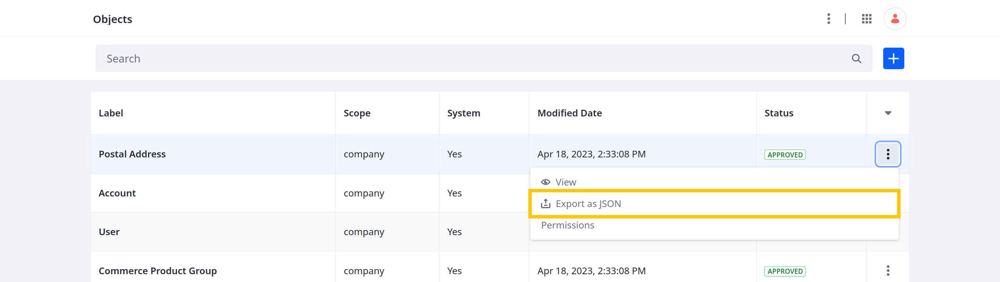
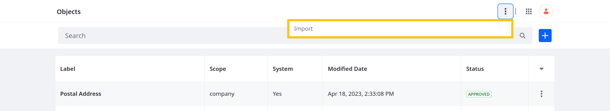

# Exporting and Importing Object Definitions

{bdg-secondary}`Liferay 7.4 U68+/GA68+`

You can export and import object definitions as `.json` files. These files include the definition's complete schema (e.g., configurations, fields, actions, and relationships).

When exporting definitions with relationships, the JSON file includes all relationships defined in the current object, as well as many-to-many relationships defined in other objects. However, the file does not include one-to-many relationships defined in other objects.

If an imported definition references picklists or objects that do not exist, Liferay automatically generates them using the external reference codes provided in the JSON file.

<!--TASK: Uncomment when batch feature and documentation is ready...
```{tip}
You can use the batch client extension to help migrate object definitions between Liferay environments. See [Batch Client Extensions](../../client-extensions/batch-client-extensions.md) for more information.
```
-->

## Exporting Definitions

1. Open the *Global Menu* (), go to the *Control Panel* tab, and click *Objects*.

1. Click the *Actions* button () for the desired object and select *Export as JSON*.

   

1. Click *Save* in the dialog window to download the object definition as a JSON file.

Once exported, you can import the object definition into compatible Liferay environments.

## Importing Definitions

1. Open the *Global Menu* (), go to the *Control Panel* tab, and click *Objects*.

1. Click the *Actions* button () in the Application Bar and select *Import Object*.

   

1. Enter a name for the object. You can edit this value after importing.

   ```{important}
   Object names must be unique and use PascalCase.
   ```

1. Select a JSON file to import.

   Once selected, the modal window displays the definition's external reference code (ERC). You can edit the ERC after importing.

   

1. Click *Import*.

The object definition begins importing in the background and can take a few minutes.

## Related Topics

* [Creating Objects](./creating-objects.md)
* [Activating and Deactivating Objects](./activating-and-deactivating-objects.md)
* [Data Migration Center](../../../headless-delivery/consuming-apis/data-migration-center.md)
