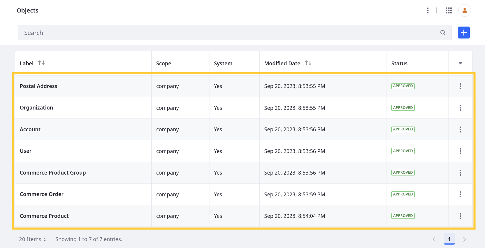

# Extending System Objects

{bdg-secondary}`Available Liferay 7.4 U38+ and GA38+`

With Liferay Objects, you can extend supported system services. Currently, only these services are integrated with the Objects framework: Account, Commerce Order, Commerce Product, Commerce Product Group, Postal Address, and User.

```{note}
The Postal Address object is only used to store account addresses. For this reason, you can only relate it to custom Objects that are related to the Accounts object. See [Using Accounts with Custom Objects](./using-accounts-with-custom-objects.md) for more information.
```



When extending system Objects, you can add [relationships](#adding-relationships), [actions](#adding-actions), and [validations](#adding-validations) to them. <!--TASK: You can also access limited [configuration options](#additional-configuration-options).-->

| Feature | System Objects | Custom Objects |
| :--- | :--- | :--- |
| Fields |  | &#10004; |
| Relationships | &#10004; | &#10004; |
| Layouts |  | &#10004; |
| Actions | &#10004; | &#10004; |
| Views |  | &#10004; |
| Validations | &#10004; | &#10004; |

<!--TASK: Uncomment once supported.
## Adding Fields

You can add custom fields to system Objects to define additional database columns. These fields are added to a separate database table that uses the service's original table name with `_x` appended to it (e.g., `AccountEntry_x`). System Objects support all available [field types](./adding-fields-to-objects.md#field-types-ui-reference). See [Adding Fields to Objects](./adding-fields-to-objects.md) for more information. -->

<!-- When you uncomment the above text, please be sure to discuss the reasons why you'd do it this way rather than add custom fields the way you've been able to add them for many releases (i.e., as Expandos). --Rich -->

## Adding Relationships

You can create relationships between system and custom Objects to link their entities. System Objects support both *One to Many* and *Many to Many* relationships. See [Defining Object Relationships](./defining-object-relationships.md) for more information.

```{important}
Since system Objects don't support [custom layouts](./designing-object-layouts.md), you cannot add [layout tabs](./designing-object-layouts.md#adding-layout-tabs) to the Object for displaying Many to Many relationships or the parent side of a One to Many relationship.
```

## Adding Actions

You can add custom actions to system Objects that are triggered when entries are added, updated, or removed. This includes both Webhook and Groovy Script actions. See [Defining Object Actions](./defining-object-actions.md) for more information.

## Adding Validations

You can add Groovy and Expression Builder validations to system Objects. When triggered, these validations check for valid field entries and show custom error messages for invalid entries. Currently, Objects only supports validations for a system Object's default fields and does not support validations for its custom Expando fields. See [Adding Custom Validations](./adding-custom-validations.md) for more information.

<!--TASK: Uncomment once supported.
## Additional Configuration Options

When editing a system Object, you can also configure the following settings in the *Details* tab.

| Field | Description |
| :--- | :--- |
| Title Field | Determine the field used as the title for Object entries. |
| Widget | Determine whether the Object's Page widget is available in Sites.| -->

## Additional Information

* [Adding Fields to Objects](./adding-fields-to-objects.md)
* [Defining Object Relationships](./defining-object-relationships.md)
* [Defining Object Actions](./defining-object-actions.md)
