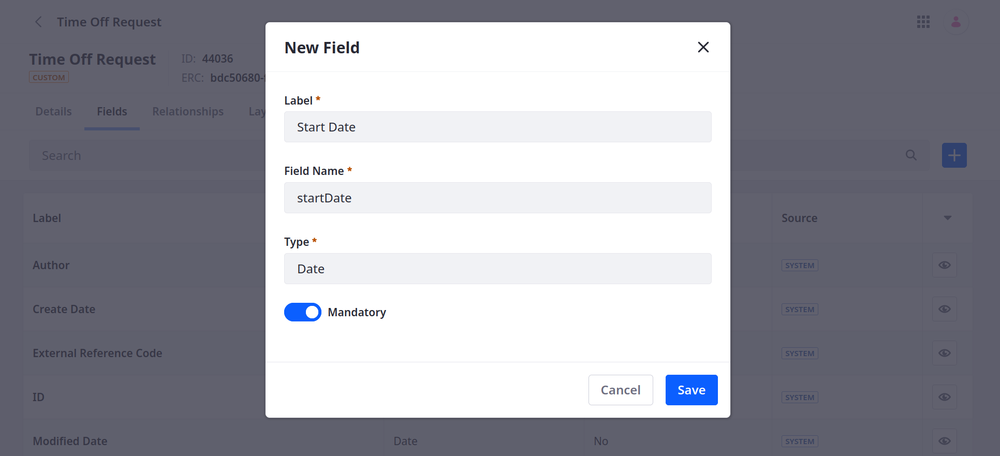

# Adding Fields to Objects

{bdg-secondary}`Available Liferay 7.4+`

Fields are data definitions that represent database columns and store different [types of values](#field-types-ui-reference). By default, all objects include the following system fields: Author, Create Date, External Reference Code, ID, Modified Date, and Status. But you can add new fields at any time.

Follow these steps:

1. Open the *Global Menu* (), go to the *Control Panel* tab, and click *Objects*.

1. Begin editing the desired object definition.

   ```{note}
   For 7.4 U47+/GA47+, you can add fields to system objects and access them via Headless APIs. See [Extending System Objects](./extending-system-objects.md) for more information.
   ```

1. Go to the *Fields* tab and click the *Add* button ().

   

1. Enter a *Label* and *Field Name*.

   **Label**: This value identifies the field in the Objects UI and can be localized after the field is created.

   **Field Name**: This value determines the field's name in the back-end and uses camel case. Once a field is published, this value cannot be changed.

   ```{note}
   Some field names are reserved by Liferay and cannot be used. See [Reserved Field Names](#reserved-field-names) for more information. 
   ```

1. Select a field *Type*. Some field types include additional configuration options (e.g., Picklist, Attachment). See [Field Type Reference](#field-types-ui-reference) below for a basic overview of each type, or see [Fields](../fields.md) for more detailed information.

   In some cases, these options are available during field creation (e.g., Picklist, Attachment), while others are only available after field creation (e.g., Text, Long Text). 

1. Determine whether the field is *Mandatory*.

   ```{note}
   Mandatory boolean fields require a true value from end users.
   ```

1. Click *Save*.

After saving fields to an object draft, you can access additional configuration options. For instance, you can determine whether a field is searchable, limit the number of allowed characters for text fields, and more. Available configuration options depend on the field's type. If you publish the draft or add fields to an already published object, configuration options are restricted. See [Configuration Restrictions for Published Objects](../creating-objects.md#configuration-restrictions-for-published-objects) to learn more.

```{important}
You can remove fields from object drafts at any time. However, you cannot remove published fields. After publishing, you can only remove fields added to the object's side table (i.e., `[Initial_Table_Name]_x`). See [Publishing Object Drafts](../creating-objects.md#publishing-object-drafts) for more information.
```

## Field Types UI Reference

{bdg-secondary}`For 7.4 U56+/GA56+`

| Type | Description |
| :--- | :--- |
| [Aggregation](./aggregation-fields.md) | Stores read-only values calculated using values from a relationship table. Available functions include `count`, `sum`, `average`, `min`, and `max`. |
| [Attachment](./attachment-fields.md) | Stores `jpeg`, `jpg`, `pdf`, and `png` files no larger than 100 MB. |
| Boolean | Stores true or false values. |
| Date | Stores date values. |
| Decimal (*previously Double*) | Stores a decimal number value that supports fractional portions. |
| Integer | Stores an integer up to 9 digits in length. |
| Long Integer (*previously Long*) | Stores a large integer up to 16 digits in length. |
| Long Text (*previously Clob*) | Stores a text box value that supports up to 65,000 characters; after creating a Long Text field, you can configure it to limit the number of characters allowed. |
| Multiselect Picklist | Stores one or more string values from a picklist. See [Picklists](../../picklists.md) for more information. |
| Picklist | Stores a picklist string value. See [Picklists](../../picklists.md) for more information. |
| Precision Decimal (*previously BigDecimal*) | Stores a high-precision decimal number without rounding. |
| Relationship | Stores the numeric ID for all related object entries. Objects automatically adds relationship fields to objects on the child side of a One to Many relationship. See [Defining Object Relationships](../relationships/defining-object-relationships.md) for more information. |
| Rich Text | Stores text with advanced formatting tools and media elements (e.g., images, videos, audio). |
| Text (*previously String*) | Stores simple text values up to 280 characters; after creating a Text field, you can configure it to limit the number of characters allowed. |

## Reserved Field Names

{bdg-secondary}`For 7.4 U41+/GA41+`

The following field names are reserved by Liferay and cannot be used. If users attempt to create a field using one of these field names, Liferay displays an error message.

| Field | Description |
| :--- | :--- |
| `companyId` | Portal instance where the entry was created. |
| `createDate` | When the entry was created. |
| `externalReferenceCode` | External reference code for the entry. |
| `groupId` | Site ID where the entry was created. |
| `lastPublishDate` | Date when the entry was last published. |
| `modifiedDate` | Date when the entry was last modified. |
| `mvccVersion` | MVCC version of the entry. |
| `objectDefinitionId` | ID of the entry's object. |
| `objectEntryId` | ID for the entry. |
| `status` | Workflow status for the entry. |
| `statusByUserId` | ID of the assigned user in Workflow. |
| `statusByUserName` | Name of the assigned user in Workflow. |
| `statusDate` | Date when the Workflow status was last updated. |
| `userEmailAddress` | Email address for the entry's author. |
| `userFirstName` | First name of the entry's author. |
| `userId` | ID of the entry's author. |
| `userLastName` | Last name of the entry's author. |
| `userName` | User name of the entry's author. |
| `uuid` | Unique universal ID for the entry. |

## Additional Information

* [Creating Objects](../creating-objects.md)
* [Defining Object Relationships](../relationships/defining-object-relationships.md)
* [Designing Object Layouts](../layouts/designing-object-layouts.md)
