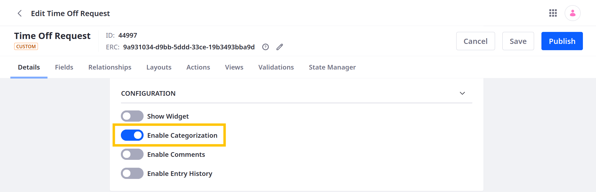
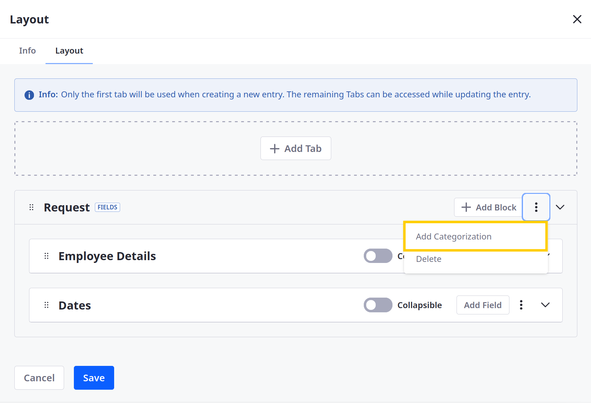
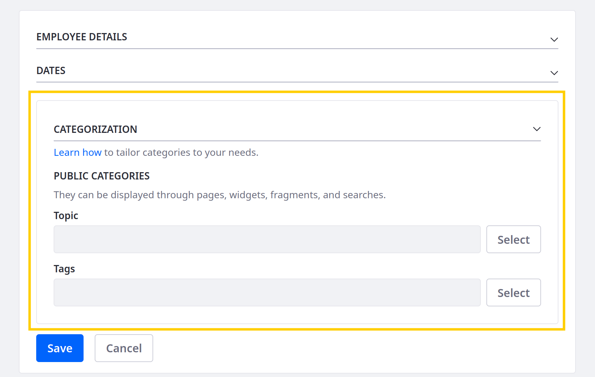

# Adding Categorization to Fields Tabs

{bdg-secondary}`Liferay 7.4 U31+/GA31+`

You can add categorization blocks to [fields tabs](./designing-object-layouts.md#fields-tabs) so end users can apply tags and categories to object entries. Follow these steps:

1. Open the *Global Menu* (), go to the *Control Panel* tab, and click *Objects*.

1. Begin editing the desired object definition.

   ```{note}
   System objects do not support custom layouts. See [Extending System Objects](../extending-system-objects.md) for more information.
   ```

1. In the Details tab, enable categorization and click *Save*.

   

1. Click the *Layouts* tab and select the desired layout.

1. Go to the *Layout* tab, click *Actions* () for the desired [Fields tab](./designing-object-layouts.md#fields-tabs), and select *Add Categorization*.

   

   This adds a new block to the tab for accessing categorization tools.

   ```{important}
   You can only add the categorization block to one tab per layout.
   ```

1. Determine whether the block is *collapsible*.

   

1. Click *Save*.

Now when creating or editing the object's entries, users can access and apply tags and categories.



```{note}
Visibility and permissions can affect how the categorization block appears.
```

## Related Topics

* [Creating Objects](../creating-objects.md)
* [Designing Object Layouts](./designing-object-layouts.md)
