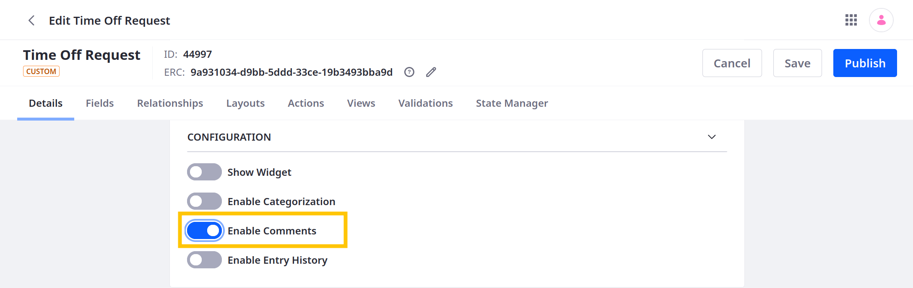

# Adding Comments to Fields Tabs

You can add comment blocks to [fields tabs](./designing-object-layouts.md#fields-tabs) so end users can comment on object entries.

Follow these steps:

1. Open the *Global Menu* (), go to the *Control Panel* tab, and click *Objects*.

1. Begin editing the desired object definition.

   ```{note}
   System objects do not support custom layouts. See [Extending System Objects](../extending-system-objects.md) for more information.
   ```

1. In the details tab, enable comments and click *Save*.

   

1. Go to the *Layouts* tab and select the desired layout.

1. Go to the *Layout* tab, click the *Actions* button () for the desired [Fields tab](./designing-object-layouts.md#fields-tabs), and select *Add Comments*.

   

   This adds a new block to the tab for adding comments to the entry.

   ```{important}
   You can only add comments block to one tab per layout.
   ```

1. Determine whether the block is *collapsible*.

   

1. Click *Save*.

Now when viewing the object entry, users can add comments.


```{note}
Visibility and permissions can affect how the comments block appears.
```

## Additional Information

* [Creating Objects](../creating-objects.md)
* [Designing Object Layouts](./designing-object-layouts.md)
* [Adding Categorization to Fields Tabs](./adding-categorization-to-fields-tabs.md)
