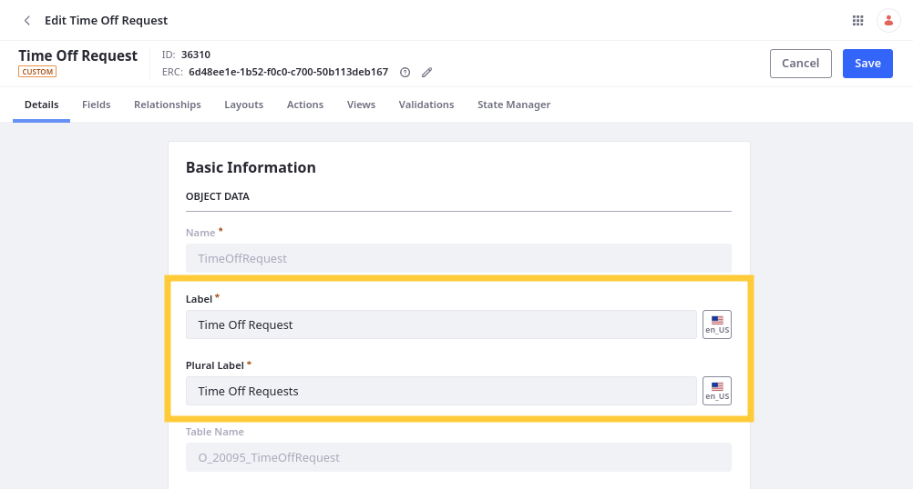
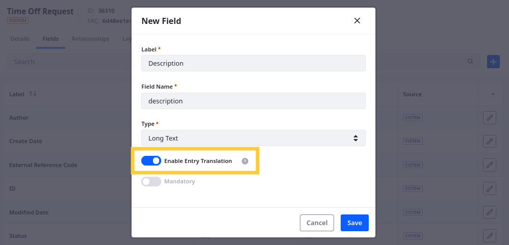

# Localizing Object Definitions and Entries

{bdg-secondary}`Liferay 7.4 2023.Q3+/GA92+`

Liferay objects are integrated with the localization framework, so you can add translations for definition labels, and users can enter localized values for text fields. With this integration, you can localize objects to better serve your global users.

## Localizing Object Definition Labels

When configuring an object definition, you can localize the definition's labels, as well as labels for its fields, relationships, actions, and view columns. This determines how these elements appear in object layouts and views.



Additionally, you can localize [validation](./validations/adding-field-validations.md) error messages.


## Enabling Localization for Text Fields

In addition to localizing definition labels, you can enable translation support for custom text [fields](fields.md) so end users can localize their input:

1. Open the Objects application and begin editing the desired definition.

1. In the Details tab, toggle *Enable Entry Translation*.

   

1. Click *Save*.

Now when adding or configuring Text, Long Text, or Rich Text fields, you can determine whether the field is localizable.



```{important}
Localized fields cannot be mandatory. Also, when using localization, field validations, conditions, filters, and sorting only support the default language.
```

While enabled, you can use the language selector button to localize the field's value when creating entries.


## Related Topics

* [Creating Objects](./creating-objects.md)
* [Understanding Object Integrations](../understanding-object-integrations.md)
