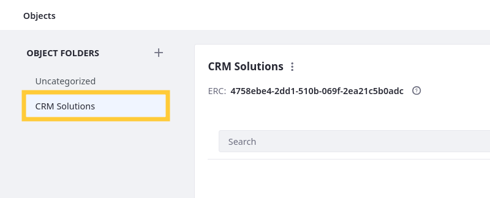

# Organizing Objects with Folders

By default, object definitions are grouped in the Uncategorized folder, but you can add object folders to organize data models and manage access to definitions.

## Creating Folders

1. Open the *Global Menu* (), go to the *Control Panel* tab, and click *Objects*.

1. Click *Add Folder* ().

1. Enter a *Label* and *Name*.

   **Label**: Identifies the relationship in the Objects UI and can be localized after the relationship is created.

   **Name**: Determines the relationship's name in the back-end and uses camel case. Once the relationship is published, this value cannot be changed.

   

1. Click *Create Folder*.

   

This creates an empty folder with an autogenerated ERC. If desired, you can update the ERC by clicking *Actions* () for the folder and selecting *Edit Label and ERC*.

## Adding Definitions to Folders

While in a folder, you can click *Add* () to create object definitions in it. To move existing definitions to the folder,

1. Go to the desired destination folder.

1. Click *View in Model Builder*.

1. Click *Actions* () for an object from another folder in the left sidebar.

1. Select *Move to Current Folder*.

   

This moves the definition to the current folder. Moving an object definition does not affect its relationships and is only for improving organization and object management.

## Deleting Folders

1. Go to the desired folder.

1. Click *Actions* () and select *Delete*.

   

1. Enter the folder's name to confirm and click *Delete*.

   

Once deleted, all objects in the folder are relocated to the default Uncategorized folder. This action cannot be undone.

## Related Topics

* [Creating Objects](./creating-objects.md)
* [Using the Objects Model Builder](./using-the-objects-model-builder.md)
