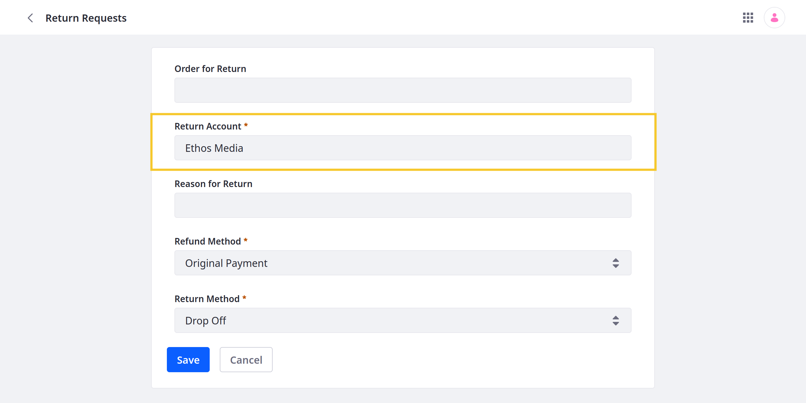
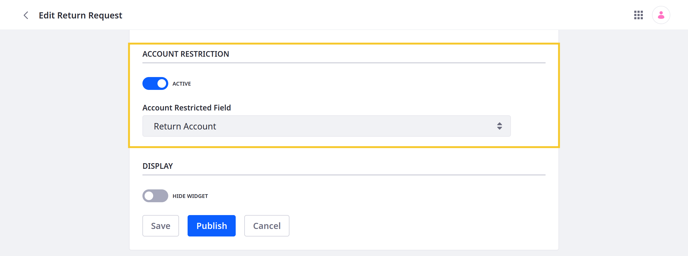

# Restricting Access to Object Data by Account

{bdg-secondary}`Available Liferay 7.4 U58+/GA58+`

In scenarios with multiple business [accounts](../../../../users-and-permissions/accounts.md), you may want to restrict access to object entries by account. To do this, your custom object must have an active [relationship](../defining-object-relationships.md) with the Account system object, and you must configure the custom object to use this relationship for restricting entry data. Once set up, anyone adding entries to the custom object must select an account. This account becomes the entry's owner. See [Account Restriction and User Roles](#account-restriction-and-user-roles) to learn how role types control access to entries.



```{important}
You can only configure account restriction for draft objects. After [publishing](../creating-objects.md#publishing-object-drafts), these settings cannot be changed.
```

To set up account restriction,

1. Open the *Global Menu* (), go to the *Control Panel* tab, and click *Objects*.

1. Begin editing the Account system object.

1. Add a One to Many relationship that relates the Account object to the desired draft object. See [Defining Object Relationships](../relationships/defining-object-relationships.md) for more information.

   

1. Return to the Objects page and begin editing the desired custom object.

1. In the Details tab, activate *Account Restriction* and select the account relationship to use.

   

1. Click *Save*.

This makes the account relationship field mandatory, so users must select an account when creating entries. Available account options are determined by each user's [permissions](#account-restriction-and-user-roles). After entry creation, the selected account becomes the entry's owner and cannot be changed.

## Account Restriction and User Roles

After restricting object data by account, entries appear according to the user's permissions. Permissions at the regular role scope apply to all object data, while permissions at the organization or account scope apply to specific accounts. For example, if a user has a regular role with the view permission, then the user can view all data from all accounts. However, if a user only has an account role with the view permission, then the user can only view object data associated with their account.

| Permission Scope | Description |
| :--- | :--- |
| Regular Role | Permissions apply to all object data without restriction by account or organization role permissions. |
| Organization Role | Permissions apply to object data for specific accounts associated with an organization and its sub-organizations. |
| Account Role | Permissions apply to object data for a specific account. |

When setting up roles for account restriction, consider these factors:

* Regular roles must have the `Accounts > Account Entry: View` permission to create object entries. This is because regular roles are not associated with accounts or organizations. Without this permission, users with the regular role cannot select an account during entry creation.

* Organization roles must have these permissions to create object entries: `User and Organizations > Organization: Manage Accounts` and `User and Organizations > Organization: Manage Suborganizations Accounts`. Without these, users with the organization role cannot select an account during entry creation.

* To use organization and account roles to access a custom object, users must have a separate regular role that grants access to the application in either the Global Menu (if company-scoped) or Site Menu (if site-scoped). See [Object Application Permissions](../../understanding-object-integrations/permissions-framework-integration.md#application-permissions) for more information.

```{important}
Account and organization roles are only supported in objects with account restriction enabled.

Account restriction does not support the default Account Member and Organization User roles. These roles do not automatically grant access to related object data.
```

## Example Use Case: Insurance Claims

Consider an insurance scenario with these requirements:

- Business account users must open claims without seeing claims made by other accounts. 
- Customer success managers (CSMs) must review claims made by the accounts they manage.
- A claims manager must oversee all claims.

To achieve this, [create a Claims object](../creating-objects.md) with account restriction enabled. Then [create organizations](../../../../users-and-permissions/organizations/creating-and-managing-organizations.md#adding-organizations) for grouping CSMs and [associate each organization](../../../../users-and-permissions/accounts.md#organizations-tab) with the appropriate business accounts. Create the following [account](#account-role), [organization](#organization-role), and [regular](#regular-role) roles and [assign them](../../../../users-and-permissions/roles-and-permissions/assigning-users-to-roles.md) to the appropriate users. Since the Claims object is company-scoped, account and organization users must also have a separate regular role that grants the `Portal: View Control Panel Menu` and `Claims: Access in Control Panel` permissions. For convenience, you can assign these permissions to the default User role.

```{note}
In this example, each role can create claim entries, but granting that permission is not necessary for the organization and regular roles.
```

### Account Role

Grant account users permission to create and manage the account's object data.

| Permission | Description |
| :--- | :--- |
| Claims: View | View the object's application page. |
| Claims > Claim: Delete | Delete object entries. |
| Claims > Claim: Permissions | View and modify permissions for individual object entries. |
| Claims > Claim: Update | Update object entries. |
| Claims > Claim: View | View object entries. |
| Claims > Claims: Add Object Entry | Create an object entry. |

```{tip}
Users can have different account roles in different accounts.
```

### Organization Role

Grant organization users permission to create and manage object data for all accounts associated with the organization and its sub-organizations.

| Permission | Description |
| :--- | :--- |
| Claims: View | View the object's application page. |
| Claims > Claim: Delete | Delete object entries. |
| Claims > Claim: Permissions | View and modify permissions for individual object entries. |
| Claims > Claim: Update | Update object entries. |
| Claims > Claim: View | View object entries. |
| Claims > Claims: Add Object Entry | Create an object entry. |
| User and Organizations > Organization: Manage Accounts | View an organization's accounts. |
| User and Organizations > Organization: Manage Suborganizations Accounts | View accounts associated with sub-organizations. |

### Regular Role

Grant users permission to create and manage object data for all accounts.

| Permission | Description |
| :--- | :--- |
| Accounts > Account Entry: View | View access to account entries. |
| Portal: View Control Panel Menu | Access to the Global Menu (  ). |
| Claims: Access in Control Panel | Access the object in the Global Menu. |
| Claims: View | View the object's application page. |
| Claims > Claim: Delete | Delete object entries. |
| Claims > Claim: Permissions | View and modify permissions for individual object entries. |
| Claims > Claim: Update | Update object entries. |
| Claims > Claim: View | View object entries. |
| Claims > Claims: Add Object Entry | Create an object entry. |

## Additional Information

* [Accounts](../../../../users-and-permissions/accounts.md)
* [Extending System Objects](../extending-system-objects.md)
* [Defining Object Relationships](../relationships/defining-object-relationships.md)
* [Accessing Accounts Data from Custom Objects](./accessing-accounts-data-from-custom-objects.md)
* [Understanding Roles and Permissions](../../../../users-and-permissions/roles-and-permissions/understanding-roles-and-permissions.md)
