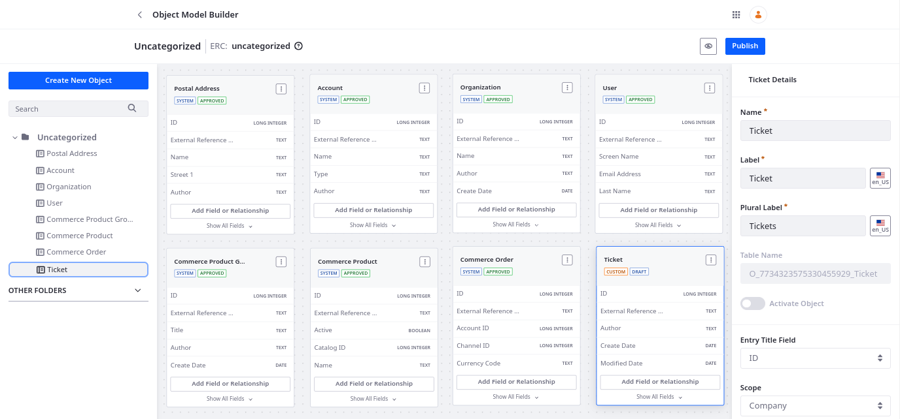
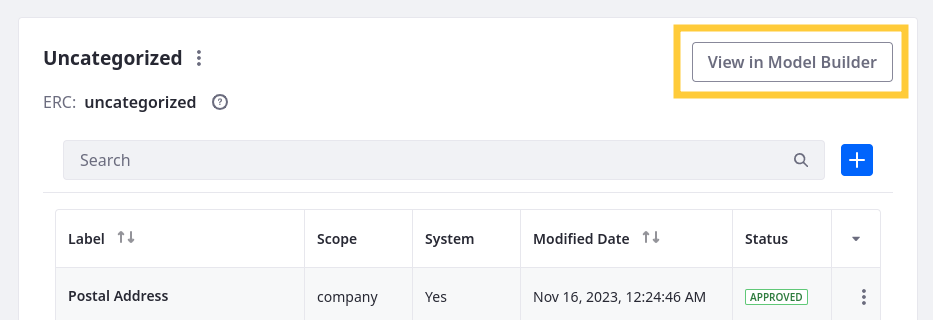
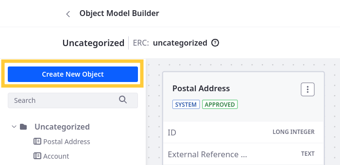
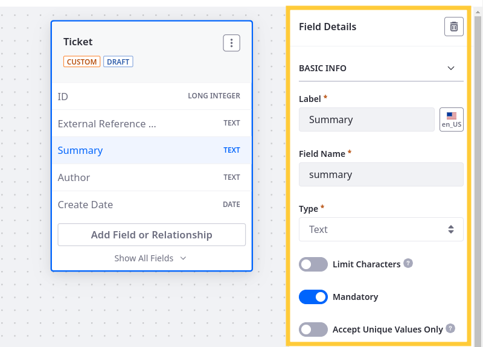
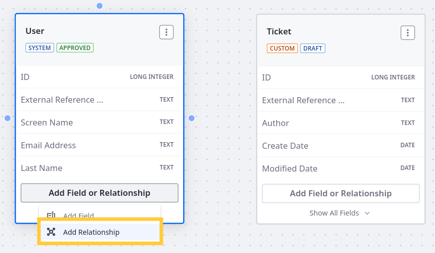
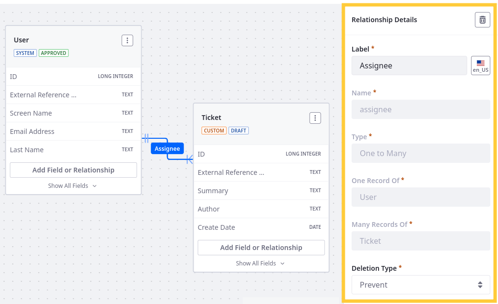
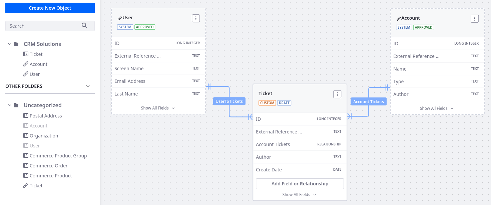
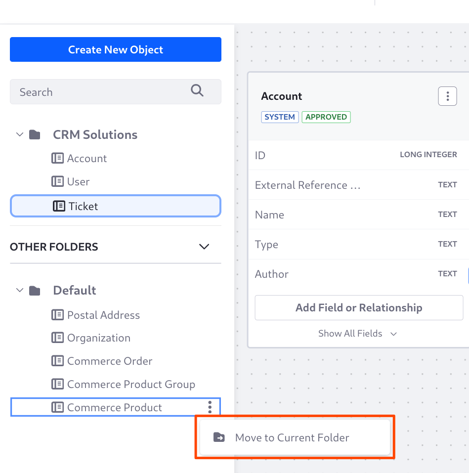
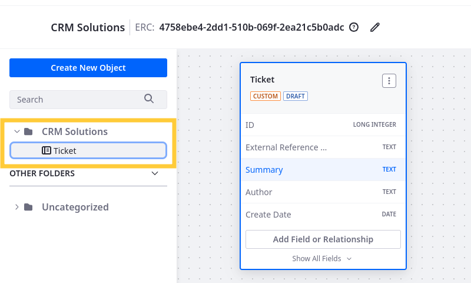
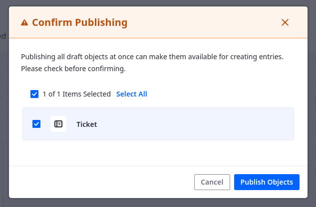

# Using the Objects Model Builder

{bdg-link-secondary}`[Liferay 7.4 2023.Q4+/GA102+](#model-builder-availability)`

Liferay Objects provides the Model Builder GUI for designing complex object structures. This graphical tool displays each object definition as a card and visualizes relationships between object definitions. With it, you can create, manage, and extend data models in the Objects application and quickly configure definitions, fields, and relationships.

!!! note 
    For Liferay 7.4 2023.Q4+/GA102+, you must have *Object Folder > View* permissions to access the Objects UI. See [Objects Application Permissions](../objects-application-permissions.md) for more information.

To access the Model Builder view,

1. Open the *Global Menu* (), go to the *Control Panel* tab, and click *Objects*.

1. Go to the desired [object folder](./organizing-objects-with-folders.md) and click *View in Model Builder*.

   

From here you can create, edit, and manage object definitions.

!!! tip 
    The Model Builder view is great for quickly configuring multiple object definitions and their attributes. It is especially helpful for visualizing and managing object relationships.

## Creating Objects

1. Go to the desired object folder.

1. Click *Create New Object*.

   

1. Provide these details for your object draft.

   **Label**: Identifies the object in the Objects admin and supported application contexts (e.g., Workflow, Display Page Templates, Forms).

   **Plural Label**: Determines the display name for the object application in the UI.

   **Object Name**: Determines the object's `definition.name` and cannot be changed after publishing.

1. Click *Save*.

Once saved, the draft definition appears in the center diagram area. You can click it to access configuration options in the right side panel.

In the side panel, you can edit the object's details, enable integrations, and configure additional features (e.g., categorization, draft mode).

You can also add fields and relationships to object definitions. However, some configurations cannot be added from the model builder view. [Validations](./validations.md), [actions](./actions.md), [views](./views.md), [layouts](./layouts.md), and [states](./fields/adding-and-managing-custom-states.md) must be added from the object's page view. To access the page view from the model builder view, click *Actions* () &rarr; *Edit in page view* in the object card.

### Adding Data Fields

1. Click *Add Field or Relationship* for an object definition.

1. Select *Add Field*.

   

1. Enter a *Label* and *Field Name*.

   **Label**: Identifies the field in the Objects UI and can be localized after the field is created.

   **Field Name**: Determines the field's name in the back-end and uses camel case. Once a field is published, this value cannot be changed.

1. Select a field *Type*. See [Field Types Reference](./fields/adding-fields-to-objects.md#field-types-ui-reference) for more information about available field types and configuration options.

1. Click *Save*.

The field is added immediately to the definition. By default, object cards display five fields, but you can click *Show All Fields* to view others. Additionally, you can select a field in the object card to access its configuration options in the right side panel.

### Defining Relationships

1. Click *Add Field or Relationship* for an object definition.

1. Select *Add Relationship*.

   

1. Enter a *Label* and *Name*.

   **Label**: Identifies the relationship in the Objects UI and can be localized after the relationship is created.

   **Name**: Determines the relationship's name in the back-end and uses camel case. Once the relationship is published, this value cannot be changed.

1. Select a relationship *Type* and an object definition for the other side of the relationship. See [Defining Object Relationships](./relationships/defining-object-relationships.md) for more information.

1. Click *Save*.

Once saved, the diagram area visualizes the logical connection between object definitions and distinguishes between one-to-many and many-to-many relationships. Click a relationship connector to access configuration options in the right side panel.

If you define relationships with object definitions in other folders, the diagram area displays their cards with a dashed border. This is only for visualizing the relationship and does not grant users the ability to edit the object definitions. To edit a definition, you must navigate to the object's source folder.

## Managing Objects

You can drag and drop object cards in the Model Builder diagram area to reorganize them visually. Liferay saves position updates automatically. Additionally, you can move object definitions between folders.

1. Go to the desired destination folder.

1. Click *Actions* () for an object from another folder in the left sidebar.

1. Select *Move to Current Folder*.

   

This moves the definition to the current folder. Moving an object definition does not affect its relationships and is only for improving organization and object management.

You can access additional management options by clicking Actions () for an object card. Available options include

* Edit in Page View: Switch to the default Objects UI.
* Edit ERC: Update the object's external reference code (ERC).
* Export as JSON: [Download](./exporting-and-importing-object-definitions.md) the JSON object definition.
* Manage Permissions: Determine which roles can [act on the object](../objects-application-permissions.md#actions-on-database-entities).
* Delete Object: [Delete](./deleting-objects.md) the object definition.

### Publishing Object Drafts

While using Model Builder, you can publish individual object definitions as well as complex data models that include multiple objects. 

1. Go to the folder with the object drafts.

1. Click *Publish*.

1. Select which drafts to publish.

   

1. Click *Publish Objects*.

The selected drafts begin publishing simultaneously.

## Model Builder Availability 

Model Builder was released behind a [release feature flag](../../../system-administration/configuring-liferay/feature-flagz.md) in Liferay 7.4 2023.Q4/GA102. It was made Generally Available (GA) in 2024.Q1/GA112.

| Liferay Version | Feature Status | Feature Flag [Label] |
|:---|:---|:---|
| 2023.Q4 GA102 | [Release Feature](../../../system-administration/configuring-liferay/feature-flagz.md#release-feture-flags) | &#10004; [Object Model Builder (LPS-148856)] |
| 2024.Q1+ GA112+ | GA | &#10008; |

## Related Topics

* [Creating Objects](./creating-objects.md)
* [Adding Fields to Objects](./fields/adding-fields-to-objects.md)
* [Defining Object Relationships](./relationships/defining-object-relationships.md)
