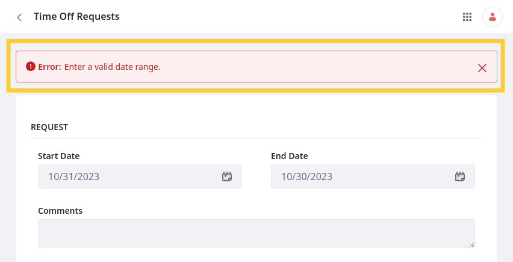
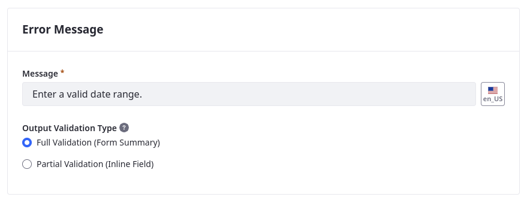

# Adding Custom Validations

{bdg-secondary}`Available Liferay 7.4 U27+/GA27+`

Validations set rules for determining valid field entries. Each validation has its own trigger, conditions, and error text, which you can set via the Objects UI. You can define validations using [Groovy scripts](#using-groovy-validations) or [Liferay expressions](#using-expression-builder-validations).



```{important}
Groovy script validations are only available for Liferay Experience Cloud Self-Managed and Liferay DXP Self-Hosted.
```

Follow these steps to add a validation:

1. Open the *Global Menu* (  ), go to the *Control Panel* tab, and click *Objects*.

1. Begin editing an object definition.

   ```{note}
   For Liferay 7.4 U38+/GA38+, you can add custom validations to system objects.
   ```

1. Go to the *Validations* tab and click *Add* (  ).

1. Enter a *label* and select a validation type: *Groovy* or *Expression Builder*.

   

1. Click *Save*.

1. Begin editing the newly created validation.

1. Go to the *Conditions* tab and add conditions to the validation.

   

   When using Groovy, you can browse and add available data fields to your conditions via the side panel. See [Using Groovy Validations](#using-groovy-validations) for more information.

   When using Expression Builder, you can browse and add fields, operators, and functions to your conditions via the side panel. See [Using Expression Builder Validations](#using-expression-builder-validations) for more information.

   ```{tip}
   Conditions can include multiple fields and functions for complex validations.
   ```

1. Enter a localizable *error message*. This message appears whenever the validation is triggered and field entries do not meet one or more of the defined conditions.

1. Go to the *Basic Info* tab and *activate* the validation.

1. Select a *Trigger Event* to determine when the validation runs.

   Each validation can only have one trigger event.

   

1. Click *Save*.

Once activated, the validation runs for all new object entries.

## Using Groovy Validations

Groovy validations support all standard [Groovy Script](https://groovy-lang.org/) capabilities. When defining conditions, you must use the `invalidFields` variable. Liferay only displays the validation error message when `invalidFields` returns `true`.



For Liferay 7.4 U33+ and GA33+, Liferay uses the [GroovyShell class](https://docs.groovy-lang.org/latest/html/api/groovy/lang/GroovyShell.html) to check your Groovy scripts for valid syntax when you click *Save*. If the script is invalid, Liferay shows an error message.

## Using Expression Builder Validations

Expression Builder provides predefined fields, operators, and functions that you can access in the Elements side panel. Clicking an element adds it to the conditions editor. These functions return a Boolean value. See [Expression Builder Validations Reference](./expression-builder-validations-reference.md) for a complete list of provided operators and functions.

```{important}
You can only use Expression Builder validations with text, numeric, date, and boolean field types.
```


For Liferay 7.4 U33+ and GA33+, Liferay checks your expression for valid syntax when you click Save. If the expression is invalid, Liferay shows an error message.

### Expression Builder Operators

This table lists available operators for Expression Builder validations:

| Operator | Description |
| :--- | :--- |
| And ( `AND` ) | Coordinating conjunction used to indicate a dependent relationship |
| Divided By ( `/` ) | Mathematical operator for division |
| Minus ( `-` ) | Mathematical operator for subtraction |
| Or ( `OR` ) | Coordinating conjunction used to indicate an independent relationship |
| Plus ( `+` ) | Mathematical operator for addition |
| Multiply ( `*` ) | Mathematical operator for multiplication |

### Expression Builder Functions

This table lists available Expression Builder functions with their compatible field types:

| Operator | Text Fields | Numeric Fields | Date Fields |
| :--- | :--- | :--- | :--- |
| Compare Dates |  |  | &#10004; |
| Concat | &#10004; |  |  |
| Condition | &#10004; | &#10004; | &#10004; |
| Contains | &#10004; | &#10004; |  |
| Does Not Contain | &#10004; | &#10004; |  |
| Future Dates |  |  | &#10004; |
| Is a URL | &#10004; |  |  |
| Is an Email | &#10004; |  |  |
| Is Decimal |  | &#10004; |  |
| Is Empty | &#10004; |  |  |
| Is Equal To | &#10004; | &#10004; |  |
| Is Greater Than |  | &#10004; |  |
| Is Greater Than or Equal To |  | &#10004; |  |
| Is Integer |  | &#10004; |  |
| Is Less Than |  | &#10004; |  |
| Is Less Than or Equal To |  | &#10004; |  |
| Is Not Equal To | &#10004; | &#10004; |  |
| Match | &#10004; |  |  |
| Past Dates |  |  | &#10004; |
| Range |  |  | &#10004; |
| Sum |  | &#10004; |  |

## Available Fields Reference

{bdg-secondary}`For 7.4 U41+/GA41+`

When constructing conditions, you can use any of the object's custom or system fields. You can also select from relationship fields on the child side of a one-to-many relationship.

Below are all default fields available for custom objects:

| Field | Description |
| :--- | :--- |
| `companyId` | Portal instance where the entry was created |
| `createDate` | When the entry was created |
| `externalReferenceCode` | External reference code for the entry |
| `groupId` | Site ID in where the entry was created |
| `lastPublishDate` | Date when the entry was last published |
| `modifiedDate` | Date when the entry was last modified |
| `mvccVersion` | MVCC version of the entry |
| `objectDefinitionId` | ID of the entry's object |
| `objectEntryId` | ID for the entry |
| `status` | Workflow status for the entry |
| `statusByUserId` | ID of the assigned user in Workflow |
| `statusByUserName` | Name of the assigned user in Workflow |
| `statusDate` | Date when the Workflow status was last updated |
| `userId` | ID of the entry's author |
| `userName` | User name of the entry's author |
| `uuid` | Unique universal ID for the entry |

System objects have their own default fields, though there is some overlap with the above chart.

## Additional Information

* [Creating Objects](../creating-objects.md)
* [Adding Fields to Objects](../fields/adding-fields-to-objects.md)
* [Expression Builder Validations Reference](./expression-builder-validations-reference.md)
