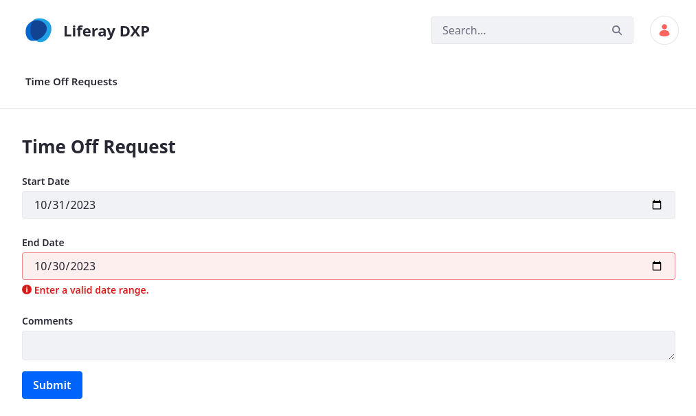
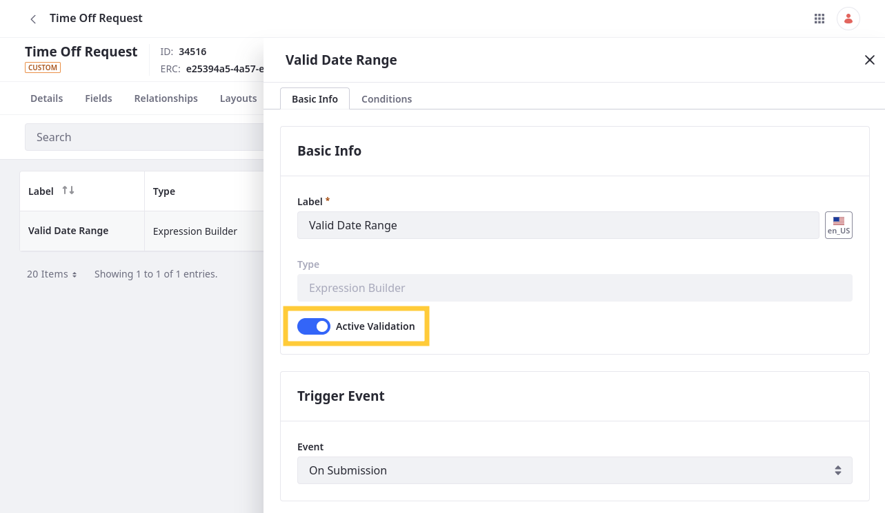
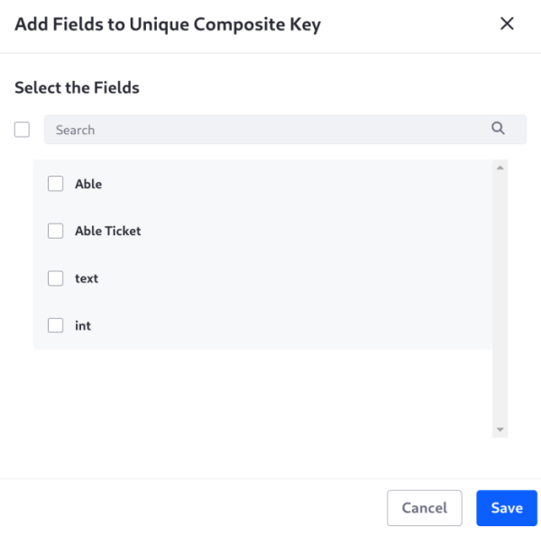
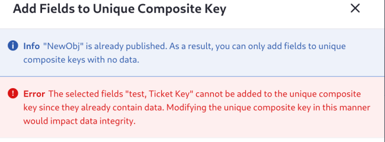

# Adding Field Validations

{bdg-secondary}`Liferay 7.4 2023.Q3+/GA92+`

Validations set rules for determining valid field entries. Each validation has its own trigger, conditions, and error message, which you can set via the Objects UI. You can define validations using [Groovy scripts](#using-groovy-validations) or [Liferay expressions](#using-expression-builder-validations).

A third type of validation is available as of Liferay DXP 2024.Q1+/GA112+: [Composite Key validation](#using-composite-key-validations). Use composite key validations to require that a combination of two or more fields be unique.

!!! note
    If out-of-the-box validations don't meet your needs, you can create custom validations using the `objectValidationRule` client extension. See [Microservice Client Extensions](../../../client-extensions/microservice-client-extensions.md) for more information.

To add a validation,

1. Open the *Global Menu* (  ), go to the *Control Panel* tab, and click *Objects*.

1. Begin editing an object definition.

1. Go to the *Validations* tab and click *Add* (  ).

1. Enter a *label* and select a validation type: *Groovy*, *Expression Builder*, or *Composite Key*.

   If you've deployed object validation rule client extensions to your instance, they also appear as options.

   

1. Click *Save*.

1. Begin editing the validation.

1. In the Basic Info tab, activate the validation.

   

1. Select the *trigger event* to determine when the validation runs.

   Each validation can only have one trigger event.

1. Add validation rules. 

   For Groovy and Expression Builder validations, go to the *Conditions* tab and add conditions to the validation.

   Conditions can include multiple fields and functions for performing complex logic.

   

   When using Groovy, you can browse and add available data fields to your conditions via the side panel. See [Using Groovy Validations](#using-groovy-validations) for more information.

   When using Expression Builder, you can browse and add fields, operators, and functions to your conditions via the side panel. See [Using Expression Builder Validations](#using-expression-builder-validations) for more information.

   !!! important
       Groovy script validations are only available for Liferay PaaS and Liferay DXP Self-Hosted.

   To set up composite key validations, go to the *Unique Composite Key* tab and select the fields to use as a composite key. See [Using Composite Key Validations](#using-composite-key-validations) for more information.

   

1. Enter a localizable *error message*. This message appears whenever the validation is triggered, and field entries do not meet one or more of the defined conditions.

1. Select an output validation type to determine where the error message appears.

   **Full Validation (Form Summary)**: Display the error message at the top of the form.

   **Partial Validation (Inline Field)**: Display the error message next to the specified field.

   

1. Click *Save*.

While activated, the validation runs for all new object entries and is displayed in [layouts](../layouts.md) and [form containers](../../using-fragments-to-build-forms.md)

## Using Groovy Validations

{bdg-primary}`Liferay PaaS and Liferay DXP Self-Hosted`

Groovy validations support all standard [Groovy Script](https://groovy-lang.org/) capabilities. When defining conditions, you must use the `invalidFields` variable. Liferay only displays the validation error message when `invalidFields` returns `true`.

Liferay uses the [GroovyShell class](https://docs.groovy-lang.org/latest/html/api/groovy/lang/GroovyShell.html) to check your Groovy scripts for valid syntax when you click *Save*. If the script is invalid, Liferay shows an error message.

## Using Expression Builder Validations

Expression Builder provides predefined fields, operators, and functions that you can access in the Elements side panel. Clicking an element adds it to the conditions editor. These functions return a Boolean value. See [Expression Builder Validations Reference](./expression-builder-validations-reference.md) for a complete list of provided operators and functions.

!!! important
    You can only use Expression Builder validations with text, numeric, date, and Boolean field types.

Liferay checks your expression for valid syntax when you click Save. If the expression is invalid, Liferay shows an error message.

### Expression Builder Operators

This table lists available operators for Expression Builder validations:

| Operator           | Description                                                           |
|:-------------------|:----------------------------------------------------------------------|
| And ( `AND` )      | Coordinating conjunction used to indicate a dependent relationship    |
| Divided By ( `/` ) | Mathematical operator for division                                    |
| Minus ( `-` )      | Mathematical operator for subtraction                                 |
| Or ( `OR` )        | Coordinating conjunction used to indicate an independent relationship |
| Plus ( `+` )       | Mathematical operator for addition                                    |
| Multiply ( `*` )   | Mathematical operator for multiplication                              |

### Expression Builder Functions

This table lists available Expression Builder functions with their compatible field types:

| Operator                    | Text Fields | Numeric Fields | Date Fields | Description                                                                                                            |
|:----------------------------|:------------|:---------------|:------------|:-----------------------------------------------------------------------------------------------------------------------|
| Compare Dates               |             |                | &#10004;    | Checks if a date field's value is the same as a set value.                                                             |
| Concat                      | &#10004;    |                |             | Combines multiple strings or text fields and returns a single string that you can use with other validation functions. |
| Condition                   | &#10004;    | &#10004;       | &#10004;    | Checks if user input meets one or more conditions and returns a Boolean value.                                         |
| Contains                    | &#10004;    | &#10004;       |             | Checks if a field contains a specified value and returns a Boolean.                                                    |
| Does Not Contain            | &#10004;    | &#10004;       |             | Checks if a field does not contain a specified value and returns a Boolean.                                            |
| Future Dates                |             |                | &#10004;    | Checks if a date field's value is in the future and returns a Boolean.                                                 |
| Is a URL                    | &#10004;    |                |             | Checks if a text field is a URL and returns a Boolean.                                                                 |
| Is an Email                 | &#10004;    |                |             | Checks if a text field is an email and returns a Boolean.                                                              |
| Is Decimal                  |             | &#10004;       |             | Checks if a number field is a decimal and returns a Boolean.                                                           |
| Is Empty                    | &#10004;    |                |             | Checks if a text field is empty and returns a Boolean.                                                                 |
| Is Equal To                 | &#10004;    | &#10004;       |             | Checks if a field value is equal to a specified value and returns a Boolean.                                           |
| Is Greater Than             |             | &#10004;       |             | Checks if a number field is greater than a specific numeric value and returns a Boolean.                               |
| Is Greater Than or Equal To |             | &#10004;       |             | Checks if a number field is greater than or equal to a specific numeric value and returns a Boolean.                   |
| Is Integer                  |             | &#10004;       |             | Checks if a number field is an integer and returns a Boolean.                                                          |
| Is Less Than                |             | &#10004;       |             | Checks if a number field is less than a specific numeric value and returns a Boolean.                                  |
| Is Less Than or Equal To    |             | &#10004;       |             | Checks if a number field is less than or equal to a specific numeric value and returns a Boolean.                      |
| Is Not Equal To             | &#10004;    | &#10004;       |             | Checks if a field value is different from a specified value and returns a Boolean.                                     |
| Match                       | &#10004;    |                |             | Checks if a text field matches a specific string value or RegEx expression and returns a Boolean.                      |
| Old Value                   | &#10004;    | &#10004;       | &#10004;    | Retrieves the prior value for the specified field.                                                                     |
| Past Dates                  |             |                | &#10004;    | Checks if a date field's value is in the past and returns a Boolean.                                                   |
| Range                       |             |                | &#10004;    | Checks if a date range begins with a past date and ends with a future date and returns a Boolean.                      |
| Sum                         |             | &#10004;       |             | Adds multiple numeric fields together and returns a single number that you can use with other validation functions.    |

See [Expression Builder Validations Reference](./expression-builder-validations-reference.md) for more information and examples.

## Available Fields Reference

When constructing conditions, you can use any of the object's custom or system fields. You can also select from relationship fields on the child side of a one-to-many relationship.

Below are all default fields available for custom objects:

| Field                   | Description                                    |
|:------------------------|:-----------------------------------------------|
| `companyId`             | Portal instance where the entry was created    |
| `createDate`            | When the entry was created                     |
| `currentDate`           | Date when the entry is submitted               |
| `currentUserId`         | ID of the user submitting the entry            |
| `externalReferenceCode` | External reference code for the entry          |
| `groupId`               | Site ID in where the entry was created         |
| `lastPublishDate`       | Date when the entry was last published         |
| `modifiedDate`          | Date when the entry was last modified          |
| `mvccVersion`           | MVCC version of the entry                      |
| `objectDefinitionId`    | ID of the entry's object                       |
| `objectEntryId`         | ID for the entry                               |
| `status`                | Workflow status for the entry                  |
| `statusByUserId`        | ID of the assigned user in Workflow            |
| `statusByUserName`      | Name of the assigned user in Workflow          |
| `statusDate`            | Date when the Workflow status was last updated |
| `userId`                | ID of the entry's author                       |
| `userName`              | User name of the entry's author                |
| `uuid`                  | Unique universal ID for the entry              |

System objects have their own default fields, though there is some overlap with the above chart.

## Using Composite Key Validations

{bdg-secondary}`Liferay DXP 2024.Q1+/GA112+`

To add composite key validation to your object, first enable its release feature flag. Go to *Global Menu* () &rarr; *Control Panel* &rarr; *Instance Settings* &rarr; *Feature Flags*. Open the *Release* section and enable *Improve Field Validations (LPS-187854)*.

Some data models and applications require unique composite keys. For example, an orders object can require that each combination of customer ID and order date are unique in the system. Once enforced, this composite key can be used to look up and work with unique order entries. The Unique Composite Key validation ensures that a combination of fields is unique in the scope of the object. Site-scoped objects can have unique composite keys in the site, while instance-scoped objects can have unique composite keys throughout the instance.

You can use text, integer, and picklist fields in composite keys. You can also use relationship fields on the child side of a one-to-many relationship.

You cannot add a field to a composite key if it already has data.

Certain actions are only supported in draft objects:

| Action                                           | Object Status          | Supported                |
|:-------------------------------------------------|:-----------------------|:-------------------------|
| Delete the validation                            | Draft  Published | &#10004;  &#10004; |
| Remove a field from the validation               | Draft  Published | &#10004;  &#10008; |
| Delete a field that's being used in a validation | Draft  Published | &#10008;  &#10008; |

## Related Topics

* [Creating Objects](../creating-objects.md)
* [Adding Fields to Objects](../fields/adding-fields-to-objects.md)
* [Expression Builder Validations Reference](./expression-builder-validations-reference.md)
