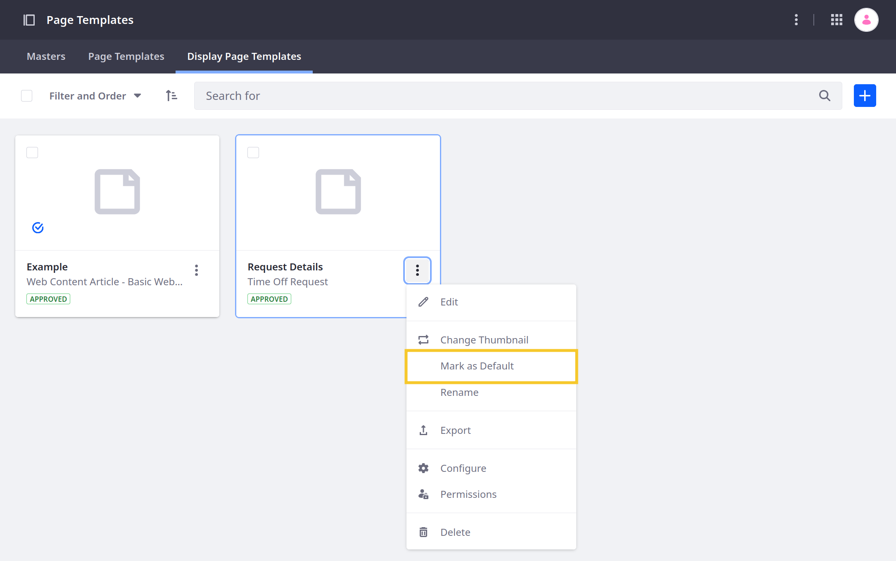

# Displaying Object Entries

{bdg-secondary}`Liferay 7.4+`

With Liferay Objects, you can use existing DXP frameworks to display Object entries dynamically in Sites. This includes collection displays for multiple entries and display pages for individual entries.

When an Object is published, Liferay creates a Collection Provider for use with the [Collection Display fragment](../../site-building/displaying-content/collections-and-collection-pages/displaying-collections.md#adding-a-collection-display-fragment-to-a-page) to display multiple Object entries. You can also configure the fragment to style, filter, and paginate the collection. See [Displaying Object Entries with Collection Providers](./displaying-object-entries-with-collection-providers.md) for more information.

And since published Objects are integrated with the Info framework, you can select them as the content type for [Display Page Templates](../../site-building/displaying-content/using-display-page-templates.md). When selected, the Object is set as the template's mapping source, so you can easily map fragment fields to Object fields to create flexible page displays for individual Object entries.

Additionally, you can use FreeMarker to create [Information Templates for Objects](#creating-information-templates-for-objects). Once created, you can map fragment fields to your template to determine how entries are rendered in Content Pages and Display Pages.

```{note}
Information Templates can be used in Content Display fragments and any other fragment with [sub-elements](../../site-building/creating-pages/page-fragments-and-widgets/using-fragments/configuring-fragments/fragment-sub-elements-reference.md) (e.g., text, rich text) that can be mapped to Objects.
```

Together, these integrations enable users to leverage Liferay's WYSIWYG page building capabilities while delivering personalized user experiences.

## Creating Display Page Templates for Objects

When created, each Object entry is assigned automatically a dedicated friendly URL that uses the following pattern: `server-address/l/objectEntryId` (e.g., `https://mysite.com/l/44337`). To view an entry at its URL, you must first create a Display Page Template for the Object.

Follow these steps:

1. Open the *Site Menu* (), expand *Design*, and go to *Page Templates*.

1. Click the *Display Page Templates* tab.

1. Click the *Add* button () and select the *Blank* template.

   This opens a modal window.

1. Enter a *name* and select the desired *Object* for Content Type.

   

1. Click *Save*.

   This creates a blank template with the selected Object as its default mapping source and redirects you to the template editing page.

1. Use page fragments and widgets to create flexible, dynamic displays for Object entries. See [Using Display Page Templates](../../site-building/displaying-content/using-display-page-templates.md) for information.

   

1. Add the Page Comments widget so end users can comment on entry display pages.

   ```{note}
   You must enable comments for the object definition. Otherwise, the widget is hidden in the display page.
   ```

1. When finished, click *Publish*.

1. Click the *Actions* button () for your template and select *Mark as Default*.

   This template is now used to render the Object's entries whenever users visit their friendly URLs.

   

### Enabling Comments

1. Open the *Global Menu* (), go to the *Control Panel* tab, and click *Objects*.

1. Edit an object definition.

1. In the Details tab, enable comments and click *Save*.

   

## Creating Information Templates for Objects

1. Open the *Site Menu* () and go to *Design* &rarr; *Templates* &rarr; *Information Templates*.

1. Click *Add* ()

1. Enter a *name* and select the desired *Object*.

   

1. Click *Save*. This redirects you to the template design page.

1. (Optional) Click Actions () in the Application Bar, select *Import Script*, and choose an `.ftl` file to import. This replaces the current template with the file's FreeMarker script.

   

1. Use [FreeMarker](https://freemarker.apache.org) to design your template.

   In the *Elements* side panel (), you can access available fields from the selected Object's structure.

   

1. (Optional) Add a description or image to the template in the Properties side panel ().

   

1. Click *Save* when finished.

You can now select from the template when mapping Object entries to fragment fields.


## Adding Entries to Navigation Menus

Since Objects are integrated with the info framework, you can add Object entries to navigation menus to provide quick access. All published Objects automatically appear as available sources for menu elements. See [Using the Navigation Menus Application](../../site-building/site-navigation/using-the-navigation-menus-application.md) for more information.

## Related Topics

* [Creating Objects](./creating-and-managing-objects/creating-objects.md)
* [Displaying Object Entries with Collection Providers](./displaying-object-entries-with-collection-providers.md)
* [About Collections and Collection Pages](../../site-building/displaying-content/collections-and-collection-pages/about-collections-and-collection-pages.md)
* [Using Display Page Templates](../../site-building/displaying-content/using-display-page-templates.md)
