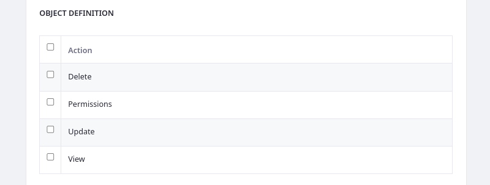

# Objects Application Permissions

{bdg-secondary}`Liferay 7.4+`

Like other Liferay applications, the Objects portlet is integrated with the permissions framework. This means you can assign [application](#application-permissions) and [resource](#resource-permissions) permissions to user roles to determine which users have access to the Objects portlet and its data.


See [Defining Role Permissions](../../users-and-permissions/roles-and-permissions/defining-role-permissions.md) for more information about assigning permissions to user roles.

## Application Permissions

Application permissions grant permission to perform general application-related operations and do not include [resource-related permissions](#resource-permissions).

Objects has the following application permissions:

| Permission | Description |
| :--- | :--- |
| Access in Control Panel | Access Objects in the Global Menu. |
| Configuration | View and modify configuration options for the Objects portlet. |
| Permissions | View and modify Objects permissions. |
| Preferences | View and modify preferences for the Objects portlet. |
| View | View the Objects portlet. |

## Resource Permissions

Resource permissions grant access to view and act on resources in the Objects application. Some of these permissions [relate to creating object definitions](#resource-related-actions), while others are for [performing actions on existing definitions](#actions-on-database-entities) (e.g., edit, delete).

Objects has the following resource permissions.

### Resource-Related Actions

| Permission | Description |
| :--- | :--- |
| Add Object Definition | Create an object definition draft. |
| Extend System Object Definition | Add fields, relationships, actions, and validations to system objects. |
| Permissions | View and manage permissions related to objects. |
| Publish Object Definition | Publish an object definition draft. |

### Actions on Database Entities

| Permission | Description |
| :--- | :--- |
| Delete | Delete an object definition. |
| Permissions | View and modify permissions for an object definition. |
| Update | Update an object definition. |
| View | View an object definition. |

## Managing Permissions for Individual Object Definitions

Follow these steps to manage permissions for individual object definitions:

1. Open the *Objects* application via the *Global Menu* ().

1. Click the *Actions* button () for the desired object definition and select *Permissions*.

   

1. Use the checkboxes to grant [object definition](#actions-on-database-entities) permissions to the desired roles.

   ```{note}
   Permissions defined at the roles admin level override permissions defined at the individual level.
   ```

   

1. Click *Save*.

## Related Topics

* [Objects](../objects.md)
* [Creating and Managing Objects](./creating-and-managing-objects.md)
