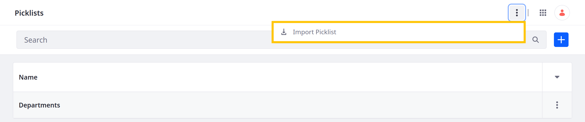

# Exporting and Importing Picklists

You can transfer picklists between environments as JSON files using Liferay's export/import framework.

## Exporting Picklists

1. Open the *Global Menu* (), go to the *Control Panel* tab, and click *Picklists*.

1. Click *Actions* () for the desired list and select *Export as JSON*.

   This downloads the picklist definition and items as a JSON file.

   

## Importing Picklists

1. Open the *Global Menu* (), go to the *Control Panel* tab, and click *Picklists*.

1. Click *Actions* () in the Application Bar and select *Import Picklist*.

   

1. In the modal window, enter a name for the list and select the picklist JSON to import.

1. Click *Import*.

   

## Related Topics

* [Creating Picklists](./creating-picklists.md)
* [Picklist API Basics](./picklists-api-basics.md)
