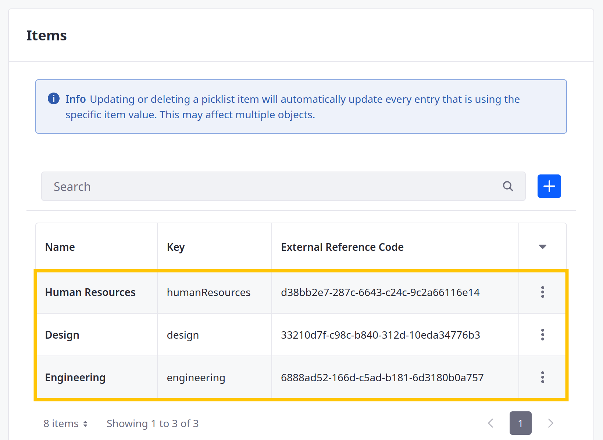

# Using Picklists

{bdg-secondary}`Available Liferay 7.4+`

Picklists are predefined lists of string values that consist of name/key pairs. Once defined, you can use these lists with object definitions.

## Creating a Picklist

1. Open the *Global Menu* (), go to the *Control Panel* tab, and click *Picklists*.

1. Click *Add* ().

   

1. Name the picklist. This identifies the list in the Liferay UI and can be localized after creation.

1. Click *Save* to create an empty picklist definition and generate an external reference code (ERC) for it, which you can edit.

1. Click the new picklist to begin editing it.

1. Under Items, click the *Add* button ().

   

1. In the modal window, enter a name and key for the item.

   **Name**: Determines the item's display name and can be localized after creation.

   **Key**: Determines the standard value understood by applications in the back-end and uses camel case.

   

1. Click *Save*. This immediately updates the picklist with the new item and generates an external reference code (ERC) for it.

   If desired, you can click the list item to localize its name or edit its ERC, but you cannot change its key value. You can remove items at any time.

1. Repeat the above steps to add additional items to the list.

   

## Adding Picklist Fields to Objects

{bdg-secondary}`For 7.4 U56+/GA56+`

After creating a list, you can select it when creating object fields. Select the *Picklist* or *Multiselect Picklist* field type and choose the list. See [Adding Fields to Objects](../creating-and-managing-objects/fields/adding-fields-to-objects.md) and [Adding and Managing Custom States](../creating-and-managing-objects/fields/adding-and-managing-custom-states.md) for more information.


When users access this field in an object's layout, it appears as a drop-down menu that lists the picklist's items.


```{important}
You cannot delete a list if it is used by an object field, though you can edit and remove list items at any time.

Updating or deleting a picklist item automatically updates all object entries using the item value.
```

## Picklist Fields in Object API Calls

{bdg-secondary}`For 7.4 U56+/GA56+`

When making POST, PATCH, and PUT API calls for objects that include a picklist field, you must use the following request payload formats for Picklist and Multiselect Picklist fields, respectively.

### Picklist Field Type

```json
{ 
      "picklistExample": {
        "key": "firstOption",
        "name": "First Option"
      }
}
```

### Multiselect Picklist Field Type

```json
{ 
      "picklistExample": [
        {
          "key": "firstOption",
          "name": "First Option"
        },
        {
          "key": "secondOption",
          "name": "Second Option"
        }
      ]
}
```

## Additional Information

* [Adding Fields to Objects](../creating-and-managing-objects/fields/adding-fields-to-objects.md)
* [Managing Picklist Permissions](./managing-picklist-permissions.md)
* [Picklist API Basics](./picklists-api-basics.md)
