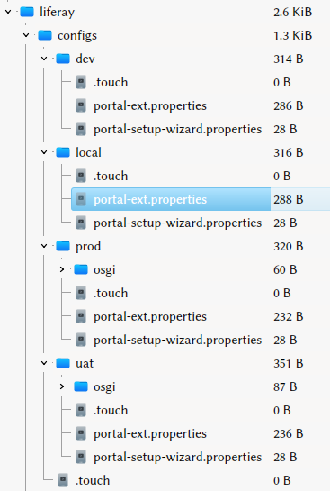

# Creating Deployment Environments

There comes a point when your code is ready to share. For that, you must build an environment. In the corporate world, there are usually three environments: 

* Developer: an environment for early testing, where code can be fixed and redeployed rapidly. Developers and power users test here. 
* User Acceptance Testing (UAT): an environment that more closely mirrors the production configuration. When your application is near-complete, you generally invite a larger segment of users to test here. 
* Production: the environment where your live site lives. Deployments are tightly controlled, and only code that's been tested on the other two environments is deployed. 

Liferay Workspace makes it easy to generate your deployment environments, whether they be container-based or traditional. You provide the configuration, run a Gradle task, and you can generate a distributable Docker container or server archive ready to install. Workspace contains an optional `configs` folder where the action happens. 

If you created your workspace using [Blade CLI](../blade-cli/generating-projects-with-blade-cli.md), the `configs` folder already exists. If you created your Workspace [manually](./creating-a-liferay-workspace.md), create this folder structure in your Workspace directory: 

   ```
   ├── common
   │   └── portal-setup-wizard.properties
   ├── dev
   │   └── portal-ext.properties
   ├── docker
   ├── local
   ├── prod
   └── uat
       └── portal-ext.properties
   ```

Don't put anything in the files yet. 

## How Deployment Environments Work

The `configs` folders define specific scenarios: 

`common`: Contains configuration that applies to all the environments. 

`dev`: Contains configuration for the development environment. 

`docker`: Contains Docker configuration. 

`local`: Contains configuration for the local environment where the Workspace resides. 

`prod`: Contains configuration for the production environment. 

`uat`: Contains configuration for the User Acceptance Testing environment. 

Placing configuration files in a particular folder defines the configuration for that environment. In the case of `common` and `docker`, all other configurations override them. This is so you can provide a baseline configuration for the environments to override. Now you're ready to build some environments. 

## Building Deployment Environments

Assume this scenario for your environments: 

- Developer environment should use developer properties 
- Local environment points to local database
- Developer and UAT environments point to their own databases
- All environments skip the setup wizard

Here's how to configure that scenario: 

1. In the `common` folder, add this property to `portal-setup-wizard.properties`: 

   ```properties
   setup.wizard.enabled=false
   ```
1. In the `local` folder, configure a local database in `portal-ext.properties`: 

   ```properties
   #
   # MySQL
   #
   jdbc.default.driverClassName=com.mysql.cj.jdbc.Driver
   jdbc.default.url=jdbc:mysql://localhost/lportal?useUnicode=true&characterEncoding=UTF-8&useFastDateParsing=false
   jdbc.default.username=root
   jdbc.default.password=password
   ```

1. In the `dev` folder, enable developer properties and configure a database on the development server in `portal-ext.properties`: 

   ```properties
   include-and-override=portal-developer.properties

   #
   # MySQL
   #
   jdbc.default.driverClassName=com.mysql.cj.jdbc.Driver
   jdbc.default.url=jdbc:mysql://devel.server/lportaldev?useUnicode=true&characterEncoding=UTF-8&useFastDateParsing=false
   jdbc.default.username=root
   jdbc.default.password=password
   ```

1. In the `uat` folder, configure a database on the UAT environment in `portal-ext.properties`:

   ```properties
   #
   # MySQL
   #
   jdbc.default.driverClassName=com.mysql.cj.jdbc.Driver
   jdbc.default.url=jdbc:mysql://uat.server/lportaluat?useUnicode=true&characterEncoding=UTF-8&useFastDateParsing=false
   jdbc.default.username=root
   jdbc.default.password=password
   ```

Excellent! You're all set up now to generate and distribute environments. 

## Generating Deployment Environments

Now you can generate a Docker container or bundles to run locally or to distribute to your server. 

### Generating a Docker Container

When you generate a Docker container, it contains configurations for all environments. You choose which environment you want to use by using the `liferay.workspace.environment` variable. 

To generate a Docker container from your deployment environment configuration, use this command: 

```bash
./gradlew buildDockerImage
```

Once your Docker container is built, this command starts it using the dev configuration above: 

```bash
./gradlew startDockerContainer -Pliferay.workspace.environment=dev
```

The configurations are generated inside the Liferay container, and the variable determines the one to use. 



### Generating Bundles

This is done using either the `initBundle` or the `distBundle` Gradle task. 

1. You should test your environment first. To build it locally, use the `initBundle` command. For example, to build the `dev` environment, you'd run this: 

   ```bash
   ./gradlew initBundle -Pliferay.workspace.environment=dev
   ```
   This compiles and deploys all the projects in your Workspace to the runtime in the `bundles` folder. It also provides the configuration you specified---in this example, the `dev` environment's configuration. If you examine the `portal-ext.properties` file in the `bundles` folder, you'll see it matches what you provided for the `dev` configuration. 

1. If the environment looks good and tests well, you can build a distributable bundle containing all your applications and configuration. Run this command: 

   ```bash
   ./gradlew distBundleTar -Pliferay.workspace.environment=dev
   ```

   This builds a gzipped `tar` file in the `build` folder. You can take this archive and install it on your development server as you would any other Liferay bundle, except that this bundle is fully configured the way you wanted it and has all your applications already installed. 

```{note}
You can use the `distBundleZip` command if you would rather have a .zip archive.
```

Follow the above steps to test and build each environment. 

You can also build all your environments at once. This takes only two steps: 

1. Set the property `liferay.workspace.bundle.dist.include.metadata` to `true` in Workspace's `gradle.properties` file: 

   ```properties
   liferay.workspace.bundle.dist.include.metadata=true
   ```

2. Call the target to build all the bundles. To build all bundles into gzipped tar files, use 

   ```bash
   ./gradlew distBundleTarAll
   ```

   To build all bundles into .zip files, use 

   ```bash
   ./gradlew distBundleZipAll
   ```

