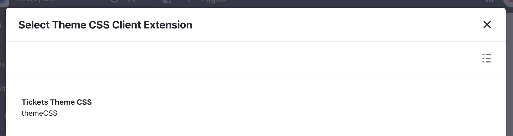

# Applying a Custom Theme

You can use different [front-end client extensions](../../building-applications/client-extensions/front-end-client-extensions.md) to customize the look and feel of your site. Specifically, [theme CSS type](../../building-applications/client-extensions/front-end-client-extensions.md#theme-css-client-extensions) client extension can be used as an alternative to [building custom themes](../../site-building/site-appearance/themes/introduction-to-themes.md).

Run the command below to generate the custom theme:

```bash
./gradlew :client-extensions:tickets-theme-css:deploy
```

In Liferay, click on the _product menu_ () and navigate to _Site Builder_ &rarr; _Pages_.


Click the _options_ icon () in the top right and click _Configuration_.

Scroll down to the theme CSS client extension section and click the _add_ icon (). 

Select the Tickets Theme CSS that was deployed. 



Scroll to the bottom and click _Save_. In the product menu, click _Home_. See the custom theme has been applied.

## Examine the Custom Theme CSS Code

This `tickets-theme-css` client extension is a [theme CSS type](../../building-applications/client-extensions/front-end-client-extensions.md#theme-css-client-extensions) client extension. It is defined as follows in the `client-extension.yaml` file:

```yaml
tickets-theme-css:
    clayURL: css/clay.css
    mainURL: css/main.css
    name: Tickets Theme CSS
    type: themeCSS
```

The customizations for the theme are contained in the two files in the `/src/css` folder. 

The `_clay_variables.scss` file provides any CSS clay variables to be overwritten.

The `_custom.scss` file provides any CSS customizations. Note how the logo and background color has been modified.

See the [Clay CSS](https://clayui.com/docs/css/index.html) documentation to learn more about the variables and customization. And see [using a theme CSS client extension](../../building-applications/client-extensions/front-end-client-extensions/tutorials/using-a-theme-css-client-extension.md) to see another client extension example.

Next: [deploy the custom ticketing application](./deploying-a-custom-application.md).
