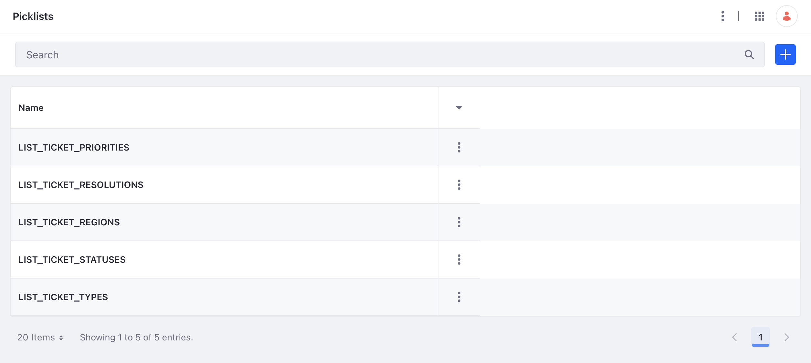
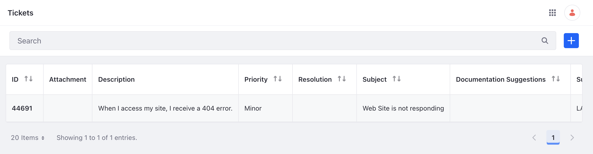

# Customizing a Data Schema

The ticketing application requires custom data fields and selections. Use Liferay [objects](../../building-applications/objects.md) and [picklists](../../building-applications/objects/picklists.md) to define a custom data schema.

## Creating Custom Picklists

A picklist is a predetermined list of values that are defined for users to select. Different picklists are needed for custom fields such as ticket status, ticket type, and ticket priority.

### Deploy the Custom Picklists

Deploy the `list-type-batch` client extension with the following command:

```bash
./gradlew :client-extensions:list-type-batch:deploy
```

In Liferay, navigate to _Control Panel_ &rarr; _Picklists_. See that five new picklists have been created.



### Examining the Custom Picklists Code

This `list-type-batch` client extension is a [batch type](../../building-applications/client-extensions/batch-client-extensions.md) client extension. It is defined as follows in the `client-extension.yaml` file:

```yaml
list-type-batch:
    name: List Type Batch
    oAuthApplicationHeadlessServer: list-type-batch-importer
    type: batch
```

The client extension makes use of the [batch engine headless API](../../headless-delivery/consuming-apis/batch-engine-api-basics-importing-data.md) and the [picklists headless API](../../building-applications/objects/picklists/picklists-api-basics.md). To make secure API requests, the client extension is configured to use OAuth2 authorization. It is defined as follows:

```yaml
list-type-batch-importer:
    .serviceAddress: localhost:8080
    .serviceScheme: http
    name: List Type Batch Importer Application
    scopes:
        - Liferay.Headless.Admin.List.Type.everything
        - Liferay.Headless.Batch.Engine.everything
    type: oAuthApplicationHeadlessServer
```

Note that the `Liferay.Headless.Admin.List.Type` resource and `Liferay.Headless.Batch.Engine` resource are given full CRUD access.

See [`client-extension.yaml`](https://github.com/LiferayCloud/client-extensions-deep-dive-devcon-2023/blob/main/client-extensions/list-type-batch/client-extension.yaml) for the full definition.

The five picklists and their selection items are defined in the JSON file located in the `/batch/` folder of the client extension. See the [`list-type-definition.batch-engine-data.json`](https://github.com/LiferayCloud/client-extensions-deep-dive-devcon-2023/blob/main/client-extensions/list-type-batch/batch/list-type-definition.batch-engine-data.json) file for the full definitions.

## Creating Custom Objects

Once the picklists are defined, the application's custom object can be created.

### Deploy the Custom Object

Deploy the `ticket-batch` client extension with the following command:

```bash
./gradlew :client-extensions:ticket-batch:deploy
```

In Liferay, navigate to _Control Panel_ &rarr; _Objects_. See that a new ticket object has been created.


### Examining the Custom Object Code

This `ticket-batch` client extension is also a [batch type](../../building-applications/client-extensions/batch-client-extensions.md) client extension. The client extension's YAML file is defined in the same way as the 
`list-type-batch` client extension.

See [client-extension.yaml](https://github.com/LiferayCloud/client-extensions-deep-dive-devcon-2023/blob/main/client-extensions/ticket-batch/client-extension.yaml) for the full definition.

The custom ticket object is defined in the JSON file located in the `/batch/` folder of the client extension. See the [`ticket-object-definition.batch-engine-data.json`](https://github.com/LiferayCloud/client-extensions-deep-dive-devcon-2023/blob/main/client-extensions/ticket-batch/batch/ticket-object-definition.batch-engine-data.json) file for the full definition.

## Generating Ticket Data through APIs

With the custom ticket object created, new ticket entries can be created within Liferay. They can also be imported through the use of the object's REST APIs.

Run the following command to generate a ticket entry:

```bash
./gradlew :client-extensions:ticket-entry-batch:deploy
```

In Liferay, navigate to _Control Panel_ &rarr; _Tickets_. See that a new ticket entry has been created.



In the next step, we will [apply a custom theme](./applying-a-custom-theme.md) to the ticketing system.
