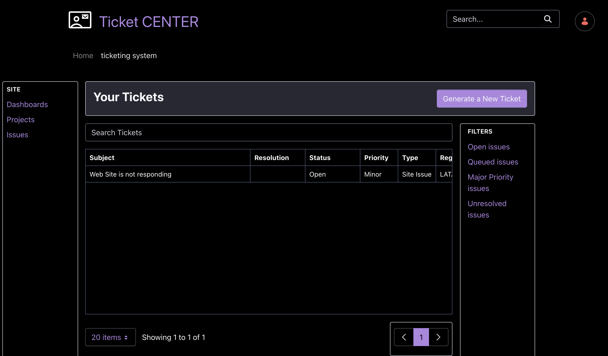

# Deploying a Custom Application

You can use a [custom element client extension](../../building-applications/client-extensions/front-end-client-extensions.md#custom-element-client-extensions) to render a JavaScript application as a widget on a Liferay site page. The application is served by Liferay and interacts with Liferay through [headless APIs](../../headless-delivery/using-liferay-as-a-headless-platform.md). 

Deploy the `current-ticket-custom-element` client extension.

1. Run the following command:

```bash
./gradlew :client-extensions:current-tickets-custom-element:deploy
```

1. In Liferay, click on the _product menu_ () and navigate to _Site Builder_ &rarr; _Pages_.

1. Click the _add_ icon () and select _Page_. 

1. Select the _Blank_ type page. Give the page a name (e.g. "ticketing system"). Click _Add_.

1. In the left navigation under fragments and widgets, click the _widgets_ tab.

1. Scroll down to the client extension type. Drag the _Current Tickets Custom Element_ widget to the page.

1. Click _Publish.

The custom ticketing system application is now running on the site page.



Note, clicking the _Generate a New Ticket_ button generates additional random ticket entries. You can also create your own ticket object entries from _Control Panel_ &rarr; _Tickets_.

## Examine the Custom Element Code

The `assemble` block section of the `client-extension.yaml` file looks like this:

```yaml
assemble:
    - from: build/assets
      into: static
```

Note, the `.js` and `.css` build files of the JavaScript application are copied from the `build/assets` folder and placed into the deployable client extension `.zip` file.

This `current-tickets-custom-element` is a [custom element](../../building-applications/client-extensions/front-end-client-extensions.md#custom-element-client-extensions) type client extension. It is defined as follows in the `client-extension.yaml` file:

```yaml
current-tickets-custom-element:
   cssURLs:
      - "*.css"
   friendlyURLMapping: current-tickets-custom-element
   htmlElementName: current-tickets-custom-element
   instanceable: false
   name: Current Tickets Custom Element
   portletCategoryName: category.client-extensions
   type: customElement
   urls:
      - "*.js"
   useESM: true
```

See [custom element YAML configuration reference](../../building-applications/client-extensions/front-end-client-extensions/custom-element-yaml-configuration-reference.md) for an explanation of each property.

The relevant JavaScript files for the application are contained in the `/src` folder. A full explanation of the JavaScript code is beyond the scope of this tutorial, but a few things to note:

* In the `/src/tickets.js` file, tickets are created and fetched through the use of the `ticket` object that was created when the [data schema](./customizing-a-data-schema.md) was defined. Note the `generateNewTicket()` function in the `/src/ticket.js` file generates additional ticket entries with random field entries.
* In the `/src/tickets.js` file, the object's headless API calls are authorized with the `Liferay.authToken` object. This object is available when a web component is running on Liferay and simplifies OAuth2 authorization.
* The `package.json` file includes a `scripts{ build: }` element that handles the initializing and building of the JavaScript application.

See [understanding custom element and iframe client extensions](../../building-applications/client-extensions/front-end-client-extensions/understanding-custom-element-and-iframe-client-extensions.md) for more information.

Next: [implement a documentation referral system](./implementing-a-documentation-referral-system.md).
