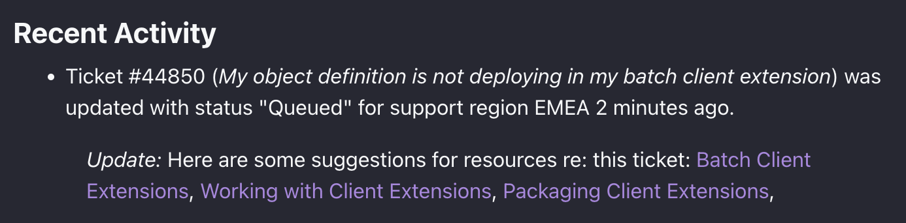

# Implementing a Documentation Referral System

The ticketing system can be further enhanced with a documentation referral system. The system will automatically search for relevant documentation based on a ticket's content and description, thereby enhancing the customer support workflow.

Follow the steps to enable and deploy the referral system:

1. Navigate to the previous `ticket-batch` client extension's `/batch/ticket-object-defintion.batch-engine-data.json` file. In line 46, under the `objectActions` section, change the `active` value from `false` to `true`.

1. Redeploy the `ticket-batch` client extension with the following command:

```bash
./gradlew :client-extensions:ticket-batch:deploy
```

   Note, the [object action](../../building-applications/objects/creating-and-managing-objects/actions.md) can also be enabled from the UI. In Liferay, navigate to _Control Panel_ &rarr; _Objects_. Click on the _Ticket_ object, and click the _Actions_ tab. See the action is `active`.

   

1. Next, run the following command:

```bash
cd client-extensions/ticket-spring-boot/ && ../../gradlew deploy bootRun
```

The documentation referral system is now running.

1. Navigate back to the ticketing system site page. Click _Generate a New Ticket_. Note, now the newly generated ticket includes different links to relevant documentation.

   

## Examine the Referral System Code

This documentation referral system is a [microservice](../../building-applications/client-extensions/microservice-client-extensions.md) type client extension. Specifically, this sample is a Spring Boot application that is built with BootJar. The `assemble` block section of the `client-extension.yaml` identifies this as follows:

assemble:
    - fromTask: bootJar

See [assembling client extensions](../../building-applications/client-extensions/working-with-client-extensions#assembling-client-extensions) to learn more.

Microservice client extensions require an OAuth2 user agent configuration to be able to interact with Liferay. Therefore the `client-extension.yaml` file includes both a `oAuthApplicationUserAgent` type client extension along with a `objectAction` type client extension.

The `ticket-spring-boot-oauth-application-user-agent` client extension creates an OAuth2 application within Liferay for the referral system application to use for authorization. It is defined as follows:

```yaml
ticket-spring-boot-oauth-application-user-agent:
    .serviceAddress: localhost:58081
    .serviceScheme: http
    name: Ticket Spring Boot OAuth Application User Agent
    scopes:
        - C_Ticket.everything
    type: oAuthApplicationUserAgent
```

Note how the `C_Ticket.everything` headless API is given access. The `serviceAddress` parameter defines where the service runs locally.

Next the `ticket-spring-boot-object-action-documentation-referral` client extension is a `objectAction` type client extension that triggers the microservice code when the object action occurs. It is defined as follows:

```yaml
ticket-spring-boot-object-action-documentation-referral:
    name: Ticket Spring Boot Object Action Documentation Referral
    oAuth2ApplicationExternalReferenceCode: ticket-spring-boot-oauth-application-user-agent
    resourcePath: /ticket/object/action/documentation/referral
    type: objectAction
```

Note, the `resourcePath` parameter defines the endpoint at which the microservice is running. The `oAuth2ApplicationExternalReferenceCode` parameter references the previous OAuth2 application configuration.

See [object action yaml configuration yaml](../../building-applications/client-extensions/microservice-client-extensions/object-action-yaml-configuration-reference.md) for an explanation of each property.

The relevant SpringBoot files for the application are contained in the `/src` folder. A full explanation of the Java code is beyond the scope of this tutorial, but a few things to note:

* In the `TicketRestController.java` file, the `@PostMapping` annotation matches the resource path referenced in the YAML file above. When a new ticket object is created, the object action the microservice at this path and the referral results are returned to Liferay.
* The actual referral search logic is in the `DocumentationReferral.java` file. In this example, relevant articles from [learn.liferay.com](https://learn.liferay.com/) are found and added to the ticket object entry.

See [developing a Java web application](../../building-applications/developing-a-java-web-application.md) for more information.

Congratulations on completing this solutions tutorial on building a custom ticketing system.
