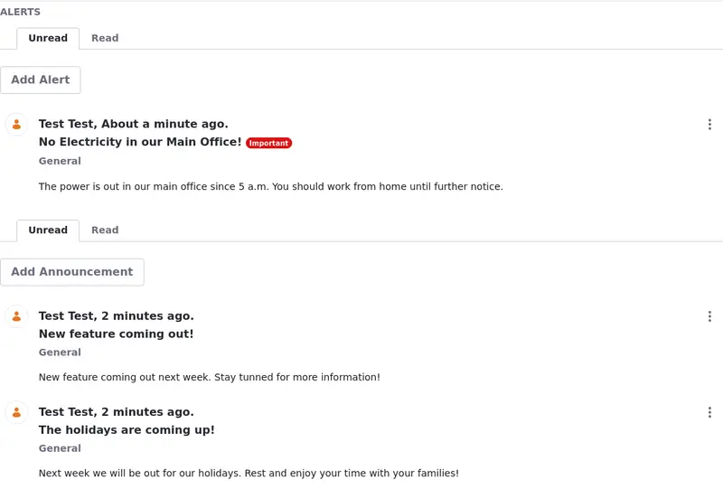
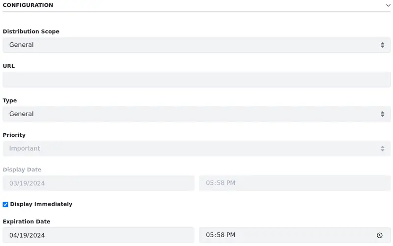

# Sending Alerts and Announcements

Use the Alerts or the Announcements widgets to broadcast important information.

Alerts are for high-priority information (e.g. planned downtime alerts, security alerts, etc.) and come with a red *Important* tag. Conversely, Announcements are for all other information you might want to broadcast.

!!! tip
    You can set the announcement's priority to important to display the red *Important* tag in the message.

Although very similar, alerts and announcements have a few differences:

| Configuration      | Alert                       | Announcement                                                       |
|:-------------------|:----------------------------|:-------------------------------------------------------------------|
| Distribution Scope | Automatic                   | Use the `Customize Announcements Displayed` option to customize it |
| Pagination         | Not Configurable            | Set the maximum number of items shown in the widget.               |
| Priority           | Set to Important by default | Normal or Important                                                |

!!! tip
    To separate critical alerts from regular announcements, consider placing the widgets on different pages or targeting specific user groups.

## Creating Alerts and Announcements

Administrators can create and manage announcements and alerts through the Announcements and Alerts application:

Open the *Global Menu* (), select the *Applications* tab, and click *Announcements and Alerts* under Communication.

In the application, select the Announcements or the Alerts tab (1) to create (2), view (3), select and delete multiple entries (4), filter by site or role (5), sort entries (6), or use the actions menu (7) to edit and delete announcements or alerts.

Another way to create, display, and manage alerts and announcements is by using widgets:

1. [Create a new page](../../site-building/creating-pages/adding-pages/adding-a-page-to-a-site.md) or [start editing](../../site-building/creating-pages/using-content-pages/adding-elements-to-content-pages.md) one.

1. In the Fragments and Widgets menu on the left, search for the Announcements or Alerts widgets under the News section and drag it to your page. The widgets have two tabs:

   **Unread:** Non-expired alerts/announcements that you haven't read.

   **Read:** Alerts/announcements that have expired, or that you've read.

   

1. To create an alert or announcement click on *Add Alert* or *Add Announcement*. A new window opens.

1. Use the Title field to give the alert or announcement a title. Add additional text in the Content field.

1. Set additional settings under the *Configuration* section. See [Alerts and Announcements Configuration Reference](#alerts-and-announcements-configuration-reference) for more information.

1. Click *Save* when you’re done. Your alert/announcement now appears in the widget.

### Alerts and Announcements Configuration Reference

While creating or editing alerts and announcements, expand the Configuration section to view the available settings.

**Distribution Scope:** The scope where the alert/announcement should appear. The default General scope sends the alert/announcements to everyone. Alternatively, you can select your site or specific roles. See [Configuring the Distribution Scope](#configuring-the-distribution-scope) to learn more.

**URL:** A URL (optional) to include with the alert/announcement. For example, an announcement about a news story could include a link to the news article. The URL must be valid and begin with `http://` or `https://`.

**Type:** The alert/announcement type. This can be General, News, or Test. Note that each user can specify a different delivery mechanism for each type of alert/announcement. See [User Configuration ](#user-configuration) for details.

**Priority:** The announcement's priority. This can be Normal or Important. Note that this is disabled for alerts because alerts are always high priority.

**Display Date:** The date the alert/announcement should be displayed. This determines when the alert/announcement is sent and appears in the widget. By default, the *Display Immediately* box is checked. This sets the display date equal to the creation date. Uncheck this box to enter a custom display date. For example, you can create alerts/announcements for display on a later date. This date can be days, weeks, months, or years in the future. Once the Display Immediately box is unchecked, clicking the Display Date field opens the date-picker.

**Expiration Date:** The date and time the alert/announcement expires. Once an alert/announcement expires, the widget displays it in the Read tab. Clicking the Expiration Date field opens the date-picker.

### Configuring the Distribution Scope

Configure the distribution scope to define where the alert/announcement appears. By default, it's set to General sending it to everyone. To set the distribution scope,

While adding an announcement or alert, click the Distribution Scope field to see a list of available sites, organizations, user groups, and roles. This list varies depending on the current user.

**Sites**: All sites the user belongs to.

**Organizations**: All organizations the user belongs to.

**User Groups**: All user groups in the instance.

**Roles**: All roles in the instance.

You can also configure your Announcements widget to customize the distribution scope. This is useful when you want to send an announcement to specific groups of people.

1. Click *Options* () on your widget and select *Configuration*.

1. Select the *Customize Announcements Displayed* option (1) to customize the distribution scope for your Announcement widget. Click *Save*.

   

   A new section is now available. You can select tabs to define which available sites, organizations, user groups, and roles are included in the distribution scope. If there are no elements in a category, the tab doesn't appear.

1. Select the available options and use the arrows to move them from the Available to the Current column to include the option in the distribution scope.

   By default, the site where the widget is placed is shown in the Current column.

   The options under the Available column vary according to the user's permissions. See [Alert and Announcement Roles](#alert-and-announcement-roles) to learn more.

## User Configuration

Users can configure how they'd like to receive announcements.

1. Click on your User profile at the top right and click on *Account Settings*.

1. Click on the *Preferences* tab to find the *Alerts and Announcements Delivery* option.

   

1. Alerts and announcements are always visible from the page on which the widget is configured. Users can choose to
receive alerts and announcements by email as well. Select between General, News, or Test type.

1. Click *Save* when you're finished.

## Alert and Announcement Roles

You can also create roles and assign permissions for users to be able to manage alerts and announcements:

1. Open the *Global Menu* () &rarr; *Control Panel* &rarr; *Roles*.

1. With the *Regular Roles* tab selected, click the *Add* icon (). This opens the New Role form.

1. Name your Role *Announcements*, give it a title and description, and click *Save*.

1. Click on the *Options* icon () of the Role and click *Edit*.

1. Click on the *Define Permissions* tab.

   Under Control Panel, click on *General Permissions*, and select *Add General Announcements*. Click *Save*.

   

   Go back to the Define Permissions tab. Navigate to *Site and Asset Library Administration* &rarr; *Applications* &rarr; *Announcements*. Select all the resource permissions and click *Save*.

1. Now any User assigned to this Role can manage alerts and announcements.

### Distribution Scope Permissions

Here's a list of necessary permissions for users to publish alerts/announcements to each distribution scope option and where you can find them in the Define Permissions tab:

| Option        | Permission                | Where is the Permission                                                                                 |
|:--------------|:--------------------------|:--------------------------------------------------------------------------------------------------------|
| General       | Add General Announcements | Control Panel &rarr; General Permissions                                                                |
| Sites         | Manage Announcements      | Control Panel &rarr; Sites &rarr; Sites                                                                 |
| Organizations | Manage Announcements      | Control Panel &rarr; Users &rarr; Users and Organizations                                               |
| User Groups   | Manage Announcements      | Control Panel &rarr; Users &rarr; Users Groups                                                          |
| Roles         | Manage Announcements      | The user must have a role assigned within the site that grants them permission to manage announcements. |