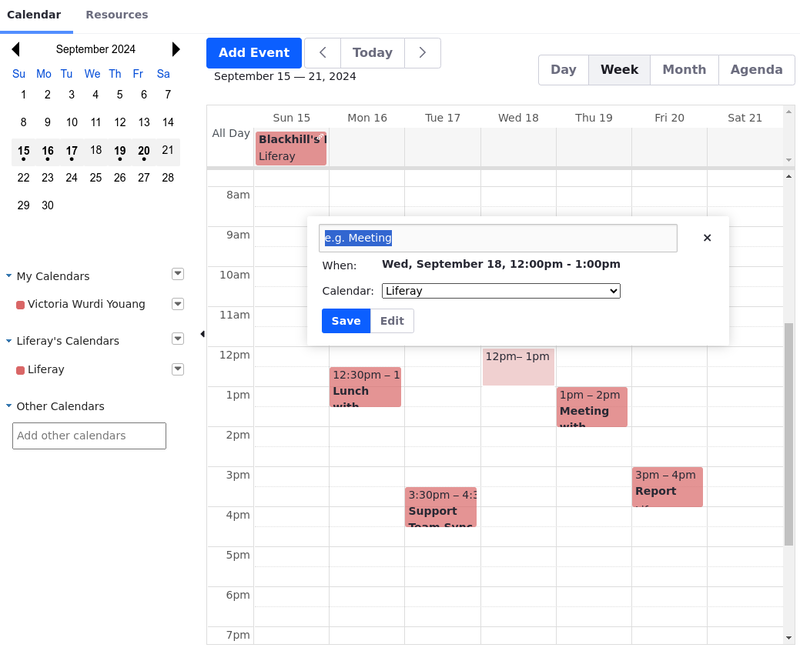
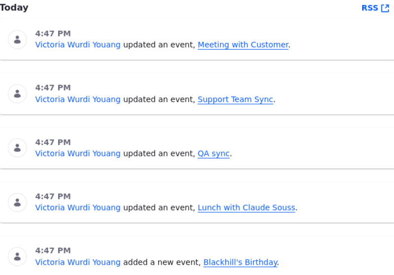
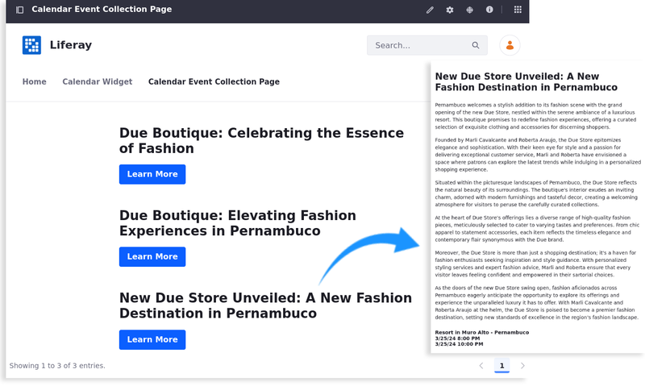

---
toc:
  - ./calendar/using-the-calendar-widget.md
  - ./calendar/configuring-the-calendar-widget.md
  - ./calendar/exporting-importing-calendar-data.md
  - ./calendar/mapping-calendar-event-fields-to-display-page-templates.md
uuid: fdc0a37a-ebdc-4543-8b07-666c88d80a1c
taxonomy-category-names:
- Sites
- Calendar
- Liferay Self-Hosted
- Liferay PaaS
- Liferay SaaS
---

# Calendar

The Calendar widget stores and shares scheduled events. It's a personal planner for individual users, a shared calendar for an entire site, or both at the same time.

In addition to regular calendar features (i.e., multiple calendars within a site or user profile, shared calendars, email reminders, etc.) Liferay's Calendar offers:

* Event Management: [Create, edit, and delete events](./calendar/using-the-calendar-widget.md) directly from the calendar interface.

   

* Drag-and-Drop Functionality: Use the drag-and-drop functionality to reschedule events by simply moving them to a different date or time slot.

* Social Activities: Automatically generate [social activity notifications](./social-tools/using-the-activities-widget.md) when calendar events are added or updated.

   

* User [Permissions](./calendar/using-the-calendar-widget.md#calendar-permissions-reference): Manage who can view, create, edit, or delete events, ensuring data security and privacy.

* [Time Zone](./calendar/configuring-the-calendar-widget.md) Support: Automatically adjust event times based on the user's time zone settings to avoid confusion in global teams.

* Responsive Design: Ensure the calendar widget is accessible and functional across various devices and screen sizes.

* Localization: Localize the event's title and description in several languages.

   

* Export and Import: [Export and import](./calendar/exporting-importing-calendar-data.md) calendar data.

* Integration: Integrate with other Liferay features and applications, enhancing overall collaboration and productivity within the platform (e.g., you can [map calendar event fields to display page templates](./calendar/mapping-calendar-event-fields-to-display-page-templates.md)).

   

Ultimately, the Calendar widget provides a robust solution for managing and sharing scheduled events within your organization. Start by [Using the Calendar Widget](./calendar/using-the-calendar-widget.md) and check all of its available features.