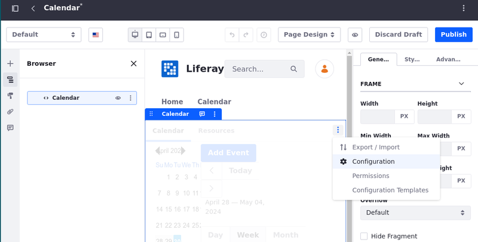
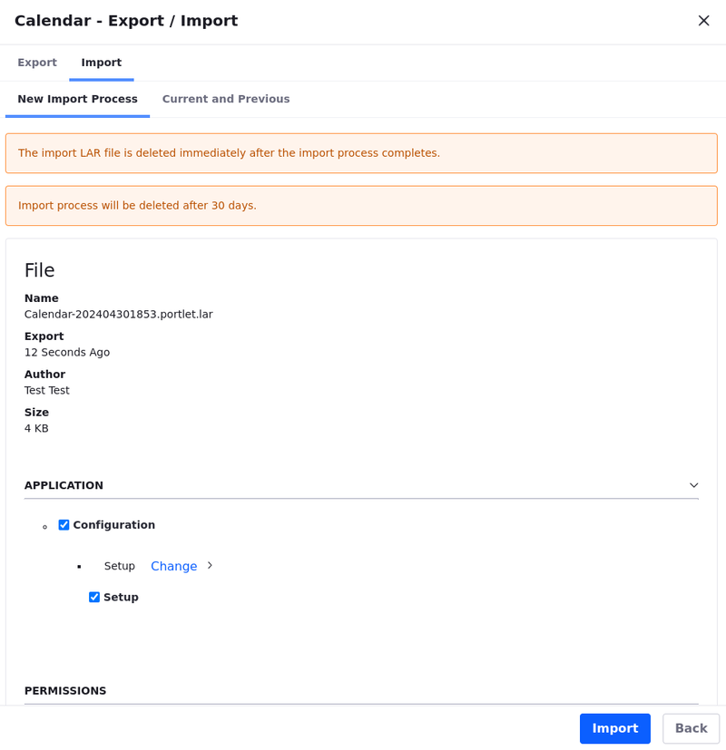

# Exporting/Importing Calendar Data

You can [export](#exporting-and-importing-calendar-data) and [import](#importing-calendar-data) calendar data as Liferay Archive (LAR) files.

!!! note
    Data can only be ported between installations of the same version.

## Exporting Calendar Data

1. Start [editing the page](../../site-building/creating-pages/using-content-pages/adding-elements-to-content-pages.md) that has the calendar widget.

1. Click  in the widget header and select *Export/Import*.

1. Click the *Export* tab.

   

1. Enter a name for the LAR file (or use the default).

1. Under Application, choose whether to include the widget's configuration in the LAR.

1. Under Content, choose how much historical data to export and select the content types (calendars, resources, and events) to include. You can also choose whether to include comments and ratings.

1. Check the appropriate boxes to select whether to include deletions and permissions in the LAR.

1.  Click *Export*. When a success message appears (this may take a few moments), you can click the LAR's filename to download it.

## Importing Calendar Data

1. Start [editing the page](../../site-building/creating-pages/using-content-pages/adding-elements-to-content-pages.md) that has the calendar widget.

1. From the calendar widget, click  in the widget header and select *Export/Import*.

1. Click the *Import* tab.

1. Click *Choose File* or drag-and-drop a LAR into the area surrounded by a dotted line. Click *Continue*.

   

1. Under Application, check the box to import the configuration stored in the LAR or leave it unchecked to keep your current configuration.

1. Under Content, decide which content types (calendars, resources, and events) to import and whether to include comments and ratings.

1. Choose whether to import permissions and deletions, and decide whether to delete your widget's existing data before the import.

1. In the collapsible Update Data section, choose how data should be updated.

   **Mirror:** The data is imported with a reference to its source. This way, data can be updated rather than duplicated if the same LAR is imported more than once.

   **Copy as New:** All data is imported as new entries. Repeat imports produce duplicates.

1. In the Authorship of the Content section, choose whether to keep the original author of the imported content (where available) or to set the current user as the author.

1. Click *Import*.

Your imported calendar data is now available for use. Better check it to see what's next on the agenda.

## Related Topics

- [Using the Calendar Widget](./using-the-calendar-widget.md)
- [Calendar Widget Configuration Reference](./calendar-widget-configuration-reference.md)
